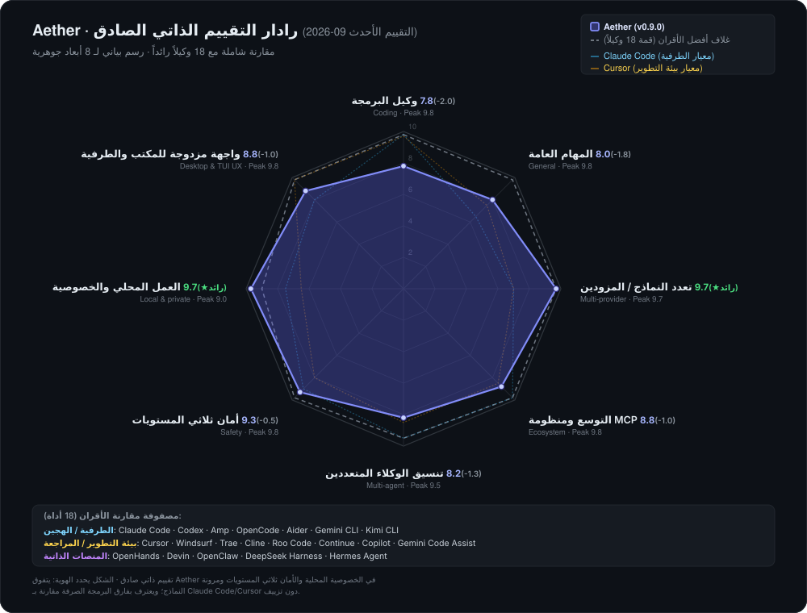

<div align="center">


# Aether

### محلّي أولاً · متعدّد النماذج · وكيل أصيل

تحدّث مع أي نموذج، وشغّل وكيل برمجة آمنًا، وقارن النماذج جنبًا إلى جنب — على سطح المكتب أو في الطرفية.

**Electron + Node.js · React + TypeScript · MCP · Agent · Skills**

[](https://github.com/TQSY114514/Aether/releases) [](https://www.npmjs.com/package/aetherai)

[](./LICENSE) [](#-download)


[English](./README.md) · [简体中文](./README.zh-CN.md) · [繁體中文](./README.zh-TW.md) · [文言文](./README.zh-WEN.md) · [日本語](./README.ja.md) · [español](./README.es.md) · [français](./README.fr.md) · [Deutsch](./README.de.md) · [português](./README.pt.md) · [русский](./README.ru.md) · [українська](./README.uk.md) · [العربية](./README.ar.md) · [हिन्दी](./README.hi.md) · [한국어](./README.ko.md)<br><sup>قد تتخلّف الترجمات عن نسختَي الإنجليزية / الصينية المبسّطة.</sup>

</div>

---

> **الحالة: Beta.** Aether مشروع فردي/هواية. يعمل، لكن توقّع بعض الخشونة في الحواف.
> تقارير الأخطاء مرحّب بها — راجع [CONTRIBUTING.md](./CONTRIBUTING.md) و
> [SECURITY.md](./SECURITY.md).

> [!CAUTION]
> **تحذير Windows SmartScreen متوقّع.** Aether يبنيه مطوّر طالب بدون شهادة توقيع كود تجارية، لذا قد يعرض Windows 11 / Defender رسالة "قام Windows بحماية جهازك" عند الإطلاق الأوّل.
> **التطبيق آمن ومفتوح المصدر — راجع الكود ثم انقر "مزيد من المعلومات ← تشغيل على أي حال".**
> إذا عزله برنامج مكافحة الفيروسات، أضف مجلد التطبيق إلى قائمة استثناءات برنامج الحماية (انظر [التنزيل](#التنزيل) للتفاصيل). لا تخرج أي بيانات من جهازك إلا إلى مزوّدي LLM الذين تهيّئهم.

**المنصّة: Windows فقط.** البناءات الرسمية والاختبار والدعم تستهدف Windows. قد يُبنى macOS / Linux من المصدر لكنهما غير مدعومَين رسميًا، ولا يُخطَّط لتوقيع الكود — توقّع رسالة SmartScreen "ناشر غير معروف" عند الإطلاق الأوّل (انظر [التنزيل](#التنزيل)).

**تطبيق واحد لكل نموذج.** OpenAI / Claude / DeepSeek / النماذج المحلّية / أي نقطة نهاية متوافقة مع OpenAI — تحدّث، وشغّل وكيل برمجة، وقارن النماذج وجهًا لوجه في ساحة متعدّدة النماذج مع تصويت ELO.

**محلّي أولاً بالتصميم.** مفاتيح API والمحادثات تعيش في قاعدة بيانات SQLite محلّية ولا تغادر جهازك أبدًا — إلّا إلى المزوّدين الذين تُهيّئهم.

**آمن افتراضيًا.** الوكيل المدمج يعمل داخل صندوق رمل لمساحة العمل مع سلم صلاحيات: الوصول إلى الملفات والأوامر يُوافَق عليه قبل حدوثه، وكل استدعاء أداة قابل للتدقيق.

---

## شكلان للمنتج، نواة موحدة واحدة

يعتمد Aether **بنية المحرك المزدوج**، مقدماً واجهتين متكافئتين من الدرجة الأولى تشتركان في نفس بيئة تشغيل الوكيل، وتخزين SQLite المحلي، وصندوق حماية أمني من 3 مستويات:

- 🖥️ **Aether Desktop (GUI)** — واجهة رسومية مبنية على Electron + React مع طباعة غنية، وسحب وإفلات، وحلبة نماذج مرئية، ومركز إعدادات سهل الاستخدام. **موصى به لمعظم تدفقات العمل اليومية وللمستخدمين الجدد.** (حمّلها من [GitHub Releases](#التنزيل-سطح-المكتب)، تعمل مباشرة)
- ⌨️ **Aether الطرفية (CLI / TUI / SDK)** — واجهة طرفية خفيفة على Ink v5 مع إقلاع فوري، وتحكم كامل عبر لوحة المفاتيح، وموافقة على الفروقات سطراً بسطر، ودعم أصيل لـ SSH وأتمتة CI/CD. **مصمم لمحترفي سطر الأوامر والأتمتة.** (`npm i -g aetherai`، [الإعداد ←](#التنزيل-cli--tui--sdk))

> 💡 **استمرارية سلسة**: يشترك الاثنان في `agentCore`، و42 أداة، وذاكرة SQLite، وتوجيه النماذج المتعدّدة، وخوادم MCP، ونفس مخزن الجلسات. المحادثة التي بدأتها في الواجهة الرسومية يمكن استئنافها في الطرفية بـ `aether tui --session <id>`، والعكس صحيح.

---

**موقع Aether — بتقييم صريح.** تقييم ذاتي مقارنة بـ 16 أداة رائدة عبر سطر الأوامر وبيئات التطوير والمنصات الذاتية بناءً على البيانات العامة (أحدث تقييم: 2026-09؛ تقديرات وليست اختبارات اصطناعية). نعرض الشكل غير المتماثل دون تجميل: ريادة في الخصوصية المحلية، وأمان صندوق الحماية ثلاثي المستويات، وتعدد النماذج؛ مع الاعتراف الصريح بفارق البرمجة الصرفة أمام Claude Code و Cursor. لمزيد من التفاصيل، راجع [docs/competitive-analysis.md](docs/competitive-analysis.md).

<p align="center"></p>

<sub>تم إنشاء الرسم البياني بواسطة <a href="./app/scripts/gen-radar.cjs">app/scripts/gen-radar.cjs</a> — الدرجات مضمنة حرفياً؛ يمكن إعادة إنتاجه عبر <code>node app/scripts/gen-radar.cjs</code>.</sub>

---

## ما الذي يميّز Aether

يجمع Aether عدّة قدرات تكون عادةً موزّعة عبر أدوات متعدّدة في تطبيق واحد لسطح المكتب محلّي:

| القدرة | الوصف | النضج |
|---|---|:---:|
| **محادثة متعدّدة المزوّدات** | بدّل بين OpenAI و Claude و DeepSeek وأي نقطة نهاية متوافقة مع OpenAI في منتصف المحادثة. | `Stable` |
| **حلقة أدوات الوكيل** | 42 أداة مدمجة مع حلقة خطّط-نفّذ-راقب، وصندوق رمل، وسلم صلاحيات. | `Beta` |
| **ساحة متعدّدة النماذج** | أرسل موجّهًا واحدًا إلى نماذج متعدّدة، صوّت للأفضل، وتتبّع ترتيب ELO. | `Beta` |
| **المهارات والتوسعة** | ملفات `SKILL.md` جاهزة للإسقاط، وخوادم MCP، ونظام خطّافات من 10 نقاط. | `Experimental` |
| **ذاكرة مهيكلة** | يتذكّر الوكيل التفضيلات والقرارات الماضية عبر الجلسات. | `Beta` |
| **تخطيط هرميّ** | الطلبات المعقّدة تُفكَّك تلقائيًا إلى مهام فرعية متوازية. | `Experimental` |
| **انكماش السياق** | المحادثات الطويلة تُلخَّص تلقائيًا بدون فقدان أزواج استدعاء الأداة. | `Beta` |
| **خصوصية محلّية أولاً** | المحادثات والمفاتيح والشخصيات في SQLite محلّي. لا شيء يغادر جهازك. | `Stable` |
| **15 لغة واجهة** | بما فيها الصينية الكلاسيكية (الصينية الكلاسيكية) والعربية RTL. | `Beta` |
| **طرفية TUI** | طرفية تفاعلية Ink v5: تدفق الجلسات، بطاقات الأدوات، مراجعة/تراجع diff، بوابة أذونات بلوحة المفاتيح، شجرة جلسات `/fork`، `/memory`، حقن steering أثناء التشغيل. | `Experimental` |
| **CLI بدون واجهة · RPC · SDK** | CLI بأربعة أوضاع (إطلاق مفرد / NDJSON / JSONL RPC / أنابيب)، وSDK بدون Electron (`aetherai/sdk`)، وبروتوكول JSONL قابل للاستدعاء آليًا. | `Experimental` |
| **مرخّص MIT** | مفتوح المصدر بالكامل. | `Stable` |

---

## التنزيل

> اختر **واحدًا**. المنتجان يشتركان في نفس بيئة تشغيل الوكيل ونفس مخزن الجلسات.
> - **كل ما تريده هو تطبيق محادثة لسطح المكتب؟** ← [Aether Desktop](#التنزيل-سطح-المكتب)
> - **تريد وكيل طرفية / CI / SDK؟** ← [Aether CLI](#التنزيل-cli--tui--sdk)

### التنزيل — سطح المكتب

**Windows — مُثبّت جاهز مسبقًا (مُوصى به لمعظم المستخدمين)**

حمّل أحدث [إصدار](https://github.com/TQSY114514/Aether/releases):

| البناء | الوصف |
|---|---|
| **`aetherai-setup-x.y.z.exe`** | مُثبّت NSIS. لكل مستخدم (بدون صلاحيات مدير)، تحديث تلقائي داخل التطبيق. **مُوصى به.** |
| **`aetherai-x.y.z.exe`** | ملف تنفيذي واحد محمول. بدون تثبيت، بدون تحديث تلقائي؛ فقط شغّله. |

> يُظهر المُثبّت تحذير SmartScreen "ناشر غير معروف" عند الإطلاق الأوّل — أمر متوقّع لتطبيق فردي غير موقّع. كل البيانات تبقى محلّية.
>
> ⚠️ قد تعزل بعض برامج مكافحة الفيروسات ملف `electron.exe` غير المُفكّ أثناء التعبئة لأن التطبيق غير موقّع. إذا أزال مضاد الفيروسات المُثبّت، أضف استثناءً أو استخدم البناء المحمول.

### التنزيل — CLI / TUI / SDK

**`aetherai`** هي حزمة npm. تجمع في ملف ثنائي واحد كلًّا من الـ CLI بدون واجهة، والـ TUI التفاعلية Ink v5، والـ SDK الخالي من Electron.

```bash
# Install once (requires Node.js ≥ 22)
npm install -g aetherai
# or, no install:
npx aetherai "fix the failing test" --model deepseek

# Interactive terminal UI (best in Windows Terminal)
aether tui

# Single-shot prompt (CI / scripts)
aether "summarize README.md"

# JSONL RPC for external scripts
echo '{"type":"request","reqId":"c1","method":"listModels","params":{}}' | aether --mode rpc
```

`aether` و `aetherai` يحلّان إلى نفس الحزمة. ثبّت إصدارًا محدّدًا بـ `npm install -g aetherai@0.8.0` لمطابقة إصدار سطح المكتب.

> **مشاركة البيانات مع الواجهة الرسومية** — المنتجان يستخدمان نفس قاعدة بيانات SQLite (`%APPDATA%/aetherai/aetherai.db`). الجلسة التي بدأت في تطبيق سطح المكتب يمكن استئنافها في الـ TUI، والعكس صحيح.

### التشغيل من المصدر (مطوّرون / مستخدمون متقدّمون)

إذا فضّلت التشغيل من المصدر، أو أردت تعديل الكود، استخدم `start.bat` (يتطلّب [Node.js 22+](https://nodejs.org)):

```bash
git clone https://github.com/TQSY114514/Aether.git
cd Aether
start.bat        # Windows: installs deps, builds frontend, launches Electron
```

انظر [البداية السريعة](#-quick-start) للخطوات اليدوية خطوة بخطوة.

> **منتجان أم شجرة مصدر واحدة** — المنتجان يعيشان في نفس المستودع. `app/electron/` يضمّ بيئة تشغيل الوكيل المشتركة، و`app/src/` هو طبقة العرض لسطح المكتب، و`app/cli.js` + `app/tui/` هما نقطتا دخول CLI/TUI. الإصدارات تُوسَم بوسم git (`v*`)، ومن وسم واحد تحصل على مُثبّت سطح المكتب وعلى نشر npm معًا.

---

## البداية السريعة

**المتطلّبات المسبقة:** Node.js 22+، npm 9+

```bash
cd app
npm install
npm run dev      # development (hot reload)
npm run build    # production frontend
npm start        # launch Electron
```

أو شغّل `start.bat` في جذر المستودع على Windows.

### جرّب الطرفية (لا حاجة لنافذة Electron)

```bash
cd app && npm install
node cli.js tui              # interactive terminal UI (Node ≥ 22; best in Windows Terminal)
node cli.js "مرحبا"           # single-shot prompt
echo "لخّص هذا" | node cli.js  # pipe stdin as prompt
node cli.js --mode json "x"  # NDJSON event stream (scripts/CI)
node cli.js tui --smoke      # headless state-machine smoke
```

### ضبط المزوّد

1. بعد الإطلاق، انقر **Models** في الشريط الجانبي.
2. أضف مزوّدًا (اسم / عنوان URL للواجهة / مفتاح API).
3. انقر **Fetch models** لسحب قائمة النماذج المتاحة.
4. عُد إلى المحادثة وابدأ التحدّث.

### تفعيل وضع Ask

1. افتح **الإعدادات - الوكيل والسلامة**.
2. اضبط وضع صلاحية الوكيل إلى **Ask**.
3. تأكّد من أن جذر مساحة العمل هو المجلد الذي تريد أن يقرأ فيه الوكيل ويكتب.
4. اترك **Yolo** مُعطّلاً ما لم تكن تريد وصولًا غير مقيّد.

### شغّل أوّل مهمة وكيل

1. افتح محادثة جديدة.
2. اطلب: `List the files in this project and summarize what the app does.`
3. راجِع كل استدعاء أداة مُقترح. وافق على القراءات الآمنة؛ ارفض أي شيء غير متوقّع.
4. راجِع تتبّع الاستدلال الحيّ والجواب النهائي.

---

## الميزات

**شارات الحالة:** `Stable` = جاهز للاستخدام اليومي، `Beta` = صالح للاستخدام مع حوافّ خشنة معروفة، `Experimental` = سلوك جديد/متقدّم قد يتغيّر، `Planned` = عنصر موثّق في خارطة الطريق.

### المحادثة

| الميزة | الحالة | الوصف |
|---|:---:|---|
| **تعدّد المزوّدات** | `Stable` | طبقة محوّل واحدة؛ إضافة مزوّد = ملف واحد. يغطّي OpenRouter و Together و DeepSeek و Ollama و LM Studio و ... |
| **بثّ متزامن** | `Stable` | محادثة واحدة تبثّ بينما تواصل التحدّث في أخرى. |
| **مزلقة جهد التفكير** | `Beta` | معاملات حقيقية: OpenAI o-series / gpt-5 / Claude عبر وسيط. فعّالة فقط على نماذج الاستدلال. |
| **المرفقات** | `Beta` | ملفات نصية كسياق؛ صور للـ multimodal (يتطلّب نموذج رؤية). |
| **طيّ اللصق الطويل** | `Stable` | مئات الأسطر تُطوى تلقائيًا إلى مقتطف قابل للتوسيع (بنمط ChatGPT). |
| **تحرير الرسالة** | `Stable` | كتابة فوق + إعادة توليد من أي نقطة. |
| **بحث الرسالة** | `Stable` | مع التمييز عبر جميع الرسائل. |
| **ملخّصات الشريط الجانبي** | `Beta` | عبارات مواضيعية يولّدها النموذج، وليس نصًّا منسوخًا. |

### الوكيل (استدعاء الدوال)

- `Beta` **42 أداة مدمجة** — عمليات الملفات (`read_file`, `list_dir`, `glob_find`, `grep_search`, `write_file`, `edit_file`, `apply_patch`), الويب (`web_search`, `web_fetch`), الصدفة (`run_command`), git و GitHub (`git_status`, `git_diff`, `git_log`, `git_commit`, `git_push`, `git_create_branch`, `github_pr_create/list/merge/review`, `github_issue_create/list`, `github_release_create`, `github_actions_status`), ذكاء الكود (`find_symbol`, `lsp_definition`, `lsp_references`, `lsp_diagnostics`, `lsp_code_actions`, `lsp_rename`), أدوات الوكيل (`use_skill`, `ask_user`, `todo_write`, `delegate_task`, `task`, `memory_save/list/search`, `get_project_context`, `review_code`, `debug_loop`, `test_first`) — مع حلقة خطّط-نفّذ-راقب، وتتبّع استدلال حيّ + قائمة مهام، وكشف الحلقات، ومهلات زمنية لكل أداة، وميزانية تكرار قابلة للتكوين (25 جولة افتراضيًا)، وانكماش السياق.
- `Experimental` **تخطيط هرميّ** — يولّد تلقائيًا تفكيك المهام للطلبات المعقّدة.
- `Experimental` **تفويض الوكيل الفرعيّ** — المهام الفرعية المستقلّة تعمل بالتوازي عبر `delegate_task`.
- `Stable` **أوضاع الصلاحيات** — سلم تصاعديّ للمخاطر:

| الوضع | الوصف | صندوق الرمل |
|---|---|:---:|
| **Off** | محادثة عاديّة، لا أدوات | غير قابل للتطبيق |
| **Plan** | أدوات للقراءة فقط (تحقيق بدون تغييرات) | - |
| **Ask** | أكّد كل إجراء خطر (مُوصى به) | - |
| **Auto** | شغّل كل شيء، بدون تأكيدات | نعم |
| **Yolo** | صلاحية كاملة، بدون صندوق رمل | لا |

- `Stable` **صندوق رمل مساحة العمل** — يُرفض `write_file`/`edit_file` خارج جذر مساحة العمل المُعدّ؛ يُوقف `run_command` الأنماط المدمّرة. قابل للتكوين في الإعدادات - الوكيل والسلامة.
- `Beta` **انكماش السياق** — يُلخّص التاريخ الأقدم تلقائيًا (أزواج استدعاء/نتيجة الأداة محفوظة سليمة؛ المُعرّفات محفوظة بحرفيتها).
- `Beta` **إصلاح استدعاء الأداة** — يُصلح تلقائيًا JSON المعيب، والمعاملات المفقودة، والمفاتيح غير المُشار إليها، والاستدعاءات المقطوعة.

### الذاكرة والتعلّم

- `Beta` **ذاكرة طويلة الأمد تلقائية** — تُحقن الذكريات ذات الصلة قبل كل دور؛ تُستخرج الحقائق الرئيسية وتُحفظ تلقائيًا. قابلة للتبديل في الإعدادات - الوكيل.
- `Experimental` **مُعلّم العادات** — يكتشف التفضيلات المتكرّرة (مثال: "استخدم Claude دائمًا") ويقترح مهارات تُطبّق تلقائيًا.
- `Beta` **سجل التدقيق** — تتبّع تنفيذ الوكيل لكل دور لأغراض التصحيح.

### الساحة

- `Beta` **ساحة متعدّدة النماذج** — موجّه واحد، نماذج متعدّدة تُجيب **بالتوازي**؛ صوّت للأفضل و**لوحة صدارة ELO** تُحدّث تلقائيًا. تُقيّم النماذج **حسب النية** (برمجة / رياضيات / ترجمة / تلخيص / عام). *لا يوجد تطبيق محادثة آخر لسطح المكتب محلّي يأتي بساحة متعدّدة النماذج مدمجة مع ELO.*

### المهارات والتوسعة

| المكوّن | التنسيق | الحالة | التفاصيل |
|---|---|:---:|---|
| **المهارات** | `SKILL.md` | `Experimental` | ألقِ في `<workspace>/.claude/skills/`؛ يأتي مع `release-checklist` و `git-commit` |
| **أوامر الشرطة المائلة** | `CMD.md` | `Stable` | 6 مدمجة: `/code`, `/continue`, `/explain`, `/polish`, `/summarize`, `/translate` |
| **الخطّافات** | نص برمجي | `Experimental` | 10 نقاط دورة حياة: PreToolUse, PostToolUse, ToolError, PreCompact, PostCompact, PreSend, PostResponse, SessionStart, SessionEnd, SubagentStop |
| **MCP** | stdio JSON-RPC 2.0 | `Beta` | خوادم MCP الخارجية تندمج مع الأدوات المدمجة تلقائيًا |

### التخصيص

| الإعداد | الحالة | الوصف |
|---|:---:|---|
| **إعدادات النموذج المتقدّمة** | `Stable` | الحدّ الأقصى للرموز، ودرجة الحرارة، و top_p، وبادئة نظام مخصّصة، وعناوين تلقائية لكل لغة، وجهد التفكير |
| **خلفية مخصّصة** | `Stable` | ارفع صورة مع ضوابط الشفافية / الضبابية |
| **الشخصيات** | `Stable` | إعدادات مسبقة لموجّه النظام، قابلة للتبديل لكل جلسة |
| **السِمات** | `Stable` | فاتح / داكن / أزرق / زجاجي / كلاسيكي |
| **15 لغة واجهة** | `Beta` | الإنجليزية، الصينية (مبسّطة/تقليدية/كلاسيكية)، اليابانية، الإسبانية، الفرنسية، الألمانية، البرتغالية، الروسية، الأوكرانية، العربية (RTL)، الهنديّة، الكورية |
| **التحديث التلقائي** | `Beta` | مُثبّت NSIS يتحقّق عند الإطلاق؛ المحمول يتحقّق أيضًا (تثبيت يدوي) |
| **تتبّع الاستخدام** | `Beta` | سجل لكل استدعاء API مع الرموز والتكلفة والزمن ومعدل إصابة المخبأ |

### الخصوصية

> **كل البيانات تبقى محلّية.** Aether لا يجمع شيئًا ولا يرفع شيئًا عنك. مفاتيح API والمحادثات والشخصيات تعيش في قاعدة بيانات SQLite محلّية. طلبات الشبكة الخارجية الوحيدة تذهب إلى مزوّدي LLM الذين ضبطتهم.

---

## طرفية TUI و RPC و SDK

إلى جانب تطبيق سطح المكتب و CLI العادي، يوفر Aether واجهة طرفية تفاعلية، ووضع RPC بنمط JSONL قابل للاستدعاء آليًا، وSDK بدون Electron. تشترك الثلاثة جميعًا في نفس نواة الوكيل والذاكرة والشخصيات وأدوات MCP وقواعد الصلاحيات مثل تطبيق سطح المكتب.

### بداية سريعة — بصيغة مزدوجة

```bash
# Interactive terminal UI (Ink v5; requires Node ≥ 22)
node app/cli.js tui                # real terminal: type, approve tools, review diffs
node app/cli.js tui --smoke        # headless state-machine smoke (CI-safe, prints JSON)

# Single-shot prompt (same as before)
node app/cli.js "fix the failing test" --mode auto --max-iterations 30

# NDJSON event stream for scripts/CI (compat: --json-lines)
echo "summarize README.md" | node app/cli.js --mode json --model deepseek

# JSONL RPC loop over stdin/stdout
printf '{"type":"request","reqId":"c1","method":"listModels","params":{}}\n' \
  | node app/cli.js --mode rpc --db path\to\aetherai.db
```

أعلام إضافية للـ headless: `--persona <id>` (حقن persona + ذاكرة)، `--memory-trace` (تقرير عدد ذكريات الحقن)، `--skills` (JSON مقترحات المهارات)، `--setup-term` (كتابة profile لـ Windows Terminal)، `--stdin` (إدخال أنابيب صريح).

### TUI (`aether tui`)

وكيل طرفية تفاعلي (Ink v5; Node ≥ 22; أفضل تجربة في Windows Terminal):

- **الجلسات**: عرض رسائل متدفّق، شجرة جلسات `/fork` (`session.parent_session_id`)، `/sessions`, `/use <id>` للتبديل بين التواريخ
- **الأدوات والصلاحيات**: بطاقات استدعاء الأدوات (لون الحالة/الزمن المستغرق/الملخّص)، مراجعة diff (`Alt+v` للتوسيع، `Enter` لقبول / `r` للتراجع — استعادة لقطة ما قبل الكتابة، فعّالة حتى في المجلدات غير git)، بوابة أذونات بلوحة المفاتيح (`y` سماح مرة واحدة / `a` سماح دائم / `n` رفض، أو الاختيار بـ `←→`)، الأدوات للقراءة فقط تُمرَّر تلقائيًا
- **وضع الموافقة**: `Shift+Tab` يتنقّل عبر `manual → auto-edits → plan` (plan = تخطيط للقراءة فقط، بعد الاكتمال ثلاثة خيارات تحدد كيفية التنفيذ)
- **الأوضاع**: `Alt+m` للتبديل بين ask/plan/auto؛ `/persona <id>` لتبديل الشخصية (حقن persona + بادئة ذاكرة)
- **اختصارات الزعيم**: `Ctrl+X` ثم `m` منتقي النموذج / `n` جلسة جديدة / `l` قائمة الجلسات / `g` خط زمني / `r` نقاط فحص rewind / `q` خروج
- **لوحة الأوامر**: `Ctrl+P` أو `x` (New chat / Model / Timeline / Export JSONL / Help / Quit)
- **إعادة ربط المفاتيح**: `~/.config/aether/keybindings.json` (مثل `{ "char:?": null }` لتعطيل مفتاح المساعدة `?`)
- **استمرار مفتاح API**: `/apikey <provider> <key>` يُحفظ في `auth.json` (المفاتيح المشفّرة بـ safeStorage في نسخة سطح المكتب لا يمكن فك تشفيرها في headless؛ استخدم هذا الأمر أو متغيّر البيئة `AETHER_API_KEY`)
- **حلقة الذاكرة والمهارات**: `/memory <كلمة>` للاسترجاع، `--memory-trace` لعدد العناصر المحقونة، `/skills` + `/skill accept|dismiss <key>` (habitLearner ← مقترحات مهارات)
- **steering**: أثناء التشغيل `Ctrl+C` للمقاطعة ← أدخل السطر التالي ← يُحقن في الحلقة الحالية (تعرض قائمة الانتظار `steer:n`)؛ أثناء التشغيل `Tab` يضع السطر التالي في قائمة الانتظار مباشرة
- **اختصارات**: `Esc` مرتين للخروج (أو `/quit`)، `Esc` لمسح الإدخال (المسودّة تدخل التاريخ)، `?` شاشة المساعدة، `PgUp/PgDn`/عجلة الماوس للتمرير، شريط الحالة يعرض لحظيًا `approval/mode/model/tok/ctx`؛ للمفاتيح الكاملة راجع [docs/tui-keys.md](./docs/tui-keys.md)

### RPC (`aether --mode rpc`)

بروتوكول JSONL قابل للاستدعاء آليًا عبر stdin/stdout: إطارات `request` للدخول، إطارات `event`/`result`/`error` للخروج — كائن JSON واحد لكل سطر، بدون نص بشري. الطرق: `run` (يبثّ أحداث `text`/`tool`/`plan`/`status`), `listModels`, `listProviders`, `models.default`, `listSessions`, `session.load`, `session.fork`, `task.derive`, `task.status`. مرجع الإطارات: [docs/rpc.md](./docs/rpc.md).

### SDK (`require('aetherai/sdk')`)

تجميع لنواة الوكيل بدون Electron للمشاريع الخارجية على Node: `runAgent`, `openDatabase`, `resolveProviderModel`, `taskDbAdapter`, `memory` (prefetch/recall/search/…), `classifyAgentMode`, إطارات `rpc`, `sessionContext` (حقن persona + ذاكرة). تتضمّن إعلانات الأنواع (`app/electron/sdk/index.d.ts`).

```js
const { runAgent, openDatabase, resolveProviderModel, classifyAgentMode } = require('aetherai/sdk')
const db = openDatabase('./aetherai.db')
const { provider, model } = resolveProviderModel(db, { modelName: 'deepseek' })
console.log(classifyAgentMode({ prompt: 'delete the file' })) // { mode: 'ask', reason: ... }
```

---

## Windows أصلي

| القدرة | الوصف |
|---|---|
| **قائمة علبة النظام** | إظهار/إخفاء النافذة، جلسة جديدة، **مهمة جديدة** (تفتح TaskPanel مباشرة)؛ النقر على العلبة يبدّل الإظهار/الإخفاء. |
| **اختصارات عامة** | `Ctrl+Alt+A` لاستدعاء النافذة الرئيسية (تُنشأ إن لم تكن مطلقة)؛ نتيجة التسجيل تُكتب في سجلّ الإطلاق. |
| **بروتوكول `aetherai://`** | `aetherai://new` / `chat` جلسة جديدة؛ `aetherai://tui` يلمّح بصيغة الطرفية؛ `aetherai://open/?path=<مسار مُرمّز>` يعيّن المجلد كمساحة عمل وينشئ جلسة جديدة (مسار النقر الأيمن "افتح مع Aether"). |
| **تسجيل النقر الأيمن** | `app/resources/register-protocol.reg` (استبدل `<AETHER_EXE>` ثم استورد بصلاحيات مدير): `.cs/.js/.ts/.tsx/.md/.json` + المجلدات ← النقر الأيمن "افتح مع Aether". |
| **إرشاد الطرفية** | `app/resources/term/aether.ps1` (اسم مستعار + إطلاق `aether tui`)؛ `node app/cli.js --setup-term` يكتب profile لـ Windows Terminal (مجموعتا ألوان داكنة/فاتحة). |
| **تقوية صندوق الرمل** | دفاع عن مسارات Windows: مسارات طويلة `\\?\`, وUNC `\\server\share`, والهروب عبر نقاط إعادة التوجيه/junction, والامتدادات الخطرة مثل `.lnk/.scr/.msi`. |

---

## هيكل المشروع

```
app/
├── electron/              # main process (Node)
│   ├── database.js        # better-sqlite3 data layer — 25+ tables (WAL)
│   ├── ipc/               # IPC handlers (chat / arena / session / mcp / ...)
│   │   ├── chat.handler.js    # THE central handler (540 lines)
│   │   ├── arena.handler.js   # Multi-model arena with ELO
│   │   ├── agent.handler.js   # Workspace management
│   │   └── ...
│   ├── llm/               # LLM abstraction (~3,700 lines, 19 files)
│   │   ├── providerAdapter.js # Dispatch by api_format (openai/anthropic)
│   │   ├── openaiAdapter.js   # OpenAI-compatible SSE streaming + retry
│   │   ├── anthropicAdapter.js# Anthropic Messages API
│   │   ├── credentialPool.js  # Multi-key rotation + cooldown
│   │   ├── toolLoop.js        # Plan-Act-Observe with iteration budget
│   │   ├── planning.js        # Hierarchical task decomposition
│   │   ├── subAgent.js        # Parallel sub-agent delegation
│   │   ├── compaction.js      # Context compaction (pair-preserving)
│   │   ├── autoMemory.js      # Long-term structured memory
│   │   ├── habitLearner.js    # Recurring preference -> auto-skills
│   │   ├── hooks.js           # 10-point extensibility hooks
│   │   ├── skills.js          # SKILL.md loader (Claude Code format)
│   │   ├── modelAdvisor.js    # Heuristic model suggestion
│   │   ├── toolCallRepair.js  # Malformed tool-call recovery
│   │   ├── auditLog.js        # Per-turn agent execution trace
│   │   └── ...
│   ├── tools/             # built-in tool registry + sandbox
│   │   ├── registry.js       # 16 tool definitions (OpenClaw-inspired)
│   │   └── sandbox.js        # 3-layer defense (workspace root, traversal guard, blocklist)
│   ├── mcp/               # MCP client + server manager
│   ├── main.js / preload.js
├── src/                   # renderer (React + TS + Zustand)
│   ├── store/index.ts     # Zustand global state (~1,000 lines)
│   ├── components/        # UI (chat / sidebar / settings / ui)
│   ├── pages/             # Chat / Models / Persona / Settings / Scores / ...
│   ├── utils/             # i18n (15 locales) / theme / markdown
│   └── types/
├── skills/                # Built-in skills (release-checklist, git-commit)
├── commands/              # Built-in slash commands (/code, /explain, /polish, ...)
└── resources/             # App icons
```

---

## حزمة التقنيات

| الطبقة | التقنية |
|---|---|
| سطح المكتب | Electron 43 |
| الواجهة الأمامية | React 18.3 + TypeScript 5.8 |
| إدارة الحالة | Zustand 4.5 |
| البناء | Vite 8 + electron-builder |
| قاعدة البيانات | better-sqlite3 (SQLite أصلي، وضع WAL) |
| LLM | OpenAI-compatible + Anthropic Messages API |
| الواجهة | Tailwind CSS 3.4, lucide-react, highlight.js |
| MCP | عميل stdio JSON-RPC 2.0 مخصّص |
| TUI | Ink 5 + React 18 (createElement, بدون JSX) |
| CLI/SDK | CLI headless لـ Node.js (4 أوضاع) + SDK بدون Electron |

---

## شكر وتقدير

يقف Aether على أكتاف هذه المشاريع — أفكارها شكّلت البنية وتجربة المستخدم:

### أطر عمل الوكيل

| المشروع | الإلهام |
|---|---|
| [OpenClaw](https://github.com/openclaw/openclaw) | انكماش السياق، كشف حلقة استدعاء الأداة، بنية تدفق الأحداث |
| [Hermes Agent](https://github.com/NousResearch/hermes-agent) | ميزانية التكرار، الذاكرة طويلة الأمد المهيكلة، المهارات المستقلّة، مجدول cron، بحث ذاكرة FTS5 |
| [Evolver](https://github.com/EvoMap/evolver) | محرك تطوّر ذاتي، GEP (Genome Evolution Protocol) |
| [Aider](https://github.com/Aider-AI/aider) | حلقة أدوات مساعد البرمجة بالـ LLM، التكامل مع git |
| [Cline](https://github.com/cline/cline) | وكيل مدمج في IDE، تكامل MCP، تجربة صلاحيات |
| [OpenCode](https://github.com/sst/opencode) | تجربة مستخدم TUI للوحة المفاتيح والسمة والأذونات، طبقة سياسة تخزين المطالبات المؤقت |
| [OpenAI Codex](https://github.com/openai/codex) | عزل شجرة العمليات في الصندوق المحصّن، تجربة مستخدم لمؤشّر الوقت المنقضي والحالة |

### الواجهة وتجربة المستخدم

| المشروع | الإلهام |
|---|---|
| [shadcn/ui](https://github.com/shadcn-ui/ui) | منهجية المكوّنات القابلة للنسخ واللصق cn() |
| [Magic UI](https://github.com/magicuidesign/magicui) | أنماط الحركة (shimmer، blur-fade) |
| [cc-switch](https://github.com/farion1231/cc-switch) | تخطيط لوحة إحصائيات الاستخدام |

### البنية التحتية

| المشروع | الإلهام |
|---|---|
| [MCP](https://modelcontextprotocol.io) | المواصفة التي يتكلّم بها وكيل Aether |
| [new-api](https://github.com/QuantumNous/new-api) | أشكال معامل reasoning-effort (منطق تحويل الوسيط) |

---

## المساهمة

كل المساهمات مرحّب بها! سواء كان إصلاح خطأ، أو طلب ميزة، أو تحسين ترجمة، أو تحديث توثيق — من فضلك افتح مسألة أو قدّم طلب دمج (PR).

1. انسخ المستودع (Fork)
2. أنشئ فرع ميزة (`git checkout -b feat/my-feature`)
3. التزم تغييراتك (`git commit -am 'Add feature'`)
4. ادفع للفرع (`git push origin feat/my-feature`)
5. افتح طلب دمج (Pull Request)

انظر [CONTRIBUTING.md](./CONTRIBUTING.md) للتوجيهات المفصّلة.

---

## الترخيص

[MIT](./LICENSE) © 2025 Aether

---

<div align="center">

بُني بـ ❤️ باستخدام Electron + Node.js + React + TypeScript

[⬆ العودة إلى الأعلى](#aether)

</div>
