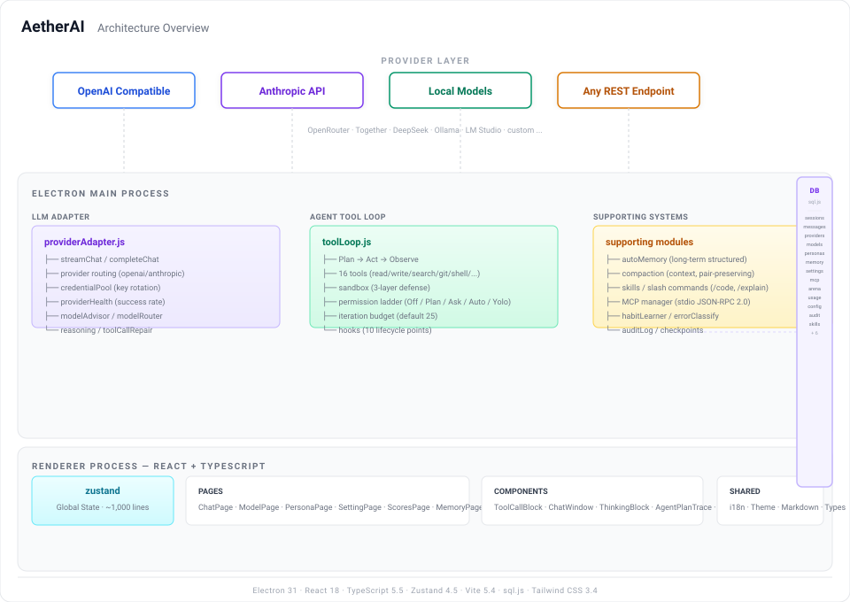

<div align="center">


# AetherAI

### A local-first, multi-model desktop AI workbench

**Electron · React · TypeScript · MCP · Agent · Skills**

[](https://github.com/TQSY114514/AetherAI/releases) [](https://github.com/TQSY114514/AetherAI/releases) [](https://github.com/TQSY114514/AetherAI/stargazers) [](https://github.com/TQSY114514/AetherAI/network/members) [](https://github.com/TQSY114514/AetherAI/issues) [](#contributing)

[](./LICENSE) [](#-download) [](#-install-from-source) [](#-tech-stack) [](#customization) [](#skills--extensibility)


[English](./README.md) · [繁體中文](./README.zh-TW.md) · [日本語](./README.ja.md) · [español](./README.es.md) · [français](./README.fr.md) · [Deutsch](./README.de.md) · [português](./README.pt.md) · [русский](./README.ru.md) · [українська](./README.uk.md) · [العربية](./README.ar.md) · [हिन्दీ](./README.hi.md) · [한국어](./README.ko.md)


---

> **Status: Beta.** AetherAI ist ein Einzel-/Hobbyprojekt. Es funktioniert, aber mit Ecken und Kanten. Fehlerberichte sind willkommen — siehe [CONTRIBUTING.md](./CONTRIBUTING.md) und [SECURITY.md](./SECURITY.md).


AetherAI vereint mehrere LLM-Anbieter (OpenAI / Claude / DeepSeek / lokale Modelle / jeden OpenAI-kompatiblen Endpunkt) in einer einzigen Desktop-Anwendung. Alle Daten werden lokal gespeichert — Ihre API-Schlüssel und Konversationen verlassen Ihren Rechner nie, außer zu den von Ihnen konfigurierten Anbietern.

## 📑 Table of Contents

- [✨ Funktionen](#-funktionen)
  - [🖥️ Chat](#️-chat)
  - [🤖 Agent (Function Calling)](#-agent-function-calling)
  - [🔒 Datenschutz](#-datenschutz)
- [🚀 Schnellstart](#-schnellstart)
- [📁 Projektstruktur](#-projektstruktur)
- [🤝 Danksagung](#-danksagung)
- [📄 Lizenz](#-lizenz)

---

## ✨ Funktionen

### 🖥️ Chat

- **Anbieter-Abstraktion** — eine einzige Adapter-Schicht; ein neues Anbieter-Format bedeutet nur eine zusätzliche Datei. Aktuell OpenAI-kompatibel (deckt OpenRouter, Together, DeepSeek, Ollamas OpenAI-Shim, LM Studio u. a. ab).
- **Gleichzeitiges Multi-Session-Streaming** — ein Chat kann streamen, während Sie in einem anderen weiter schreiben.
- **Arena** — ein Prompt, mehrere Modelle antworten gleichzeitig; stimmen Sie für die beste Antwort, und eine ELO-Rangliste wird automatisch aktualisiert.
- **Personas** — System-Prompt-Vorlagen, pro Sitzung umschaltbar.
- **Anhänge** — Textdateien werden als Kontext eingebettet; Bilder werden multimodal verarbeitet (erfordert ein Vision-Modell).
- **Lange-Eingaben einklappen** — beim Einfügen hunderter Zeilen wird der Text automatisch zu einem ausklappbaren Snippet zusammengefasst (ChatGPT-Stil).
- **Thinking-Effort-Schieber** — echte Parameter: OpenAI o-series → `reasoning_effort`, Claude → `thinking.budget_tokens`.
- **Seitenleisten-Zusammenfassungen** — Titel sind modellgenerierte Themenphrasen (z. B. „Neuer Eiyuu-Angel-Pull-Rat"), kein kopierter Text.
- **Erweiterte Einstellungen** — maximale Token, Temperature, top_p, benutzerdefiniertes System-Präfix, automatische Titel pro Sprache.
- **Benutzerdefinierter Hintergrund** — Bild hochladen mit Reglern für Deckkraft und Unschärfe.
- **15 UI-Sprachen** — English (Standard + kopfüber), 中文 (简体/繁體/文言), 日本語, español, français, Deutsch, português, русский, українська, العربية (RTL), हिन्दी, 한국어.
- **Themes** — Light / Dark / Blue / Glass / Retro.

### 🤖 Agent (Function Calling)

- **13 eingebaute Werkzeuge** (`read_file`, `list_dir`, `glob_find`, `grep_search`, `web_search`, `web_fetch`, `write_file`, `edit_file`, `run_command`, `git_status`, `git_diff`, `memory_save`, `memory_list`) mit einem Plan→Act→Observe-Loop und live Reasoning-Trace.
- **Agent-Berechtigungsmodi** — Aus / Nachfragen (jedes riskante Werkzeug bestätigen) / Auto (alles erlauben) / Plan (nur Lesen). Spiegelt das Berechtigungsmodell eines Coding-Agenten wider.
- **MCP-Unterstützung** — externe stdio-MCP-Server verbinden; deren Werkzeuge verschmelzen automatisch mit den eingebauten.
- **Tool call repair** — LLMs produzieren manchmal fehlerhaftes JSON; die Agenten-Schleife repariert automatisch fehlende Argumente, nicht quotierte Schlüssel und abgeschnittene Aufrufe vor der Ausführung.

---

## 🚀 Schnellstart

### Voraussetzungen
- Node.js 18+
- npm 9+

### Installieren & starten
```bash
cd app
npm install
npm run dev      # Entwicklung (Hot Reload)
npm run build    # das Produktions-Frontend bauen
npm start        # Electron starten
```

Oder führen Sie auf Windows `start.bat` im Repository-Stammverzeichnis aus.

### Ersten Anbieter konfigurieren
1. Klicken Sie nach dem Start in der Seitenleiste auf **Models**.
2. Fügen Sie einen Anbieter hinzu (Name / API-URL / API-Schlüssel).
3. Klicken Sie auf **Fetch models**, um die verfügbare Modellliste abzurufen.
4. Kehren Sie zum Chat zurück und legen Sie los.

---

<p align="center">
  
</p>

---

## 🤝 Danksagung

AetherAI steht auf den Schultern dieser Projekte — ihre Ideen haben die Architektur und UX geprägt:

- [Claude Code](https://github.com/anthropics/claude-code) — Berechtigungsmodell für Agenten, Thinking-Effort-Schieber, Visualisierung von Werkzeugaufrufen, der Leerzustand bei neuem Chat.
- [Continue](https://github.com/continuedev/continue) — deklarative Config als einzige Wahrheitsquelle, Anbieter-Abstraktion, Function-Calling-Protokoll.
- [Dify](https://github.com/langgen/dify) — Muster zur Normalisierung mehrerer Anbieter-Formate.
- [Model Context Protocol](https://modelcontextprotocol.io) — die MCP-Spezifikation, die der Agent von AetherAI spricht.
- [shadcn/ui](https://github.com/shadcn-ui/ui) — die cn()-/cva-Komponentenmethodik per Copy & Paste.
- [Magic UI](https://github.com/magicuidesign/magicui) — Animationsmuster (Streaming-Text, Shimmer, Blur-Fade).
- [new-api](https://github.com/QuantumNous/new-api) — Referenz für die Relay-Konvertierung des Reasoning-Effort.
- [OpenClaw](https://github.com/openclaw/openclaw) — README-Aufpolitur und Onboarding-Inspiration.
- [DS4](https://github.com/antirez/ds4) — structured task decomposition before execution.
- [Hermes](https://github.com/NousResearch/Hermes) — iteration budget, memory_manager pattern, structured memory extraction.

---

## 📄 Lizenz

MIT

---

<div align="center">

Built with ❤️ using Electron + React + TypeScript

[⬆ Back to top](#aetherai)

</div>
