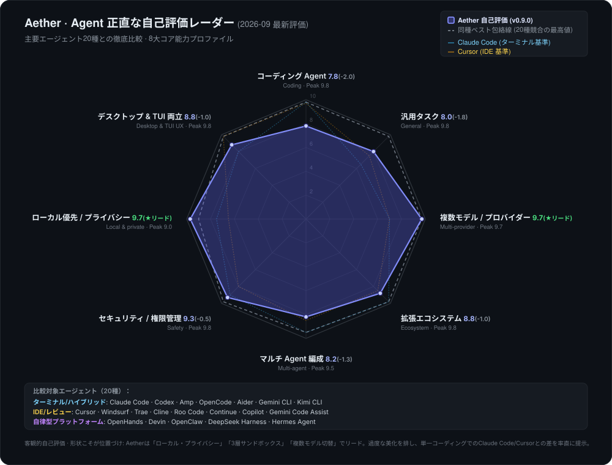

<div align="center">


# Aether

### ローカルファースト · マルチモデル · エージェントネイティブ

あらゆるモデルとチャットし、安全なコーディングエージェントを実行し、モデルを並べて比較 — デスクトップでもターミナルでも。

**Electron + Node.js · React + TypeScript · MCP · Agent · Skills**

[](https://github.com/TQSY114514/Aether/releases) [](https://www.npmjs.com/package/aetherai)

[](./LICENSE) [](#-download)


[English](./README.md) · [简体中文](./README.zh-CN.md) · [繁體中文](./README.zh-TW.md) · [文言文](./README.zh-WEN.md) · [日本語](./README.ja.md) · [español](./README.es.md) · [français](./README.fr.md) · [Deutsch](./README.de.md) · [português](./README.pt.md) · [русский](./README.ru.md) · [українська](./README.uk.md) · [العربية](./README.ar.md) · [हिन्दी](./README.hi.md) · [한국어](./README.ko.md)<br><sup>翻訳は英語版 / 簡体字中国語版より古い場合があります。</sup>

</div>

---

> **ステータス: Beta。** Aether はソロ / 趣味のプロジェクトです。動作しますが、粗い部分があることを想定してください。
> バグ報告は歓迎します — [CONTRIBUTING.md](./CONTRIBUTING.md) と
> [SECURITY.md](./SECURITY.md) を参照してください。

> [!CAUTION]
> **Windows SmartScreen の警告は想定内です。** Aether は学生開発者が商用コード署名証明書なしで開発しているため、Windows 11 / Defender が初回起動時に「Windows によって PC が保護されました」と表示することがあります。
> **アプリは安全なオープンソースです — コードを確認してから「詳細情報 → 実行」をクリックしてください。**
> アンチウイルスに隔離された場合は、アプリフォルダーを除外リストに追加してください（詳細は[ダウンロード](#ダウンロード)を参照）。設定した LLM プロバイダー以外にデータが PC の外へ出ることはありません。

**プラットフォーム: Windows のみ。** 公式ビルド、テスト、サポートは Windows を対象としています。macOS / Linux はソースからビルドできますが、公式にはサポートされていません。また、コード署名の予定はなく、初回起動時に SmartScreen の「発行元不明」プロンプトが表示されます（[ダウンロード](#ダウンロード) を参照）。

**あらゆるモデルに対応する 1 つのアプリ。** OpenAI / Claude / DeepSeek / ローカルモデル / あらゆる OpenAI 互換エンドポイント — チャット、コーディングエージェントの実行、ELO 投票によるマルチモデルアリーナでのモデルの直接比較が可能です。

**設計思想としてのローカルファースト。** API キーと会話はローカルの SQLite データベースに保存され、設定したプロバイダー以外には決してマシンの外に出ません。

**デフォルトで安全。** 内蔵エージェントは権限ラダー付きのワークスペースサンドボックス内で実行されます。ファイルとコマンドへのアクセスは実行前に確認され、すべてのツール呼び出しを監査できます。

---

## 2 つの製品形態、1 つの共通コア

Aether は**デュアルエンジン・アーキテクチャ**として提供され、まったく同等の一級体験を実現しています。水面下では 100% 同一のエージェントランタイム、SQLite メモリ、3 層セキュリティサンドボックスを共有しています:

- 🖥️ **Aether Desktop (GUI)** — Electron + React によるグラフィカル UI。視覚的なリッチテキスト、マルチウィンドウのドラッグ＆ドロップ、直感的なモデルアリーナと設定センターを備えています。**日常の開発やビジュアル操作を好む方、すべての新規ユーザーに強く推奨します。**（[GitHub Releases](#ダウンロード-デスクトップ) からダウンロード、すぐに使えます）
- ⌨️ **Aether ターミナル版 (CLI / TUI / SDK)** — Node.js 22+ と Ink v5 に基づく対話型ターミナル＆ヘッドレス SDK。ミリ秒起動、完全キーボード操作、行番号付き Diff 承認、SSH リモート開発や CI/CD 自動化にネイティブ対応。**ターミナル志向のパワーユーザーに推奨します。**（`npm i -g aetherai`、[セットアップ →](#ダウンロード-cli--tui--sdk)）

> 💡 **シームレスな連携**: 両者は `agentCore`、42 のツール、SQLite メモリ、マルチモデルルーティング、MCP サーバー、同一のセッションストアを共有します。GUI で開始したチャットは `aether tui --session <id>` でターミナルからそのまま再開でき、その逆も可能です。

---

**Aether の現在地 — 率直な自己評価。** 公開情報に基づき、主要なターミナル / IDE / プラットフォーム系エージェントツール16種との詳細な自己評価を実施しました（2026-09 最新評価；ベンチマークではなく推定値）。私たちはこの非対称な形状をありのままに提示しています。「ローカルファースト」「3層サンドボックスの安全性」「複数モデルの自由切替」において業界をリードする一方、単一モデルによる純粋なコーディング能力ではトップ集団に後れを取っている現実を率直に認めています。詳細な比較分析は [docs/competitive-analysis.md](docs/competitive-analysis.md) をご覧ください。

<p align="center"></p>

<sub>チャートは <a href="./app/scripts/gen-radar.cjs">app/scripts/gen-radar.cjs</a> により生成されました。16 種のツールスコアが埋め込まれており、<code>node app/scripts/gen-radar.cjs</code> で再現可能です。</sub>

---

## Aether の特長

Aether は、通常は複数のツールに分散している機能を、1 つのローカルデスクトップアプリに統合しています:

| 機能 | 説明 | 成熟度 |
|---|---|:---:|
| **マルチプロバイダーチャット** | 会話の途中で OpenAI、Claude、DeepSeek、あらゆる OpenAI 互換エンドポイントを切り替え可能。 | `Stable` |
| **エージェントツールループ** | Plan-Act-Observe ループ、サンドボックス化、権限ラダーを備えた 42 の内蔵ツール。 | `Beta` |
| **マルチモデルアリーナ** | 1 つのプロンプトを複数のモデルに送信し、最良に投票、ELO ランキングを追跡。 | `Beta` |
| **スキルと拡張性** | 置くだけで使える `SKILL.md` ファイル、MCP サーバー、10 ポイントのフックシステム。 | `Experimental` |
| **構造化メモリ** | エージェントがセッションをまたいで好みや過去の決定を思い出します。 | `Beta` |
| **階層的プランニング** | 複雑なリクエストを自動的に並行サブタスクへ分解。 | `Experimental` |
| **コンテキスト圧縮** | 長い会話をツール呼び出しペアを失わずに自動要約。 | `Beta` |
| **ローカルファーストのプライバシー** | 会話、キー、ペルソナをローカルの SQLite に保存。何もマシンの外に出ません。 | `Stable` |
| **15 の UI 言語** | 文語中国語（文言）と RTL アラビア語を含む。 | `Beta` |
| **ターミナル TUI** | Ink v5 の対話型ターミナル: セッションストリーム、ツールカード、diff 審査 / ロールバック、キーボード権限ゲート、`/fork` セッションツリー、`/memory`、todo パネル、`@` ファイル参照、`!` シェル、実行中の steering、セッションの resume。 | `Experimental` |
| **ヘッドレス CLI · RPC · SDK** | 4 モード CLI（単発 / NDJSON / JSONL RPC / パイプ）、Electron 不要の SDK（`aetherai/sdk`）、機械から呼び出し可能な JSONL プロトコル。 | `Experimental` |
| **MIT ライセンス** | 完全オープンソース。 | `Stable` |

---

## ダウンロード

> **どちらか 1 つ**を選んでください。両製品は同じエージェントランタイムとセッションストアを共有します。
> - **デスクトップのチャットアプリが欲しいだけ?** → [Aether Desktop](#ダウンロード-デスクトップ)
> - **ターミナルエージェント / CI / SDK が欲しい?** → [Aether CLI](#ダウンロード-cli--tui--sdk)

### ダウンロード — デスクトップ

**Windows — ビルド済みインストーラー（ほとんどのユーザーに推奨）**

最新の [Release](https://github.com/TQSY114514/Aether/releases) をダウンロード:

| ビルド | 説明 |
|---|---|
| **`aetherai-setup-x.y.z.exe`** | NSIS インストーラー。ユーザー単位（管理者不要）、アプリ内自動更新。**推奨。** |
| **`aetherai-x.y.z.exe`** | ポータブル単一 EXE。インストール不要、自動更新なし。実行するだけ。 |

> インストーラーは初回起動時に SmartScreen の「発行元不明」警告を表示します — 署名のない個人アプリとしては想定どおりです。すべてのデータはローカルに留まります。
>
> ⚠️ アプリが未署名のため、一部のアンチウイルスソフトウェアはパッケージング中に展開された `electron.exe` を隔離する場合があります。インストーラーが AV に削除された場合は、除外を追加するかポータブルビルドを使用してください。

### ダウンロード — CLI / TUI / SDK

**`aetherai`** は npm パッケージです。ヘッドレス CLI、Ink v5 の対話型 TUI、Electron 不要の SDK を 1 つのバイナリに同梱しています。

```bash
# Install once (requires Node.js ≥ 22)
npm install -g aetherai
# or, no install:
npx aetherai "fix the failing test" --model deepseek

# Interactive terminal UI (best in Windows Terminal)
aether tui

# Single-shot prompt (CI / scripts)
aether "summarize README.md"

# JSONL RPC for external scripts
echo '{"type":"request","reqId":"c1","method":"listModels","params":{}}' | aether --mode rpc
```

`aether` と `aetherai` は同じパッケージを指します。`npm install -g aetherai@0.8.0` でバージョンを固定すると、デスクトップのリリースと一致させられます。

> **GUI とのデータ共有** — 両製品は同じ SQLite データベース（`%APPDATA%/aetherai/aetherai.db`）を使用します。デスクトップアプリで開始したセッションは TUI で再開でき、その逆も可能です。

### ソースから実行（開発者 / パワーユーザー）

ソースから実行したい場合やコードを変更したい場合は、`start.bat` を使用してください（[Node.js 22+](https://nodejs.org) が必要）:

```bash
git clone https://github.com/TQSY114514/Aether.git
cd Aether
start.bat        # Windows: installs deps, builds frontend, launches Electron
```

手動のステップバイステップは [クイックスタート](#-quick-start) を参照してください。

> **2 つの製品、1 つのソースツリー** — 両製品は同じリポジトリにあります。`app/electron/` は共有のエージェントランタイム、`app/src/` はデスクトップのレンダラー、`app/cli.js` + `app/tui/` は CLI/TUI のエントリポイントです。リリースは git タグ（`v*`）で切り、1 つのタグからデスクトップインストーラーと npm パッケージの両方が得られます。

---

## クイックスタート

**前提条件:** Node.js 22+、npm 9+

```bash
cd app
npm install
npm run dev      # development (hot reload)
npm run build    # production frontend
npm start        # launch Electron
```

または Windows でリポジトリルートの `start.bat` を実行してください。

### ターミナルを試す（Electron ウィンドウは不要）

```bash
cd app && npm install
node cli.js tui              # 交互终端 UI（Node ≥ 22；Windows Terminal 体验最佳）
node cli.js "你好"           # 单发 prompt
echo "总结一下" | node cli.js  # 管道 stdin 作为 prompt
node cli.js --mode json "x"  # NDJSON 事件流（脚本/CI）
node cli.js tui --smoke      # headless 状态机冒烟
```

### プロバイダーの設定

1. 起動後、サイドバーの **Models** をクリックします。
2. プロバイダーを追加します（名前 / API URL / API キー）。
3. **Fetch models** をクリックして利用可能なモデル一覧を取得します。
4. チャットに戻って会話を始めます。

### Ask モードの有効化

1. **Settings - Agent & Safety** を開きます。
2. エージェントの権限モードを **Ask** に設定します。
3. ワークスペースルートがエージェントに読み書きさせたいフォルダであることを確認します。
4. 無制限アクセスが必要でない限り、**Yolo** は無効のままにします。

### 最初のエージェントタスクを実行

1. 新しいチャットを開きます。
2. 質問します: `List the files in this project and summarize what the app does.`
3. 提案された各ツール呼び出しを確認します。安全な読み取りは承認し、想定外のものは拒否します。
4. リアルタイムの推論トレースと最終回答を確認します。

---

## 機能

**ステータスラベル:** `Stable` = 日常利用可能、`Beta` = 既知の粗い部分はあるが利用可能、`Experimental` = 新しい / 高度な動作で変更される可能性あり、`Planned` = ドキュメント化されたロードマップ項目。

### チャット

| 機能 | ステータス | 説明 |
|---|:---:|---|
| **マルチプロバイダー** | `Stable` | 単一のアダプターレイヤー。プロバイダー追加 = 1 ファイル。OpenRouter、Together、DeepSeek、Ollama、LM Studio などに対応。 |
| **同時ストリーミング** | `Stable` | 別のチャットで話している間も、1 つのチャットがストリーミングされます。 |
| **思考量（Thinking-effort）スライダー** | `Beta` | 実際のパラメータ: リレー経由の OpenAI o シリーズ / gpt-5 / Claude。推論モデルでのみ有効。 |
| **添付ファイル** | `Beta` | テキストファイルをコンテキストとして。画像はマルチモーダル用（ビジョンモデルが必要）。 |
| **長文ペーストの折りたたみ** | `Stable` | 数百行を展開可能なスニペットに自動折りたたみ（ChatGPT スタイル）。 |
| **メッセージ編集** | `Stable` | 任意の時点から上書き + 再生成。 |
| **メッセージ検索** | `Stable` | 全メッセージにわたりハイライト表示付き。 |
| **サイドバーの要約** | `Beta` | モデル生成のトピックフレーズ（コピーされたテキストではない）。 |

### エージェント（Function Calling）

- `Beta` **42 の内蔵ツール** — ファイル操作（`read_file`、`list_dir`、`glob_find`、`grep_search`、`write_file`、`edit_file`、`apply_patch`）、ウェブ（`web_search`、`web_fetch`）、シェル（`run_command`）、git & GitHub（`git_status`、`git_diff`、`git_log`、`git_commit`、`git_push`、`git_create_branch`、`github_pr_create/list/merge/review`、`github_issue_create/list`、`github_release_create`、`github_actions_status`）、コードインテリジェンス（`find_symbol`、`lsp_definition`、`lsp_references`、`lsp_diagnostics`、`lsp_code_actions`、`lsp_rename`）、エージェントメタ（`use_skill`、`ask_user`、`todo_write`、`delegate_task`、`task`、`memory_save/list/search`、`get_project_context`、`review_code`、`debug_loop`、`test_first`）— Plan-Act-Observe ループ、ライブ推論トレース + タスクチェックリスト、ループ検出、ツールごとのタイムアウト、設定可能な反復予算（デフォルト 25 ラウンド）、コンテキスト圧縮付き。
- `Experimental` **階層的プランニング** — 複雑なリクエストに対するタスク分解を自動生成。
- `Experimental` **サブエージェント委譲** — 独立したサブタスクが `delegate_task` 経由で並行実行されます。
- `Stable` **権限モード** — リスクの昇順ラダー:

| モード | 説明 | サンドボックス |
|---|---|:---:|
| **Off** | ツールなしの通常チャット | N/A |
| **Plan** | 読み取り専用ツール（変更なしで調査） | - |
| **Ask** | リスクのある各アクションを確認（推奨） | - |
| **Auto** | すべて実行、確認なし | Yes |
| **Yolo** | 完全な権限、サンドボックスなし | No |

- `Stable` **ワークスペースサンドボックス** — 設定されたワークスペースルート外では `write_file`/`edit_file` を拒否。`run_command` は破壊的なパターンをブロック。Settings - Agent & Safety で設定可能。
- `Beta` **コンテキスト圧縮** — 古い履歴を自動要約（ツール呼び出し / 結果のペアはそのまま保持。識別子は逐語的に保存）。
- `Beta` **ツール呼び出しの修復** — 不正な JSON、欠落した引数、引用符のないキー、切り詰められた呼び出しを自動修復。

### メモリと学習

- `Beta` **自動長期メモリ** — 各ターンの前に関連するメモリを注入。重要な事実を自動的に抽出して保存。Settings - Agent で切り替え可能。
- `Experimental` **習慣学習機能** — 繰り返し現れる好み（例: 「常に Claude を使う」）を検出し、自動適用されるスキルを提案。
- `Beta` **監査ログ** — デバッグ用のターンごとのエージェント実行トレース。

### アリーナ

- `Beta` **マルチモデルアリーナ** — 1 つのプロンプトに対して複数のモデルが**同時に**回答。最良に投票すると **ELO リーダーボード**が自動更新されます。モデルは**意図ごと**にスコアリングされます（コーディング / 数学 / 翻訳 / 要約 / 一般）。*ELO を備えた内蔵マルチモデルアリーナを同梱するローカルファーストのデスクトップチャットアプリは他にありません。*

### スキルと拡張性

| コンポーネント | 形式 | ステータス | 詳細 |
|---|---|:---:|---|
| **スキル** | `SKILL.md` | `Experimental` | `<workspace>/.claude/skills/` に置くだけ。`release-checklist` と `git-commit` を同梱 |
| **スラッシュコマンド** | `CMD.md` | `Stable` | 内蔵 6 種: `/code`、`/continue`、`/explain`、`/polish`、`/summarize`、`/translate` |
| **フック** | スクリプト | `Experimental` | ライフサイクル 10 ポイント: PreToolUse、PostToolUse、ToolError、PreCompact、PostCompact、PreSend、PostResponse、SessionStart、SessionEnd、SubagentStop |
| **MCP** | stdio JSON-RPC 2.0 | `Beta` | 外部 MCP サーバーが内蔵ツールに自動的に統合されます |

### カスタマイズ

| 設定 | ステータス | 説明 |
|---|:---:|---|
| **高度なモデル設定** | `Stable` | Max tokens、temperature、top_p、カスタムシステムプレフィックス、言語別自動タイトル、思考量 |
| **カスタム背景** | `Stable` | 不透明度 / ぼかしコントロール付きで画像をアップロード |
| **ペルソナ** | `Stable` | システムプロンプトのプリセット。セッションごとに切り替え可能 |
| **テーマ** | `Stable` | ライト / ダーク / ブルー / グラス / レトロ |
| **15 の UI 言語** | `Beta` | 英語、中国語（簡 / 繁 / 文言）、日本語、スペイン語、フランス語、ドイツ語、ポルトガル語、ロシア語、ウクライナ語、アラビア語（RTL）、ヒンディー語、韓国語 |
| **自動更新** | `Beta` | NSIS インストーラーは起動時にチェック。ポータブル版もチェックします（手動インストール） |
| **使用量トラッキング** | `Beta` | トークン、コスト、レイテンシ、キャッシュヒット率を含む API 呼び出しごとのログ |

### プライバシー

> **すべてのデータはローカルに留まります。** Aether はあなたに関する情報を収集もアップロードもしません。API キー、会話、ペルソナはローカルの SQLite データベースに保存されます。送信されるネットワークリクエストは、設定した LLM プロバイダーへのものだけです。

---

## ターミナル TUI、RPC、SDK

デスクトップアプリと通常の CLI に加えて、Aether は対話型ターミナル UI、機械から呼び出し可能な JSONL RPC モード、Electron 不要の SDK を提供します。3 つすべてがデスクトップと同じエージェントコア、メモリ、ペルソナ、MCP ツール、権限ルールを共有します。

### クイックスタート — 2 つの形態

```bash
# Interactive terminal UI (Ink v5; requires Node ≥ 22)
node app/cli.js tui                # real terminal: type, approve tools, review diffs
node app/cli.js tui --smoke        # headless state-machine smoke (CI-safe, prints JSON)

# Single-shot prompt (same as before)
node app/cli.js "fix the failing test" --mode auto --max-iterations 30

# NDJSON event stream for scripts/CI (compat: --json-lines)
echo "summarize README.md" | node app/cli.js --mode json --model deepseek

# JSONL RPC loop over stdin/stdout
printf '{"type":"request","reqId":"c1","method":"listModels","params":{}}\n' \
  | node app/cli.js --mode rpc --db path\to\aetherai.db
```

追加のヘッドレスフラグ: `--persona <id>`（persona + メモリ注入）、`--memory-trace`（注入したメモリエントリ数を報告）、`--skills`（スキル提案 JSON）、`--setup-term`（Windows Terminal プロファイルを書き込み）、`--stdin`（明示的なパイプ入力）、`--resume` / `--session <id>` / `--fork [<id>]`（セッションを再開。context-only — この実行のターンは書き戻されない）、`-o` / `--output-last-message <file>`（最終回答をファイルに書き込み）、`--version`、`--list-models` / `--list-providers`、`aether completion bash|zsh|powershell`（シェル補完スクリプト）。

デフォルトは `~/.config/aether/config.json`（`model` / `mode` / `workspace` / `maxIterations`）と環境変数 `AETHER_MODEL` / `AETHER_MODE` / `AETHER_WORKSPACE` / `AETHER_MAX_ITERATIONS` / `AETHER_CONFIG` から取得されます。優先順位: CLI フラグ > 環境変数 > 設定ファイル > DB デフォルト。JSON の `done` フレームは、価格テーブルが利用可能な場合に `estimatedCost`（USD）を運びます。

### TUI（`aether tui`）

対話型ターミナルエージェント（Ink v5; Node ≥ 22; Windows Terminal での体験が最良）:

- **セッション**: メッセージのストリーミングレンダリング、毎ターン SQLite に保存（終了しても失われない）、`--continue` / `--session <id>` / `--fork` で再開、最初のプロンプトから自動タイトル、`/fork` セッションツリー（`session.parent_session_id`）、`/sessions`、`/use <id>` での履歴切り替え
- **1 つのランタイム、複数のクライアント**: デスクトップ GUI と TUI は同じ SQLite セッションを共有します — GUI で開始したチャットは `aether tui --session <id>` でターミナルから続きを行え（ID 一覧は `aether tui --continue` または GUI サイドバーで）、その逆も可能です。ヘッドレス CLI（`--resume`/`--fork`）も同じセッションを読み取ります。
- **ツールと権限**: ツール呼び出しカード（ステータス色 / 所要時間 / 要約）、diff 審査（`Alt+v` で展開、`Enter` で受け入れ / `r` でロールバック — 書き込み前のスナップショットを復元、git ディレクトリでなくても有効）、キーボード権限ゲート（`y` で 1 回許可 / `a` で常に許可 / `n` で拒否、または `←→` で選択）、読み取り専用ツールは自動通過
- **承認モード**: `Shift+Tab` で `manual → auto-edits → plan` を循環（plan = 読み取り専用のプランニング。完了後に 3 つの選択肢で実施方法を決定）;`/approval-mode dontask` はルールのみの承認を実行（書き込みツールには allow ルールが必要）
- **モード**: `Alt+m` で ask/plan/auto を切り替え。`/persona <id>` でペルソナを切り替え（persona + メモリプレフィックスを注入）
- **leader ショートカット**: `Ctrl+X` の後に `m` モデルセレクター / `n` 新規セッション / `l` セッションリスト / `g` タイムライン / `r` rewind チェックポイント / `q` 終了 / `e` 外部エディター
- **コマンドパレット**: `Ctrl+P` または `x`（New chat / Model / History (sessions) / Timeline / Export JSONL / Help / Quit）
- **キー再バインド可能**: `~/.config/aether/keybindings.json`（例: `{ "char:?": null }` で `?` ヘルプキーを無効化）
- **API キーの永続化**: `/apikey <provider> <key>` で `auth.json` に保存（デスクトップ版の safeStorage で暗号化されたキーはヘッドレスでは復号できないため、このコマンドまたは環境変数 `AETHER_API_KEY` を使用）
- **メモリとスキルのループ**: `/memory <キーワード>` で検索、`--memory-trace` で注入エントリ数、`/skills` + `/skill accept|dismiss <key>`（habitLearner → スキル提案）
- **todo とお気に入り**: `Ctrl+T` でエージェントのライブ todo チェックリストを切り替え、`Ctrl+F` で現在のモデルをお気に入りに追加/解除（永続化）、`F2` で最近のモデルを循環
- **`@` ファイルと `!` シェル**: `@` を入力するとファイルピッカー（送信時にファイル内容を注入、≤50KB）、`!command` でシェルコマンドをサンドボックス経由で実行し、その出力をモデルに渡します
- **セッションコンテキストコマンド**: `/compact` / `/compress-fast`（履歴を圧縮）、`/context`（使用量）、`/clear`（新規セッション）、`/undo`（最後のターン + ファイルスナップショットをロールバック）、`/recap`（1 行要約）、`/rename` / `/delete`、`/diff`（未コミット変更ビューアー）、`/permissions add <name> <ruleKey> <allow|deny|ask>`、`/provider add|list`
- **初回起動のブートストラップ**: デスクトップ版の実行は不要 — `aether tui` がデータベースを自動作成し、`/provider add` でのプロバイダー設定を案内します
- **steering**: 実行中に `Ctrl+C` で中断 → 次の入力を入力 → 現在のループに注入（キューに `steer:n` を表示）。実行中に `Tab` で次の入力を直接キューに入れる
- **ショートカットキー**: `Esc` ダブルクリックで終了（または `/quit`）、`Esc` で入力をクリア（下書きは履歴に残る）、`?` でヘルプ画面、`PgUp/PgDn` / マウスホイールでページ送り、ステータスバーに `approval/mode/model/tok/ctx` をリアルタイム表示。完全なキー一覧は [docs/tui-keys.md](./docs/tui-keys.md) を参照

### RPC（`aether --mode rpc`）

stdin/stdout 上の機械から呼び出し可能な JSONL プロトコル: `request` フレームを入力し、`event`/`result`/`error` フレームを出力 — 1 行に 1 つの JSON オブジェクトで、人間向けテキストはありません。メソッド: `run`（`text`/`tool`/`plan`/`status` イベントをストリーミング）、`listModels`、`listProviders`、`models.default`、`listSessions`、`session.load`、`session.fork`、`task.derive`、`task.status`。フレームのリファレンス: [docs/rpc.md](./docs/rpc.md)。

### SDK（`require('aetherai/sdk')`）

外部 Node プロジェクト向けにエージェントコアを集約した Electron 不要の SDK: `runAgent`、`openDatabase`、`resolveProviderModel`、`taskDbAdapter`、`memory`（prefetch/recall/search/…）、`classifyAgentMode`、`rpc` フレーム、`sessionContext`（persona + メモリ注入）。型宣言を含む（`app/electron/sdk/index.d.ts`）。

```js
const { runAgent, openDatabase, resolveProviderModel, classifyAgentMode } = require('aetherai/sdk')
const db = openDatabase('./aetherai.db')
const { provider, model } = resolveProviderModel(db, { modelName: 'deepseek' })
console.log(classifyAgentMode({ prompt: 'delete the file' })) // { mode: 'ask', reason: ... }
```

---

## Windows ネイティブ機能

| 機能 | 説明 |
|---|---|
| **トレイメニュー** | ウィンドウの表示 / 非表示、新規セッション、**新規タスク**（TaskPanel を直接開く）。トレイクリックで表示 / 非表示を切り替え。 |
| **グローバルショートカット** | `Ctrl+Alt+A` でメインウィンドウを呼び出し（未起動なら作成）。登録結果は起動ログに書き込み。 |
| **`aetherai://` プロトコル** | `aetherai://new` / `chat` で新規セッション。`aetherai://tui` でターミナル形態を起動。`aetherai://open/?path=<エンコードされたパス>` でフォルダをワークスペースに設定して新規セッションを作成（右クリック「Aether で開く」リンク）。 |
| **右クリック登録** | `app/resources/register-protocol.reg`（`<AETHER_EXE>` を置換して管理者としてインポート）: `.cs/.js/.ts/.tsx/.md/.json` + フォルダ → 右クリック「Aether で開く」。 |
| **ターミナルブートストラップ** | `app/resources/term/aether.ps1`（エイリアス + `aether tui` を起動）。`node app/cli.js --setup-term` で Windows Terminal プロファイルを書き込み（ダーク / ライトの 2 セットの配色）。 |
| **サンドボックス強化** | Windows パス防御: `\\?\` 長パス、UNC `\\server\share`、再解析ポイント / ジャンクションのエスケープ、`.lnk/.scr/.msi` などの危険な拡張子。 |

---

## プロジェクト構成

```
app/
├── electron/              # main process (Node)
│   ├── database.js        # better-sqlite3 data layer — 25+ tables (WAL)
│   ├── ipc/               # IPC handlers (chat / arena / session / mcp / ...)
│   │   ├── chat.handler.js    # THE central handler (540 lines)
│   │   ├── arena.handler.js   # Multi-model arena with ELO
│   │   ├── agent.handler.js   # Workspace management
│   │   └── ...
│   ├── llm/               # LLM abstraction (~3,700 lines, 19 files)
│   │   ├── providerAdapter.js # Dispatch by api_format (openai/anthropic)
│   │   ├── openaiAdapter.js   # OpenAI-compatible SSE streaming + retry
│   │   ├── anthropicAdapter.js# Anthropic Messages API
│   │   ├── credentialPool.js  # Multi-key rotation + cooldown
│   │   ├── toolLoop.js        # Plan-Act-Observe with iteration budget
│   │   ├── planning.js        # Hierarchical task decomposition
│   │   ├── subAgent.js        # Parallel sub-agent delegation
│   │   ├── compaction.js      # Context compaction (pair-preserving)
│   │   ├── autoMemory.js      # Long-term structured memory
│   │   ├── habitLearner.js    # Recurring preference -> auto-skills
│   │   ├── hooks.js           # 10-point extensibility hooks
│   │   ├── skills.js          # SKILL.md loader (Claude Code format)
│   │   ├── modelAdvisor.js    # Heuristic model suggestion
│   │   ├── toolCallRepair.js  # Malformed tool-call recovery
│   │   ├── auditLog.js        # Per-turn agent execution trace
│   │   └── ...
│   ├── tools/             # built-in tool registry + sandbox
│   │   ├── registry.js       # 16 tool definitions (OpenClaw-inspired)
│   │   └── sandbox.js        # 3-layer defense (workspace root, traversal guard, blocklist)
│   ├── mcp/               # MCP client + server manager
│   ├── main.js / preload.js
├── src/                   # renderer (React + TS + Zustand)
│   ├── store/index.ts     # Zustand global state (~1,000 lines)
│   ├── components/        # UI (chat / sidebar / settings / ui)
│   ├── pages/             # Chat / Models / Persona / Settings / Scores / ...
│   ├── utils/             # i18n (15 locales) / theme / markdown
│   └── types/
├── skills/                # Built-in skills (release-checklist, git-commit)
├── commands/              # Built-in slash commands (/code, /explain, /polish, ...)
└── resources/             # App icons
```

---

## 技術スタック

| レイヤー | 技術 |
|---|---|
| Desktop | Electron 43 |
| Frontend | React 18.3 + TypeScript 5.8 |
| State | Zustand 4.5 |
| Build | Vite 8 + electron-builder |
| Database | better-sqlite3 (native SQLite, WAL mode) |
| LLM | OpenAI-compatible + Anthropic Messages API |
| UI | Tailwind CSS 3.4, lucide-react, highlight.js |
| MCP | Custom stdio JSON-RPC 2.0 client |
| TUI | Ink 5 + React 18 (createElement, no JSX) |
| CLI/SDK | Node.js headless CLI (4 modes) + Electron-free SDK |

---

## 謝辞

Aether は以下のプロジェクトの上に成り立っています — そのアイデアがアーキテクチャと UX を形作りました:

### エージェントフレームワーク

| プロジェクト | 着想 |
|---|---|
| [OpenClaw](https://github.com/openclaw/openclaw) | コンテキスト圧縮、ツール呼び出しループ検出、イベントストリームアーキテクチャ |
| [Hermes Agent](https://github.com/NousResearch/hermes-agent) | 反復予算、構造化された長期メモリ、自律スキル、cron スケジューラ、FTS5 メモリ検索 |
| [Evolver](https://github.com/EvoMap/evolver) | 自己進化エンジン、GEP（Genome Evolution Protocol） |
| [Aider](https://github.com/Aider-AI/aider) | LLM コーディングアシスタントのツールループ、git 統合 |
| [Cline](https://github.com/cline/cline) | IDE 埋め込みエージェント、MCP 統合、権限 UX |
| [OpenCode](https://github.com/sst/opencode) | TUI のキーボード/テーマ/権限 UX、プロンプトキャッシュポリシーレイヤー |
| [OpenAI Codex](https://github.com/openai/codex) | サンドボックスのプロセスツリー分離、経過時間/ステータス表示 UX |

### UI & UX

| プロジェクト | 着想 |
|---|---|
| [shadcn/ui](https://github.com/shadcn-ui/ui) | cn() のコピーペーストコンポーネント手法 |
| [Magic UI](https://github.com/magicuidesign/magicui) | アニメーションパターン（shimmer、blur-fade） |
| [cc-switch](https://github.com/farion1231/cc-switch) | 使用統計ダッシュボードのレイアウト |

### インフラストラクチャ

| プロジェクト | 着想 |
|---|---|
| [MCP](https://modelcontextprotocol.io) | Aether のエージェントが話す仕様 |
| [new-api](https://github.com/QuantumNous/new-api) | reasoning-effort パラメータ形状（リレー変換ロジック） |

---

## コントリビューション

すべてのコントリビューションを歓迎します! バグ修正、機能リクエスト、翻訳の改善、ドキュメント更新のいずれであっても、Issue を開くか PR を送ってください。

1. リポジトリをフォーク
2. フィーチャーブランチを作成（`git checkout -b feat/my-feature`）
3. 変更をコミット（`git commit -am 'Add feature'`）
4. ブランチにプッシュ（`git push origin feat/my-feature`）
5. プルリクエストを開く

詳細なガイドラインは [CONTRIBUTING.md](./CONTRIBUTING.md) を参照してください。

---

## ライセンス

[MIT](./LICENSE) © 2025 Aether

---

<div align="center">

Electron + Node.js + React + TypeScript で ❤️ を込めて作られました

[⬆ 先頭に戻る](#aether)

</div>
