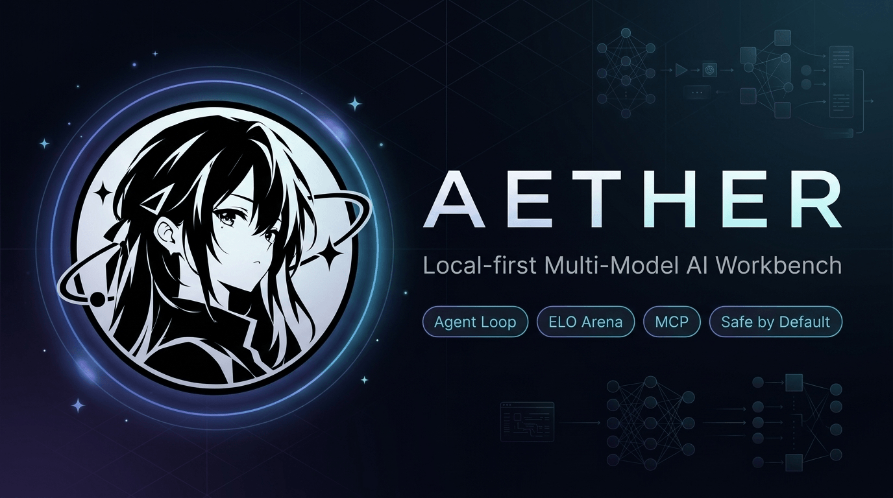

<div align="center">



# Aether

### Local-first Agent Workbench · Built-in Arena · Safe by Default

**Stop wondering which model is best — Aether tests them on your own tasks and picks for you.**

[](https://github.com/TQSY114514/Aether/releases)
[](https://github.com/TQSY114514/Aether/releases)
[](https://www.npmjs.com/package/aetherai)
[](https://www.npmjs.com/package/aetherai)
[](https://github.com/TQSY114514/Aether/actions/workflows/ci.yml)
[](./LICENSE)
[](#-download)

[English](./README.md) · [简体中文](./README.zh-CN.md)

</div>

---

## Why Aether in 60 Seconds

Most AI coding tools force you to pick a single model and trust it blindly. Aether treats models as pluggable engines and keeps you in full control:

1. **Benchmark on your own tasks.** Open the built-in **Arena**, send a prompt to multiple models concurrently, and vote on the best answer. Local ELO ratings update per task type (coding, reasoning, translation).
2. **Hand over work safely.** Point Aether at your project in **Ask mode**. The agent plans, inspects files, and executes commands — but asks for your approval before every risky step.
3. **Inspect before landing.** Every proposed file modification renders an inline diff; terminal commands stream real-time stdout and can be halted immediately.
4. **Local-first privacy.** API keys, chat history, and memory stay in a local SQLite database (`%APPDATA%/aetherai/`). Zero telemetry, no cloud accounts, no middleman servers.

---

## Two Interfaces, One Unified Runtime

Aether provides two first-class interfaces sharing the exact same agent core, local SQLite storage, memory, and permission sandbox:

- 🖥️ **Aether Desktop (GUI)** — Electron + React workbench with rich Markdown streaming, visual Model Arena, live reasoning trace, and settings.
- ⌨️ **Aether Terminal (TUI / CLI / SDK)** — Lightweight Ink v5 interactive terminal (`aether tui`) with full keyboard navigation, line-numbered diff reviews, headless CI modes (`--mode json|rpc`), and an Electron-free SDK (`require('aetherai/sdk')`).

> 💡 **Seamless Continuity**: Start a session in the desktop app, and resume it in the terminal with `aether tui --session <id>` (and vice versa).

---

## Honest Positioning

Aether's strength lies in **local-first privacy, multi-model evaluation, and multi-tier sandbox safety**. We honestly acknowledge that our raw single-model coding assistance does not aim to replace full-blown proprietary IDEs like Cursor — our goal is to give you a reliable, transparent workbench where you benchmark models on your own workload.

> 📊 **Detailed 20-Peer Competitive Analysis**: For our open, reproducible evaluation matrix comparing Aether across 8 dimensions against Claude Code, Codex, Cursor, OpenHands, and 16 others, see [docs/competitive-analysis.md](./docs/competitive-analysis.md) (and [architecture radar](./assets/agent-radar-2026.en.svg)).

---

## Download & Getting Started

### 1. Terminal & CLI (Cross-Platform: macOS, Linux, Windows)

The headless agent runtime and interactive terminal are 100% cross-platform (Node.js ≥ 22):

```bash
# Install globally
npm install -g aetherai

# Launch interactive terminal UI (TUI)
aether tui

# One-shot coding or debugging task
aether "run test suite and fix failing tests" --model deepseek

# Headless JSONL RPC for scripts and subagents
aether --mode rpc
```

### 2. Desktop Workbench (Windows)

Download the latest desktop release from [GitHub Releases](https://github.com/TQSY114514/Aether/releases):

- **`aetherai-setup-x.y.z.exe`** (Installer, recommended)
- **`aetherai-x.y.z.exe`** (Portable, zero install)

> **Note on Windows SmartScreen**: Aether is built by an independent developer without a commercial code-signing certificate. If Windows 11 / Defender displays "Windows protected your PC", click **More info → Run anyway**. The project is 100% open source.

### 3. Run from Source

```bash
git clone https://github.com/TQSY114514/Aether.git
cd Aether

# Windows (installs deps, builds frontend, launches Electron)
start.bat

# Linux / macOS (defaults to terminal TUI; add --desktop for GUI workbench)
./start.sh              # Terminal TUI
./start.sh --desktop    # Electron GUI workbench
```

---

## Core Capabilities

- **Multi-Model Arena**: Real-time concurrent model generation with ELO leaderboard scoring categorized by intent.
- **Permission Ladder**: Fine-grained capability control (`Plan` → `Ask` → `Auto` → `Yolo`) backed by an allowlist command sandbox and sensitive file protection.
- **Live Terminal Execution**: Real-time streaming stdout/stderr inside tool call blocks, matching Claude Code-style live execution feedback.
- **Context Compaction**: Automated history summarization that preserves intact tool-call pairs and key technical decisions.
- **MCP Extensibility**: Connect any Model Context Protocol stdio server seamlessly with automatic namespacing (`server__tool`).
- **Structured Memory**: Persistent project-level and user-level facts in SQLite with FTS5 keyword indexing.

---

## Acknowledgements

Aether stands on the shoulders of these innovative open-source projects and architectures:

### Agent Frameworks & Runtime Design

- [Claude Code](https://claude.ai/code) (Anthropic) — Verification debug loop (`debugAgent.js`), 10-point lifecycle hook system (`hooks.js`), permission ladder (`trustEngine.js`), terminal streaming tool execution, and the Ask/Plan/Yolo mode paradigm.
- [pi](https://github.com/badlogic/pi-mono) (Mario Zechner) — `AgentMessage` abstraction separating UI representation from LLM wire format, unified event-stream telemetry architecture, and runtime mid-loop steering (`agent.steer()`).
- [OpenClaw](https://github.com/openclaw/openclaw) — Context compaction algorithm, tool-call loop detection, event-stream orchestration, and tool result sanitization middleware.
- [Hermes Agent](https://github.com/NousResearch/hermes-agent) — Iteration budget control, structured long-term SQLite memory, and FTS5 memory retrieval.
- [Evolver](https://github.com/EvoMap/evolver) — Genome Evolution Protocol (GEP) reflection architecture.
- [Aider](https://github.com/Aider-AI/aider) — LLM coding-assistant interaction patterns and git workflow integration.
- [OpenCode](https://github.com/sst/opencode) — TUI keyboard navigation, permission gate UX, and prompt cache policy.
- [OpenAI Codex](https://github.com/openai/codex) — Process-tree isolation and evidence-based verification concepts.
- [DS4](https://gist.github.com/antirez) (Salvatore Sanfilippo) — Pre-execution hierarchical task planning and decomposition.
- [Continue](https://github.com/continuedev/continue) — Declarative configuration schema ("config is code").
- [Grok Build](https://x.ai) — Specialized agent roles and long-running execution patterns.

### UI, Infrastructure & Tooling

- [shadcn/ui](https://github.com/shadcn-ui/ui) — Copy-paste component methodology and clean utility tokens.
- [Magic UI](https://github.com/magicuidesign/magicui) — Zero-dependency CSS animations (shimmer, blur-fade).
- [cc-switch](https://github.com/farion1231/cc-switch) — Usage metrics dashboard layout inspiration.
- [Model Context Protocol (MCP)](https://modelcontextprotocol.io) — Standardized tool integration protocol.
- [new-api](https://github.com/QuantumNous/new-api) — Reasoning effort parameter mappings and relay format conversion.

---

## Contributing & Community

Contributions are welcome! If you encounter an issue or have an idea, please open an issue or submit a pull request.

- **Found a bug?** Submit via [GitHub Issues](https://github.com/TQSY114514/Aether/issues/new)
- **Contributing**: Please review [CONTRIBUTING.md](./CONTRIBUTING.md) and [docs/roadmap.md](./docs/roadmap.md) before submitting major architectural changes.

---

## License

[Apache-2.0](./LICENSE) © 2025-2026 Aether
