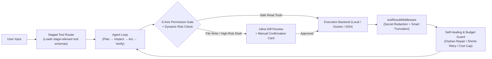
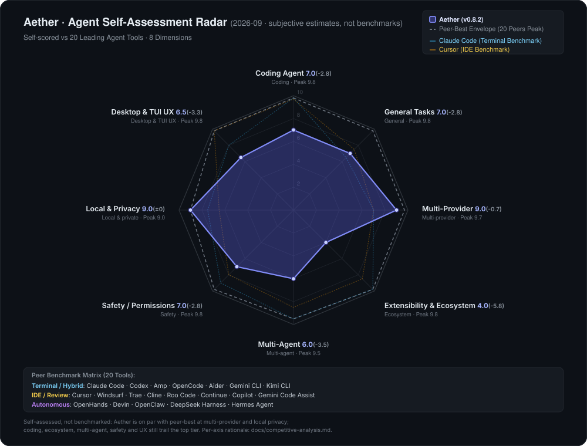

<div align="center">

<picture>
  <source media="(prefers-color-scheme: dark)" srcset="./assets/readme-hero-dark.png" />
  <source media="(prefers-color-scheme: light)" srcset="./assets/readme-hero-light.png" />
  
</picture>

# Aether

### Local-first Agent Workbench · Built-in Arena · Safe by Default

Benchmark multiple models concurrently on your actual tasks and route work based on empirical performance. Desktop GUI and Terminal TUI share the exact same local SQLite database, long-term memory graph, and permission sandbox.

[](https://github.com/TQSY114514/Aether/releases)
[](https://github.com/TQSY114514/Aether/releases)
[](https://www.npmjs.com/package/aetherai)
[](https://www.npmjs.com/package/aetherai)
[](https://github.com/TQSY114514/Aether/actions/workflows/ci.yml)
[](./LICENSE)
[](#1-windows-desktop-installation-primary-edition--recommended)

**[English](./README.md)** · [简体中文](./README.zh-CN.md) · [日本語](./README.ja.md) · [Roadmap](./docs/roadmap.md) · [20-Peer Competitive Matrix](./docs/competitive-analysis.md)

</div>

---

## Overview

Aether is a local-first AI workbench built with Electron, React/TypeScript, better-sqlite3 (WAL mode), and Ink v5. It treats LLM providers as pluggable compute backends without requiring cloud accounts or telemetry servers. All sessions, encrypted API keys, memories, and evaluation metrics reside locally in `%APPDATA%/aetherai/aetherai.db`.

It is designed around four engineering requirements:

1. **Empirical Model Evaluation (Arena)**: Public benchmarks rarely reflect your specific codebase or workflow. Aether lets you send the same task to multiple models concurrently, vote on blind outputs, and maintain local intent-categorized ELO ratings.
2. **Capability-Gated Execution (Permission System)**: The agent can inspect files and execute shell commands, but mutations are gated by a 6-axis permission model (`READ`, `WRITE`, `EXECUTE`, `NETWORK`, `GIT`, `EXTERNAL`) with inline Diff previews before changes land on disk.
3. **Structured Long-Term Memory (AutoMemory & Knowledge Graph)**: Facts, architectural decisions, and entity relationships are asynchronously extracted into SQLite + FTS5 tables, scoped per workspace, and prefetched in `< 2ms` without wasting extra LLM tool-call turns.
4. **Desktop-First Runtime with Terminal Continuity**: **Development focus is centered on the Windows Desktop Workbench (GUI)**, which hosts the full visual Model Arena, Knowledge Graph manager, inline Diff reviewer, and provider hub. A lightweight Terminal UI (`aether tui` / CLI) is provided as a companion extension sharing the same SQLite database.

---

## Getting Started

> **Recommended Edition**: Aether's primary engineering focus and full feature set (side-by-side visual Arena, interactive Diff approval cards, Knowledge Graph visualization, and settings) live in the **Windows Desktop application**. For the complete experience, **we strongly recommend downloading the Windows Desktop edition**.

### 1. Windows Desktop Installation (Primary Edition · Recommended)

Download the latest release from [GitHub Releases](https://github.com/TQSY114514/Aether/releases):

- **`aetherai-setup-x.y.z.exe`**: Standard installer (includes desktop shortcuts and auto-update support; **recommended for most users**).
- **`aetherai-x.y.z.exe`**: Portable single-file executable (zero installation).

> **Note on Windows SmartScreen**: Aether is maintained by an independent developer without a commercial code-signing certificate. If Windows Defender displays *"Windows protected your PC"* on first launch, click **More info → Run anyway**.

### 2. Terminal Companion & CLI (Companion Extension · Cross-Platform)

The headless agent runtime, interactive TUI, and SDK run on Windows, macOS, and Linux (requires **Node.js ≥ 22**):

```bash
# Install globally
npm install -g aetherai

# Launch interactive terminal UI (Ink v5)
aether tui

# Resume an existing session (including sessions created in the Desktop GUI)
aether tui --session <session_id>

# Execute a one-shot task from the command line
aether "run test suite and fix failing unit tests" --model deepseek

# Start headless JSONL RPC server for scripts and subagents
aether --mode rpc
```

### 3. Configuring LLM Providers

On first launch, open **Settings → Providers** in the sidebar to configure one or more API endpoints. Aether supports native OpenAI, Anthropic, and Gemini wire formats:

| Provider Option | Wire Format | Base URL Example | Typical Use Case |
| :--- | :--- | :--- | :--- |
| **DeepSeek API** | OpenAI-compatible | `https://api.deepseek.com/v1` | Low-cost, reliable daily coding and debugging |
| **OpenRouter** | OpenAI-compatible | `https://openrouter.ai/api/v1` | Access Claude, GPT, Gemini, and Qwen with a single key; ideal for **Arena** comparisons |
| **Ollama / LM Studio** | OpenAI-compatible | `http://127.0.0.1:11434/v1` | 100% offline local GPU inference with zero API cost |

### 4. Building from Source

```bash
git clone https://github.com/TQSY114514/Aether.git
cd Aether

# Windows: installs dependencies, builds frontend, and launches Electron
start.bat

# macOS / Linux: defaults to Terminal TUI; pass --desktop for Electron GUI
./start.sh
./start.sh --desktop
```

---

## Core Subsystems

### 1. AutoMemory · Structured Long-Term Memory & Project Brain

Instead of storing memories in a flat YAML/JSON file that requires full-file rewrites or manual `memory_search` tool calls, Aether implements a two-pass **Prefetch + Async Sync** pipeline backed by SQLite WAL, FTS5 full-text indexing, and a relational Knowledge Graph (`kg_nodes` / `kg_edges`):

- **Zero-Roundtrip Prefetch (`< 2ms`)**: Before sending a turn to the LLM, Aether queries the local FTS5 index and entity graph in memory, injecting relevant facts directly into the system prompt without spending an extra LLM tool-call roundtrip.
- **Debounced Background Sync**: After each turn completes, a background pass extracts new entities, technical decisions, and preferences, deduplicating entries via Jaccard similarity before persisting to SQLite.

#### Memory Types & Scoping

| Type (`type`) | Scope & Injection Policy | Examples |
| :--- | :--- | :--- |
| **`project` (Project Brain)** | Scoped to the active `workspace` directory; **always pinned at the top of context** | Repository architecture rules, build/test commands, module boundaries |
| **`preference`** | Global scope; injected on keyword/topic match | Code formatting rules, verbosity preferences, preferred libraries |
| **`fact`** | Global or workspace-scoped; retrieved via FTS5 keyword matching | Port numbers, environment conventions, verified domain rules |
| **`context`** | Cross-session summary index | Milestones from prior sessions, compacted long-conversation conclusions |
| **`review`** | Conflict resolution queue | Newly extracted statements that contradict existing memories |

#### Isolation & Safety Controls

1. **Automatic `AGENTS.md` Discovery**: When pointed at a project directory, Aether automatically detects and injects root `AGENTS.md` or `AETHER.md` files.
2. **Transparent Provenance (`Why Injected`)**: Whenever a memory is injected into a conversation turn, the UI displays which memory entries were used and why they matched. Users can inspect, edit, deduplicate (`dedupe`), or delete entries in the **Memory** view.
3. **Fail-Closed Workspace Isolation (`getMemoriesScoped`)**: Project memories recorded in Repository A are strictly isolated from Repository B.
4. **Untrusted Memory Sandboxing (`<untrusted_memory>`)**: Memories originating from web fetches or external tools are tagged with `origin='external'`, capped in count, and wrapped in `<untrusted_memory>` tags so the model treats them as data rather than executable instructions.
5. **Memory-to-Skill Distillation (`memorySkillBridge`)**: Clusters recurring project memories into reusable draft `SKILL.md` templates.

---

### 2. Arena 2.0 · Empirical Multi-Model Evaluation

The built-in Arena allows side-by-side evaluation on your actual workload:

| Feature | Mechanism |
| :--- | :--- |
| **Concurrent Blind Streaming** | Dispatch a single prompt to 2–4 models (or compare different temperatures / system prompts on the same model) with real-time side-by-side streaming. |
| **Intent-Categorized ELO** | Prompts are classified by intent (`Coding`, `Reasoning`, `Translation`). Votes update separate local ELO leaderboards per category. |
| **Personal Benchmark Suites** | Save recurring tasks as a local benchmark suite; re-run the suite in one click when evaluating a new model release to measure accuracy, latency, token cost, and tool success rate. |
| **Report Export** | Export side-by-side comparison results as structured Markdown reports or summary cards. |

---

### 3. 6-Axis Permission System & Fault-Tolerant Tool Loop

To prevent unintended file deletions, secret leaks, or broken sessions caused by unhandled tool exceptions, the agent runtime enforces a multi-stage execution pipeline:



#### 4-Tier Operating Modes & 6 Capability Axes

Permissions are evaluated independently across six axes (`READ`, `WRITE`, `EXECUTE`, `NETWORK`, `GIT`, `EXTERNAL`) under four operating modes:

| Mode | Enforcement Behavior | Typical Scenario |
| :--- | :--- | :--- |
| **`Plan` (Read-Only)** | Blocks all file writes and shell commands; the agent inspects files and persists a structured checklist (`session_plan`). | Architecture review, codebase exploration, impact analysis |
| **`Ask` (Default)** | Read tools run automatically; file edits display an inline red/green Diff and shell commands require explicit approval. | Daily pair programming, refactoring, and debugging |
| **`Auto` (Guarded Autonomy)** | Whitelisted build/test commands execute automatically, but high-risk operations (deleting files, editing `.env`, running `npm install`) dynamically escalate to `ALWAYS_ASK`. | Iterative test-driven development |
| **`Yolo` (Unattended Sandbox)** | Approves all operations automatically (designed to be paired with the **Docker execution backend** or an isolated branch). | Sandboxed autonomous tasks |

#### Runtime Resilience & Cost Visibility

- **Staged Tool Router**: Dynamically injects only the tool schemas relevant to the current task phase (`Diagnose → Search → Edit → Verify`) out of 42+ built-in and MCP tools, reducing prompt token overhead by ~40%.
- **Orphan Tool-Call Self-Healing**: Automatically sanitizes unclosed `tool_calls` on session reload so a previously interrupted tool execution never poisons subsequent turns with HTTP 400 errors.
- **Live Cost & Iteration Circuit Breaker**: The status bar displays current iteration count, estimated turn tokens, cumulative USD cost, and stops execution automatically if a user-defined budget cap is reached.

---

### 4. Extensibility: Skills, MCP, and Execution Backends

- **Skills (`SKILL.md`)**: Import or author modular skills with declarative `permissions:` frontmatter (`filesystem`, `network`, `shell`) enforced by the permission engine.
- **MCP (Model Context Protocol)**: Connect external stdio MCP servers with automatic `server__tool` namespacing to prevent tool name collisions. All MCP outputs pass through `toolResultMiddleware`.
- **Pluggable Execution Backends**: Switch command execution between **Local Host (`local`)**, **Docker Container Sandbox (`docker`)**, and **Remote SSH (`ssh`)**.

---

## Honest Positioning (20-Peer Radar Comparison)

Aether focuses on **local data ownership, multi-model empirical evaluation, capability-gated safety, and GUI/TUI parity**. On raw single-model autocomplete speed and proprietary cloud-indexed repository completion, an independent open-source workbench naturally trails commercial IDEs like Cursor and Claude Code (the radar chart below is generated from reproducible scores in `app/scripts/gen-radar.cjs`):

<div align="center">
  
</div>

For the full 8-dimension evaluation criteria and scoring breakdown across 20 peer tools, see [docs/competitive-analysis.md](./docs/competitive-analysis.md).

---

## Acknowledgements

Aether's architecture draws inspiration from the following open-source projects and engineering designs:

- **Agent Runtimes & Interaction**: [Claude Code](https://claude.ai/code) (verification loop, lifecycle hooks, permission ladder, Ask/Plan modes), [pi](https://github.com/badlogic/pi-mono) (`AgentMessage` wire decoupling and runtime `steer()`), [OpenClaw](https://github.com/openclaw/openclaw) (context compaction, loop detection, and result sanitization middleware), [Hermes Agent](https://github.com/NousResearch/hermes-agent) (iteration budgets and SQLite + FTS5 memory), [OpenCode](https://github.com/sst/opencode) (TUI keyboard navigation and permission gates), [Aider](https://github.com/Aider-AI/aider) (Git workflow integration), [OpenAI Codex](https://github.com/openai/codex) (process-tree isolation), [Evolver](https://github.com/EvoMap/evolver), [DS4](https://gist.github.com/antirez), [Continue](https://github.com/continuedev/continue), [Grok Build](https://x.ai).
- **UI & Infrastructure**: [shadcn/ui](https://github.com/shadcn-ui/ui) · [Magic UI](https://github.com/magicuidesign/magicui) · [cc-switch](https://github.com/farion1231/cc-switch) · [Model Context Protocol (MCP)](https://modelcontextprotocol.io) · [new-api](https://github.com/QuantumNous/new-api).

---

## Contributing & License

- **Bug Reports & Feature Requests**: Submit via [GitHub Issues](https://github.com/TQSY114514/Aether/issues/new).
- **Development Guidelines**: Review [CONTRIBUTING.md](./CONTRIBUTING.md), [AGENTS.md](./AGENTS.md), and [docs/roadmap.md](./docs/roadmap.md) before submitting pull requests.
- **License**: [Apache-2.0](./LICENSE) (see [THIRD-PARTY-NOTICES.md](./THIRD-PARTY-NOTICES.md) for third-party attributions) © 2025-2026 Aether
