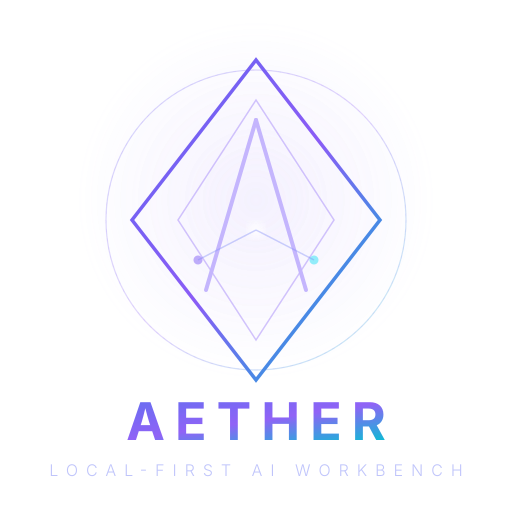

<div align="center">

<p align="center">
  
</p>

# AetherAI

### A local-first, multi-model desktop AI workbench

**Electron · React · TypeScript · MCP · Agent · Skills**

[](https://github.com/TQSY114514/AetherAI/releases) [](https://github.com/TQSY114514/AetherAI/releases) [](https://github.com/TQSY114514/AetherAI/stargazers) [](https://github.com/TQSY114514/AetherAI/network/members) [](https://github.com/TQSY114514/AetherAI/issues) [](#contributing)

[](./LICENSE) [](#-download) [](#-install-from-source) [](#-tech-stack) [](#customization) [](#skills--extensibility)


[English](./README.md) · [简体中文](./README.zh-CN.md) · [繁體中文](./README.zh-TW.md) · [文言文](./README.zh-WEN.md) · [日本語](./README.ja.md) · [español](./README.es.md) · [français](./README.fr.md) · [Deutsch](./README.de.md) · [português](./README.pt.md) · [русский](./README.ru.md) · [українська](./README.uk.md) · [العربية](./README.ar.md) · [हिन्दी](./README.hi.md) · [한국어](./README.ko.md)


---

> **Статус: бета.** AetherAI — личный/хобби-проект. Работает, но возможны шероховатости. О багах сообщайте — см. [CONTRIBUTING.md](./CONTRIBUTING.md) и [SECURITY.md](./SECURITY.md).


AetherAI объединяет несколько провайдеров LLM (OpenAI / Claude / DeepSeek / локальные модели / любую совместимую с OpenAI конечную точку) в одном настольном приложении. Все данные хранятся локально — ваши API-ключи и переписки никогда не покидают ваш компьютер, за исключением обращений к настроенным вами провайдерам.

## 📑 Table of Contents

- [🎯 Что отличает AetherAI](#-что-отличает-aetherai)
- [✨ Возможности](#-возможности)
  - [🖥️ Чат](#️-чат)
  - [🤖 Агент (вызов функций)](#-агент-вызов-функций)
  - [🧠 Память и обучение](#-память-и-обучение)
  - [🏟️ Арена](#-арена)
  - [🛠️ Навыки и расширяемость](#-навыки-и-расширяемость)
  - [⚙️ Настройка](#-настройка)
  - [🔒 Конфиденциальность](#-конфиденциальность)
- [📸 Скриншоты](#-скриншоты)
- [📦 Скачивание](#-скачивание)
  - [Windows — Готовая сборка](#windows--готовая-сборка-рекомендуется)
- [🚀 Быстрый старт](#-быстрый-старт)
  - [Предварительные требования](#предварительные-требования)
  - [Установка и запуск](#установка-и-запуск)
  - [Включите режим Ask](#включите-режим-ask)
  - [Запустите первую задачу агента](#запустите-первую-задачу-агента)
- [📁 Структура проекта](#-структура-проекта)
- [🔑 Технический стек](#-технический-стек)
- [🤝 Вклад](#-вклад)
- [🤝 Благодарности](#-благодарности)
- [📄 Лицензия](#-лицензия)

---

## ✨ Возможности

### 🖥️ Чат

- **Единая абстракция провайдеров** — один слой адаптеров; добавление формата нового провайдера сводится к одному файлу. На данный момент поддерживается формат, совместимый с OpenAI (охватывает OpenRouter, Together, DeepSeek, OpenAI-шим Ollama, LM Studio и др.).
- **Параллельная потоковая передача в нескольких сессиях** — один чат может вести потоковую передачу, пока вы продолжаете общаться в другом.
- **Арена** — один запрос, отвечают сразу несколько моделей; голосуйте за лучший ответ, и рейтинг ELO обновляется автоматически.
- **Персоны** — готовые системные промпты, переключаемые для каждой сессии.
- **Вложения** — текстовые файлы добавляются как контекст; изображения передаются мультимодально (требуется модель с поддержкой зрения).
- **Свёртка длинных вставок** — вставка сотен строк автоматически сворачивается в раскрываемый фрагмент (в стиле ChatGPT).
- **Ползунок усилия размышления** — реальные параметры: для o-series от OpenAI → `reasoning_effort`, для Claude → `thinking.budget_tokens`.
- **Сводки в боковой панели** — заголовки формируются моделью как тематические фразы (например, «Совет по новому баннеру Eiyuu Angel»), а не как скопированный текст.
- **Расширенные настройки** — max tokens, temperature, top_p, пользовательский системный префикс, автоматические заголовки для каждого языка.
- **Своё фоновое изображение** — загрузите изображение с настройкой прозрачности и размытия.
- **15 языков интерфейса** — English (стандартный + перевёрнутый), 中文 (简体/繁體/文言文), 日本語, español, français, Deutsch, português, русский, українська, العربية (RTL), हिन्दी, 한국어.
- **Темы** — Light / Dark / Blue / Glass / Retro.
- **Локальное хранение** — все данные в локальной базе SQLite; ничего не загружается наружу.

### 🤖 Агент (вызов функций)

- **13 встроенных инструментов** (`read_file`, `list_dir`, `glob_find`, `grep_search`, `web_search`, `web_fetch`, `write_file`, `edit_file`, `run_command`, `git_status`, `git_diff`, `memory_save`, `memory_list`) с циклом «План → Действие → Наблюдение» и живой трассировкой рассуждений.
- **Режимы разрешений агента** — Выкл / Спрашивать (подтверждать каждое рискованное действие) / Авто (разрешать всё) / План (только чтение). Повторяет модель разрешений агента для программирования.
- **Поддержка MCP** — подключайте внешние stdio MCP-серверы; их инструменты автоматически объединяются со встроенными.
- **Tool call repair** — LLMs иногда производят неверный JSON; цикл агента автоматически исправляет отсутствующие аргументы, незакавыченные ключи и усечённые вызовы перед выполнением.

## 🎯 Что отличает AetherAI

AetherAI объединяет несколько возможностей, которые обычно разбросаны по разным инструментам, в одном настольном приложении:

| Возможность | Описание | Зрелость |
|---|---|:---:|
| **Мульти-провайдер Чат** | Переключайтесь между OpenAI, Claude, DeepSeek и любым OpenAI-совместимым конечным пунктом во время разговора. | `Stable` |
| **Цикл агента (вызов функций)** | 16 встроенных инструментов с циклом План→Действие→Наблюдение, песочница, лестница разрешений. | `Beta` |
| **Мульти-модельная Арена** | Отправьте один запрос нескольким моделям, проголосуйте за лучшую, отслеживайте ELO-рейтинг. | `Beta` |
| **Навыки и расширяемость** | Файлы `SKILL.md` на вынос, MCP-серверы, 10-точечная система хуков. | `Experimental` |
| **Структурированная память** | Агент запоминает предпочтения и прошлые решения между сессиями. | `Beta` |
| **Иерархическое планирование** | Сложные запросы автоматически разбираются на параллельные подзадачи. | `Experimental` |
| **Свёртка контекста** | Длинные разговоры автоматически суммируются без потери пар вызовов инструментов. | `Beta` |
| **Локальная приватность** | Разговоры, ключи, персоны — в локальной SQLite. Ничего не покидает ваш компьютер. | `Stable` |
| **15 языков интерфейса** | Включая классический китайский (文言) и арабский с RTL. | `Beta` |
| **Лицензия MIT** | Полностью открытый исходный код. | `Stable` |

---

### 🧠 Память и обучение

- `Beta` **Автодолгосрочная память** — релевантные воспоминания внедряются перед каждым ходом; ключевые факты извлекаются и сохраняются автоматически. Включается в Настройки — Агент.
- `Experimental` **Обучающий привычек** — обнаруживает повторяющиеся предпочтения (например, «всегда использовать Claude») и предлагает автоматически применяемые навыки.
- `Beta` **Журнал аудитa** — трассировка выполнения агента по ходам для отладки.

### 🏟️ Арена

- `Beta` **Мульти-модельная арена** — один запрос, несколько моделей отвечают **одновременно**; проголосуйте за лучшую, и **ELO-таблица лидеров** обновляется автоматически. Модели оцениваются **по намерению** (кодинг / математика / перевод / сводка / общее). *Ни одно другое локальное настольное приложение чата не имеет встроенной мульти-модельной арены с ELO.*

### 🛠️ Навыки и расширяемость

| Компонент | Формат | Зрелость | Подробности |
|---|---|:---:|---|
| **Навыки** | `SKILL.md` | `Experimental` | Перенесите в `<рабочая_папка>/.claude/skills/`; поставляется с `release-checklist` и `git-commit` |
| **Слэш-команды** | `CMD.md` | `Stable` | 6 встроенных: `/code`, `/continue`, `/explain`, `/polish`, `/summarize`, `/translate` |
| **Хуки** | Скрипт | `Experimental` | 10 точек жизненного цикла: PreToolUse, PostToolUse, ToolError, PreCompact, PostCompact, PreSend, PostResponse, SessionStart, SessionEnd, SubagentStop |
| **MCP** | stdio JSON-RPC 2.0 | `Beta` | Внешние MCP-серверы автоматически сливаются со встроенными инструментами |

### ⚙️ Настройка

| Параметр | Зрелость | Описание |
|---|:---:|---|
| **Расширенные настройки модели** | `Stable` | max tokens, temperature, top_p, пользовательский системный префикс, автозаголовки по языкам, усилие размышления |
| **Своё фоновое изображение** | `Stable` | Загрузите изображение с управлением прозрачностью / размытием |
| **Персоны** | `Stable` | Пресеты системных промптов, переключаются для каждой сессии |
| **Темы** | `Stable` | Светлая / Тёмная / Синяя / Стеклянная / Ретро |
| **15 языков интерфейса** | `Beta` | Английский, китайский (简/繁/文言), японский, испанский, французский, немецкий, португальский, русский, украинский, арабский (RTL), хинди, корейский |
| **Автообновление** | `Beta` | NSIS-инсталлятор проверяет при запуске; портативная версия тоже (ручная установка) |
| **Отслеживание использования** | `Beta` | Журнал каждого вызова API с токенами, стоимостью, задержкой, процентом попаданий в кэш |

### 🔒 Конфиденциальность

> **Все данные остаются локальными.** AetherAI ничего не собирает и не загружает о вас. Ваши API-ключи, разговоры и персоны хранятся в локальной базе SQLite. Единственные исходящие сетевые запросы идут к настроенным вами LLM-провайдерам.

---

## 📸 Скриншоты

> Сделайте скриншоты в `assets/screenshots/` и обновите пути ниже.

| Процесс | Предпросмотр |
|---|:---:|
| Потоковая передача чата | `assets/screenshots/chat-streaming.gif` — _TODO_ |
| Выполнение инструментов агентом | `assets/screenshots/agent-tool-execution.gif` — _TODO_ |
| Голосование на арене | `assets/screenshots/arena-voting.gif` — _TODO_ |
| Настройки провайдера | `assets/screenshots/provider-settings.png` — _TODO_ |

---

## 📦 Скачивание

### Windows — Готовая сборка (рекомендуется)

Скачайте последнюю [Release](https://github.com/TQSY114514/AetherAI/releases):

| Сборка | Описание |
|---|---|
| **`AetherAI-Setup-x.y.z.exe`** | NSIS-инсталлятор. Для пользователя (без admin), автообновления внутри приложения. **Рекомендуется.** |
| **`AetherAI-x.y.z.exe`** | Портативный одноисполняемый файл. Без установки, без автообновления; просто запустите. |

> Инсталлятор показывает предупреждение SmartScreen «неизвестный издатель» при первом запуске — ожидаемо для неподписанного хобби-приложения. Все данные остаются локальными.

---

### Настройка первого провайдера
1. После запуска нажмите **Models** в боковой панели.
2. Добавьте провайдера (имя / API URL / API Key).
3. Нажмите **Fetch models**, чтобы получить список доступных моделей.
4. Вернитесь к чату и начните общение.

### Включите режим Ask

1. Откройте **Настройки — Агент и безопасность**.
2. Установите режим разрешений агента на **Ask**.
3. Убедитесь, что корень рабочей папки — та папка, в которой агент должен читать/записывать.
4. Держите **Yolo** выключенным, если вам не нужен неограниченный доступ.

### Запустите первую задачу агента

1. Откройте новый чат.
2. Спросите: `Список файлов в этом проекте и сводка того, что делает приложение.`
3. Проверьте каждый предлагаемый вызов инструмента. Одобрите безопасные чтения; откажитесь от неожиданного.
4. Проверьте живую трассировку рассуждений и финальный ответ.

---

## 🔑 Технический стек

| Слой | Технология |
|---|---|
| Десктоп | Electron 31 |
| Фронтенд | React 18.3 + TypeScript 5.5 |
| Состояние | Zustand 4.5 |
| Сборка | Vite 5.4 + electron-builder |
| База данных | sql.js (SQLite в памяти, сохраняется на диск) |
| LLM | OpenAI-совместимый + Anthropic Messages API |
| UI | Tailwind CSS 3.4, lucide-react, highlight.js |
| MCP | Собственный stdio JSON-RPC 2.0 клиент |

---

## 🤝 Вклад

Приветствуются все вклады! Будь то исправление ошибок, запрос новой функции, улучшение перевода или обновление документации — пожалуйста, откройте issue или отправьте PR.

1. Форкните репозиторий
2. Создайте ветку для новой функциональности (`git checkout -b feat/my-feature`)
3. Зафиксируйте изменения (`git commit -am 'Add feature'`)
4. Отправьте в ветку (`git push origin feat/my-feature`)
5. Откройте Pull Request

См. [CONTRIBUTING.md](./CONTRIBUTING.md) для подробных руководств.

---

## 🚀 Быстрый старт

### Предварительные требования
- Node.js 18+
- npm 9+

### Установка и запуск
```bash
cd app
npm install
npm run dev      # разработка (горячая перезагрузка)
npm run build    # сборка продакшен-фронтенда
npm start        # запуск Electron
```

Либо запустите `start.bat` в корне репозитория на Windows.

---

## 📁 Project Structure

```
app/
├── electron/              # main process (Node)
│   ├── database.js        # SQLite (sql.js) data layer — 14 tables
│   ├── ipc/               # IPC handlers (chat / arena / session / mcp / ...)
│   │   ├── chat.handler.js    # THE central handler (540 lines)
│   │   ├── arena.handler.js   # Multi-model arena with ELO
│   │   ├── agent.handler.js   # Workspace management
│   │   └── ...
│   ├── llm/               # LLM abstraction (~3,700 lines, 19 files)
│   │   ├── providerAdapter.js # Dispatch by api_format (openai/anthropic)
│   │   ├── openaiAdapter.js   # OpenAI-compatible SSE streaming + retry
│   │   ├── anthropicAdapter.js# Anthropic Messages API
│   │   ├── credentialPool.js  # Multi-key rotation + cooldown
│   │   ├── toolLoop.js        # Plan-Act-Observe with iteration budget
│   │   ├── planning.js        # Hierarchical task decomposition
│   │   ├── subAgent.js        # Parallel sub-agent delegation
│   │   ├── compaction.js      # Context compaction (pair-preserving)
│   │   ├── autoMemory.js      # Long-term structured memory
│   │   ├── habitLearner.js    # Recurring preference -> auto-skills
│   │   ├── hooks.js           # 10-point extensibility hooks
│   │   ├── skills.js          # SKILL.md loader (Claude Code format)
│   │   ├── modelAdvisor.js    # Heuristic model suggestion
│   │   ├── toolCallRepair.js  # Malformed tool-call recovery
│   │   ├── auditLog.js        # Per-turn agent execution trace
│   │   └── ...
│   ├── tools/             # built-in tool registry + sandbox
│   │   ├── registry.js       # 16 tool definitions (OpenClaw-inspired)
│   │   └── sandbox.js        # 3-layer defense (workspace root, traversal guard, blocklist)
│   ├── mcp/               # MCP client + server manager
│   ├── main.js / preload.js
├── src/                   # renderer (React + TS + Zustand)
│   ├── store/index.ts     # Zustand global state (~1,000 lines)
│   ├── components/        # UI (chat / sidebar / settings / ui)
│   ├── pages/             # Chat / Models / Persona / Settings / Scores / ...
│   ├── utils/             # i18n (15 locales) / theme / markdown
│   └── types/
├── skills/                # Built-in skills (release-checklist, git-commit)
├── commands/              # Built-in slash commands (/code, /explain, /polish, ...)
├── locales/               # Translation files (13 languages, lazy-loaded)
└── resources/             # App icons
```

---

## 🤝 Благодарности

AetherAI стоит на плечах этих проектов — их идеи сформировали архитектуру и UX:

- [Claude Code](https://github.com/anthropics/claude-code) — модель разрешений агента, ползунок усиления размышления, визуализация вызовов инструментов, пустое состояние нового чата.
- [Continue](https://github.com/continuedev/continue) — декларативный подход «конфиг как источник истины», абстракция провайдеров, протокол вызова функций.
- [Dify](https://github.com/langgen/dify) — паттерны нормализации мультиформатных провайдеров.
- [Model Context Protocol](https://modelcontextprotocol.io) — спецификация MCP, на которой говорит агент AetherAI.
- [shadcn/ui](https://github.com/shadcn-ui/ui) — методология копируемых компонентов cn() / cva.
- [Magic UI](https://github.com/magicuidesign/magicui) — паттерны анимации (потоковый текст, мерцание, blur-fade).
- [new-api](https://github.com/QuantumNous/new-api) — эталон преобразования reasoning-effort при ретрансляции.
- [OpenClaw](https://github.com/openclaw/openclaw) — доработка README и вдохновение для онбординга.
- [DS4](https://github.com/antirez/ds4) — structured task decomposition before execution.
- [Hermes](https://github.com/NousResearch/Hermes) — iteration budget, memory_manager pattern, structured memory extraction.

---

## 📄 Лицензия

MIT

---

<div align="center">

Built with ❤️ using Electron + React + TypeScript

[⬆ Back to top](#aetherai)

</div>
