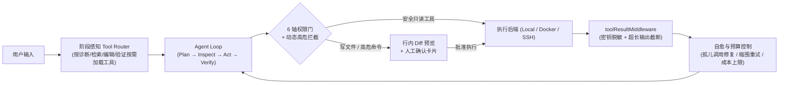

<div align="center">

<picture>
  <source media="(prefers-color-scheme: dark)" srcset="./assets/readme-hero-dark.png" />
  <source media="(prefers-color-scheme: light)" srcset="./assets/readme-hero-light.png" />
  
</picture>

# Aether

### 本地优先的多模型 Agent 工作台 · 内置竞技场 · 默认安全

在本地真实任务上并行评测不同模型，基于实测表现路由工作流；桌面 GUI 与终端 TUI 共享同一套 SQLite 存储、长期记忆与权限沙箱。

[](https://github.com/TQSY114514/Aether/releases)
[](https://github.com/TQSY114514/Aether/releases)
[](https://www.npmjs.com/package/aetherai)
[](https://www.npmjs.com/package/aetherai)
[](https://github.com/TQSY114514/Aether/actions/workflows/ci.yml)
[](./LICENSE)
[](#1-windows-桌面端安装主力形态--强烈推荐)

[English](./README.md) · **[简体中文](./README.zh-CN.md)** · [日本語](./README.ja.md) · [架构路线图](./docs/roadmap.md) · [20 款 Agent 竞品评估矩阵](./docs/competitive-analysis.md)

</div>

---

## 项目概述

Aether 是一个面向开发者与重度 AI 用户的本地工作台（Electron + React/TypeScript + better-sqlite3 + Ink v5）。它不绑定单一模型厂商，也不依赖云端账号中转，所有会话、API 密钥、记忆图谱与评测数据均保存在本机 `%APPDATA%/aetherai/aetherai.db` 中。

它主要解决四个具体问题：

1. **多模型实测对比（Arena）**：不同模型在编程、数理推理、长文处理上的实际表现差异很大。Aether 支持将同一任务并发发送给多个模型（或不同参数配置），通过盲测投票维护本地按意图分类的 ELO 排行榜。
2. **文件与命令执行可控（Permission System）**：Agent 具备读写代码库与执行终端命令的能力，但默认处于受控状态。所有高风险变更在落盘前均提供行内 Diff 预览与分级确认机制。
3. **跨会话结构化记忆（AutoMemory & Knowledge Graph）**：对话结束后后台自动提取事实与实体关系写入本地数据库，按项目工作区（Workspace）隔离作用域，并在后续会话中毫秒级预取注入。
4. **桌面端为主、终端端协同（Desktop-First Unified Runtime）**：**项目开发重心在 Windows 桌面图形版（GUI）**，完整承载可视化竞技场、知识图谱管理、行内 Diff 审阅与配置中心；同时提供轻量级终端版（`aether tui` / CLI）作为命令行延伸，两端共享同一个本地 SQLite 数据库。

---

## 快速上手指南

> **推荐首选 Windows 桌面版**：Aether 的核心研发重心与最完整的功能体验（多模型同屏竞技场、可视化记忆图谱、图形化权限与 Diff 审批）均集中在 **Windows 桌面端应用**。除非你处于纯命令行或非 Windows 环境，否则**强烈建议直接下载桌面端安装包**。

### 1. Windows 桌面端安装（主力形态 · 强烈推荐）

前往 [GitHub Releases](https://github.com/TQSY114514/Aether/releases) 下载对应版本：

- **`aetherai-setup-x.y.z.exe`**：标准安装程序（含桌面快捷方式与自动更新支持，**推荐日常首选**）。
- **`aetherai-x.y.z.exe`**：单文件便携版（免安装，双击直接运行）。

> **关于 Windows SmartScreen 提示**：本项目由独立开发者维护，未购买商业代码签名证书。首次运行若遇到系统弹窗提示「Windows 已保护你的电脑」，点击 **更多信息 → 仍要运行** 即可。

### 2. 终端伴侣与命令行工具（辅助延伸 · 跨平台）

终端交互界面（TUI）、命令行工具（CLI）及无头 SDK 支持 Windows、macOS 与 Linux（需 **Node.js ≥ 22**）：

```bash
# 全局安装
npm install -g aetherai

# 启动交互式终端界面 (Ink v5)
aether tui

# 在指定会话上继续工作（可接续桌面端创建的会话）
aether tui --session <session_id>

# 单次执行指令
aether "运行测试套件并修复失败的单元测试" --model deepseek

# 启动 JSONL RPC 守护进程（供外部脚本或子 Agent 调用）
aether --mode rpc
```

### 3. 首次配置模型提供商

启动应用后，前往侧栏 **设置 → 模型提供商 (Providers)** 添加至少一个 API 接口。Aether 原生支持 OpenAI、Anthropic、Gemini 等协议格式，常见配置如下：

| 接入方式 | 协议格式 | Base URL 示例 | 适用场景说明 |
| :--- | :--- | :--- | :--- |
| **DeepSeek 官方** | OpenAI 兼容 | `https://api.deepseek.com/v1` | 国内直连稳定，日常代码编写与任务处理性价比高 |
| **OpenRouter / 聚合接口** | OpenAI 兼容 | `https://openrouter.ai/api/v1` | 单一密钥可同时调用 Claude、GPT、Gemini、Qwen 等模型，适合用于竞技场对比 |
| **Ollama / LM Studio** | OpenAI 兼容 | `http://127.0.0.1:11434/v1` | 纯本地显卡推理，无需 API Key，支持完全断网环境运行 |

### 4. 从源码构建运行

```bash
git clone https://github.com/TQSY114514/Aether.git
cd Aether

# Windows：自动安装依赖、编译前端并启动 Electron
start.bat

# macOS / Linux：默认进入终端 TUI；附加 --desktop 参数启动桌面 GUI
./start.sh
./start.sh --desktop
```

---

## 核心子系统说明

### 一、 AutoMemory · 结构化长期记忆与项目大脑

Aether 的长期记忆系统基于 SQLite（WAL 模式）、FTS5 全文索引与本地知识图谱（`kg_nodes` / `kg_edges`）构建，而非简单的平面文本或单文件 YAML。它采用 **预取（Prefetch）+ 异步同步（Sync）** 的双通道架构：

- **零延迟上下文预取（Prefetch）**：每次发送消息前，系统在本地数据库中进行关键词与图谱检索（耗时 `< 2ms`），直接将相关记忆拼入本轮上下文，**无需消耗额外的 LLM 工具调用轮次**。
- **后台防抖提炼（Sync）**：每轮对话结束后，后台静默提取新出现的实体、技术决定与用户偏好，经 Jaccard 相似度去重后落盘，不阻塞主对话流。

#### 记忆分类与作用域

| 类型 (`type`) | 作用域与注入策略 | 记录内容示例 |
| :--- | :--- | :--- |
| **`project`（项目大脑）** | 绑定当前工作区目录（Workspace），**每轮固定置顶注入** | 仓库架构约定、构建命令、模块边界、核心技术选型 |
| **`preference`（用户偏好）** | 全局生效，按相关性匹配注入 | 代码风格习惯、回复详略程度、常用语言与框架偏好 |
| **`fact`（客观事实）** | 全局或工作区隔离，按 FTS5 关键词检索注入 | 环境变量位置、服务器端口约定、已确认的业务规则 |
| **`context`（会话摘要）** | 跨会话背景索引 | 阶段性任务进度、长对话压缩后的历史上下文结论 |
| **`review`（待复核项）** | 冲突或待确认条目 | 与既有记忆发生矛盾、需人工裁决保留或覆盖的记录 |

#### 记忆安全与管理特性

1. **`AGENTS.md` 自动发现**：当工作区指向具体代码仓库时，系统自动扫描并注入根目录下的 `AGENTS.md` 或 `AETHER.md` 规范文件。
2. **注入来源透明化（Why Injected）**：每当本轮回复引用了长期记忆，界面会明确标注命中的记忆条目及触发原因，支持在侧栏 **记忆 (Memory)** 页面随时查看、编辑、合并重复项（`dedupe`）或删除单条记录。
3. **跨工作区防串味（Fail-Closed Isolation）**：A 项目的工作区记忆严格限制在 A 目录内生效，不会泄漏到 B 项目的对话上下文中。
4. **外部内容降权沙箱（`<untrusted_memory>`）**：由网页抓取或外部工具产生的记忆会自动标记为 `origin='external'`，注入时置于末尾并用 `<untrusted_memory>` 标签隔离，防止间接提示词注入（Indirect Prompt Injection）。
5. **记忆向技能演进（Memory → Skill Bridge）**：支持将高频复用的项目记忆自动聚类，生成可复用的 `SKILL.md` 技能草稿。

---

### 二、 Arena 2.0 · 多模型并发评测与个人基准集

内置竞技场用于在实际工作负载下量化评估不同模型的表现：

| 功能模块 | 工作机制 |
| :--- | :--- |
| **同屏并发盲测** | 单条提示词同时下发给 2～4 个选定模型（或同一模型的不同 Temperature / System Prompt），并排流式渲染输出。 |
| **分意图 ELO 计分** | 系统根据提示词自动归类任务意图（`编程 Coding` / `推理 Reasoning` / `翻译写作 Translation`），投票后分别计算各领域的本地 ELO 积分。 |
| **个人测试集（Personal Benchmark）** | 可将日常遇到的典型难题保存为本地基准测试集；接入新模型后支持一键重跑，统计准确率、首字延迟、Token 成本与工具调用成功率。 |
| **报告导出** | 支持将对比结果导出为结构化 Markdown 报告或可视化对比卡片。 |

---

### 三、 6 轴权限控制与执行容错机制

为避免 Agent 在自动化执行过程中误删文件、泄露密钥或因工具报错导致会话死锁，运行时内置了多层防护：



#### 1. 四档运行模式与 6 轴细粒度权限

系统在 `READ`（读文件）、`WRITE`（写文件）、`EXECUTE`（执行命令）、`NETWORK`（网络访问）、`GIT`（版本控制）、`EXTERNAL`（外部 MCP 工具）六个维度上进行独立权限校验，并提供四档预设模式：

| 模式 | 行为规则 | 适用场景 |
| :--- | :--- | :--- |
| **`Plan`（只读规划）** | 禁用一切写入与命令执行工具；Agent 仅读取代码并生成持久化任务清单（`session_plan`） | 架构探讨、代码走读、改动前方案评估 |
| **`Ask`（默认安全模式）** | 只读操作自动放行；文件写入提供行内 Diff 预览，终端命令需确认后执行 | 日常编码协作、重构与调试 |
| **`Auto`（受控自动模式）** | 白名单内的构建与测试命令自动放行；但涉及删除文件、修改 `.env` 或执行 `npm install` 等高危动作时，强制升级为 `ALWAYS_ASK` 弹窗确认 | 自动化编写并运行单元测试 |
| **`Yolo`（沙箱全速模式）** | 全部操作自动放行（建议配合内置 **Docker 沙箱后端** 或独立分支使用） | 隔离环境下的无人值守长任务 |

#### 2. 运行时容错与成本可见性

- **阶段感知工具路由（Staged Tool Router）**：从 42+ 内置工具及已挂载的 MCP 工具中，按当前任务阶段动态筛选注入工具 Schema，降低上下文 Token 占用约 40%，减少小模型选错工具的概率。
- **异常自愈机制**：自动清理中断遗留的孤儿 `tool_calls` 记录（防止会话因未闭合的工具调用而永久报错 400）；工具失败时自动触发缩小范围重试（`tryShrinkRetry`）。
- **实时成本与预算熔断**：状态栏实时显示当前迭代步数、单轮预估 Token、累计成本及预算上限，达到阈值时自动暂停 Agent 循环。

---

### 四、 扩展体系：Skills、MCP 与多执行后端

- **Skills（技能包）**：支持导入或编写带有 `permissions:` 权限声明（声明所需文件系统、网络或 Shell 权限）的 `SKILL.md` 模块，与权限引擎联动校验。
- **MCP（Model Context Protocol）**：支持挂载外部 stdio MCP 工具服务器，系统自动为工具添加 `server__tool` 命名空间前缀以防止多服务同名冲突，输出统一经过 `toolResultMiddleware` 脱敏处理。
- **多执行后端（Execution Backends）**：命令与代码执行支持在 **本地进程 (`local`)**、**Docker 容器沙箱 (`docker`)** 与 **远程 SSH 主机 (`ssh`)** 之间切换。

---

## 客观能力定位（对比 20 款主流 Agent）

Aether 的设计重心在于**本地数据主权、多模型横向评测、细粒度权限安全以及 GUI/TUI 双端一致性**。在单模型代码补全速度与超大型代码库的专有云端索引上，独立开源工作台与 Cursor、Claude Code 等商业产品存在客观差距（下方雷达图基于 `app/scripts/gen-radar.cjs` 公开评分生成，不做满分美化）：

<div align="center">
  
</div>

详细的 8 维度评分标准与 20 款工具对比表格见 [docs/competitive-analysis.md](./docs/competitive-analysis.md)。

---

## 致谢 (Acknowledgements)

Aether 的架构与实现参考并借鉴了以下开源项目与设计思想：

- **Agent 运行时与交互**：[Claude Code](https://claude.ai/code)（验证闭环、生命周期钩子、权限阶梯与 Ask/Plan 模式）、[pi](https://github.com/badlogic/pi-mono)（`AgentMessage` 消息解耦抽象与运行中 `steer()` 机制）、[OpenClaw](https://github.com/openclaw/openclaw)（上下文压缩算法、死循环检测与结果脱敏中间件）、[Hermes Agent](https://github.com/NousResearch/hermes-agent)（迭代预算控制与 SQLite + FTS5 长期记忆）、[OpenCode](https://github.com/sst/opencode)（TUI 键盘交互与权限门设计）、[Aider](https://github.com/Aider-AI/aider)（Git 集成流）、[OpenAI Codex](https://github.com/openai/codex)（进程树隔离）、[Evolver](https://github.com/EvoMap/evolver)、[DS4](https://gist.github.com/antirez)、[Continue](https://github.com/continuedev/continue)、[Grok Build](https://x.ai)。
- **UI 与基础组件**：[shadcn/ui](https://github.com/shadcn-ui/ui) · [Magic UI](https://github.com/magicuidesign/magicui) · [cc-switch](https://github.com/farion1231/cc-switch) · [Model Context Protocol (MCP)](https://modelcontextprotocol.io) · [new-api](https://github.com/QuantumNous/new-api)。

---

## 参与贡献与许可

- **问题反馈与功能建议**：请提交至 [GitHub Issues](https://github.com/TQSY114514/Aether/issues/new)。
- **开发规范**：提交代码前请查阅 [CONTRIBUTING.md](./CONTRIBUTING.md)、[AGENTS.md](./AGENTS.md) 与 [docs/roadmap.md](./docs/roadmap.md)。
- **开源协议**：[Apache-2.0](./LICENSE)（第三方开源组件声明见 [THIRD_PARTY_NOTICES.md](./THIRD_PARTY_NOTICES.md)） © 2025-2026 Aether
