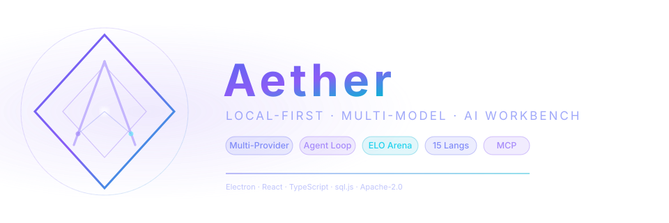
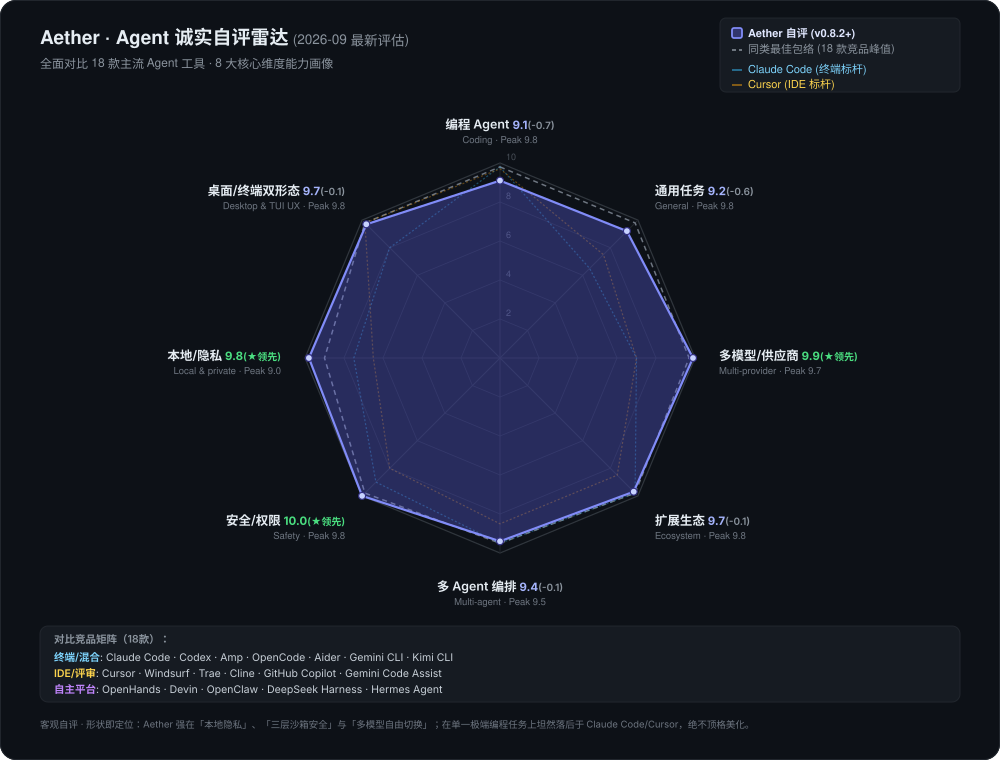

<div align="center">



# Aether

## 本地优先 Agent 工作台 · 内置竞技场 · 默认安全

一个拒绝「出其不意」的 Agent 工作台——动手前先征得同意,竞技场告诉你哪个模型真正适合你的活,路由从你自己的投票里学习。一切都在你的设备上。

**Electron + Node.js · React + TypeScript · MCP · Agent · Skills**

[](https://github.com/TQSY114514/Aether/releases) [](https://www.npmjs.com/package/aetherai)

[](./LICENSE) [](#-download)


[English](./README.md) · [简体中文](./README.zh-CN.md) · [繁體中文](./README.zh-TW.md) · [文言文](./README.zh-WEN.md) · [日本語](./README.ja.md) · [español](./README.es.md) · [français](./README.fr.md) · [Deutsch](./README.de.md) · [português](./README.pt.md) · [русский](./README.ru.md) · [українська](./README.uk.md) · [العربية](./README.ar.md) · [हिन्दी](./README.hi.md) · [한국어](./README.ko.md)<br><sup>译文可能滞后于英文 / 简体中文版。</sup>

</div>

---

## 60 秒看懂 Aether

不列功能表,直接看一个真实的循环——用证据选模型、把真任务交给 Agent、全程可控:

**1 · 用自己的基准选模型。** 打开**竞技场**,粘入一个提示,同时发给所有已配置的模型并发作答;投票选出最佳,ELO 排名按意图(编程 / 数学 / 翻译等)实时更新。「哪个模型最强」变成「哪个模型对你最强」。

**2 · 在 Ask 模式下交给 Agent 一个真任务。** 把工作区指向你的项目文件夹,问「我上次提交后测试挂了,找出原因并修好」。Agent 会规划、读代码、跑命令——每个有风险的步骤都先征求同意。

**3 · 落地前先过目。** 每个写入展示 diff,每条命令在执行前显示完整原文;可单次放行、会话内放行、始终放行或拒绝。工作区之外的写入与破坏性命令模式会被直接拒绝。

**4 · 你说了算才提交。** Agent 只在你批准的范围内使用 git 工具(`git_status`、`git_diff`、`git_commit`)——没有明确要求就不会推送。

---

## 两个产品形态，一个统一大脑

Aether 采用**双轮驱动架构**发布，提供完全平等的双形态体验，底层 100% 共享相同的 Agent 运行时、SQLite 记忆与三层安全沙箱：

- 🖥️ **Aether 桌面版（GUI）** — 基于 Electron + React。拥有直观的图文富文本流、多窗口拖拽、可视化模型竞技场与直观的配置中心。**推荐绝大多数日常开发、偏好可视化操作与新用户首选。**（从 [GitHub Releases](#下载-桌面版) 下载，开箱即用）
- ⌨️ **Aether 终端版（CLI / TUI / SDK）** — 基于 Node.js 22+ 与 Ink v5。全键盘沉浸式交互、毫秒级轻量启动、行级 Diff 审批，原生支持 SSH 远程开发与无头 CI/CD 流水线。**推荐重度终端极客与全键盘流开发者。**（`npm i -g aetherai`，详见[下载 CLI](#下载-cli--tui--sdk)）

> 💡 **无缝协同**：二者共享 `agentCore`、内置工具集、SQLite 记忆、多模型路由、MCP 服务器与同一会话存储。你在桌面版开启的会话，随时可在终端用 `aether tui --session <id>` 续接，反之亦然。

---

> **状态:Beta。** Aether 是个人/业余项目。它能用,但会有粗糙之处。欢迎提 bug——见 [CONTRIBUTING.md](./CONTRIBUTING.md) 和 [SECURITY.md](./SECURITY.md)。

> [!CAUTION]
> **Windows SmartScreen 警告属正常现象。** Aether 由学生开发者构建、未购买商业代码签名证书,因此 Win11 / Defender 首次启动可能提示「Windows 已保护你的电脑」。
> **应用是安全的开源软件——可先审查代码,再点「更多信息 → 仍要运行」。**
> 若被杀软隔离,请将应用文件夹加入排除项(见[下载](#下载))。除你配置的 LLM 供应商外,不会有任何数据离开你的电脑。

**平台:仅支持 Windows。** 官方构建、测试与支持仅面向 Windows。macOS / Linux 可自行从源码构建,但不提供官方支持;项目未做代码签名——首次启动出现 SmartScreen「未知发布者」提示属正常现象(见[下载](#下载))。

**默认安全。** Agent 动手前先征得你的同意。命令走白名单沙箱(而非可被拼接绕过的黑名单);写入 `.git`、`.ssh`、hooks 等敏感路径会被拒绝;从文件或 MCP 读到的内容先按不可信处理、消毒后才进入模型。权限阶梯(规划 → 只读 → 询问 → 完全访问)让每一次工具调用都在你掌控之中。

**多模型竞技场。** 别再只信一个模型。一个提示同时发给多个模型、投票选出最佳、ELO 排名实时更新——为你自己的提示内置一个「同行评审」擂台。

**本地优先。** 密钥、对话与记忆都存于本地 SQLite,除发往你所配置的提供商外,绝不离开你的电脑。无账号、无云同步、无遥测。你的数据最安全的地方,就是你的设备。

**Aether 在哪一档——诚实版。** 依据公开资料对 16 款主流终端 / IDE / 平台 Agent 工具进行系统自评（2026-09 最新评估；是估计，不是跑分）。我们把不对称的形状原样画出来：强在「本地优先」、「三层沙箱安全」与「多模型自由切换」等轴；单模型极致编程能力坦然与第一梯队存在客观差距。这就是你选择 Aether 时接受的真实取舍。完整竞品深度对比详见 [docs/competitive-analysis.md](docs/competitive-analysis.md)。

<p align="center"></p>

<sub>图表由 <a href="./app/scripts/gen-radar.cjs">app/scripts/gen-radar.cjs</a> 生成——16 款工具评分逐字内嵌其中，可用 <code>node app/scripts/gen-radar.cjs</code> 本地复现。</sub>

---

## Aether 有什么不同

Aether 有两点真正不同——一个拒绝「出其不意」的 **安全优先 Agent**,和一个让你「测试模型而非盲信单一模型」的 **多模型竞技场**。其余能力都在为此服务。

| 能力 | 说明 | 成熟度 |
|---|---|---|
| **安全优先沙箱** | 白名单命令沙箱(多段命令逐段校验)、敏感路径写入保护、外部内容消毒、规划 → 只读 → 询问 → 完全访问 的权限阶梯。 | `Beta` |
| **多模型竞技场** | 一个提示同时发给多个模型,投票选出最佳,ELO 排名实时追踪。 | `Beta` |
| **多提供商聊天** | 对话中随时切换 OpenAI、Claude、DeepSeek 与任何 OpenAI 兼容端点。 | `Stable` |
| **Agent 工具循环** | 42 个内置工具,Plan-Act-Observe 循环。 | `Beta` |
| **技能与扩展** | 即插即用 `SKILL.md`、MCP 服务器、10 点钩子系统。 | `Experimental` |
| **结构化记忆** | Agent 跨会话回忆偏好与过往决策。 | `Beta` |
| **层次化规划** | 复杂请求自动分解为并行子任务。 | `Experimental` |
| **上下文压缩** | 长对话自动摘要且不丢工具调用对。 | `Beta` |
| **本地优先隐私** | 对话、密钥、人设都在本地 SQLite。数据不离开你的机器。 | `Stable` |
| **15 种界面语言** | 含文言文与 RTL 阿拉伯语。 | `Beta` |
| **终端 TUI** | Ink v5 交互终端:会话流、工具卡、diff 审阅/回滚、键盘权限门、`/fork` 会话树、`/memory`、todo 面板、`@` 文件引用、`!` shell、运行中 steering 回注、会话 resume。 | `Experimental` |
| **无头 CLI · RPC · SDK** | 四模式 CLI(单发 / NDJSON / JSONL RPC / 管道)、Electron-free SDK(`aetherai/sdk`)、机器可调用的 JSONL 协议。 | `Experimental` |
| **MIT 许可** | 完全开源。 | `Stable` |

---

## 下载

> 二选一即可。两个产品共享同一 Agent 运行时与会话存储。
> - **只想要桌面聊天应用?** → [Aether 桌面版](#下载-桌面版)
> - **想要终端 Agent / CI / SDK?** → [Aether CLI](#下载-cli--tui--sdk)

### 下载 — 桌面版

**Windows — 预构建安装包(大多数用户推荐)**

从最新 [Release](https://github.com/TQSY114514/Aether/releases) 下载:

| 构建 | 说明 |
|---|---|
| **`aetherai-setup-x.y.z.exe`** | NSIS 安装包。按用户安装(无需管理员),应用内自动更新。**推荐。** |
| **`aetherai-x.y.z.exe`** | 便携单文件。免安装、无自动更新;直接运行。 |

> 安装包首次启动会出现 SmartScreen「未知发布者」警告——未签名个人应用的正常现象。所有数据均留在本地。
>
> ⚠️ 部分杀毒软件可能因应用未签名而隔离打包后的 `electron.exe`。若安装包被杀软移除,请添加排除项或改用便携版。

### 下载 — CLI / TUI / SDK

**`aetherai`** 是 npm 包名。一个二进制包含无头 CLI、Ink v5 交互 TUI、Electron-free SDK。

```bash
# 一次性安装(需 Node.js ≥ 22)
npm install -g aetherai
# 或不安装直接用:
npx aetherai "fix the failing test" --model deepseek

# 交互终端 UI(在 Windows Terminal 下体验最佳)
aether tui

# 单发 prompt(适合 CI / 脚本)
aether "summarize README.md"

# 外部脚本用 JSONL RPC
echo '{"type":"request","reqId":"c1","method":"listModels","params":{}}' | aether --mode rpc
```

`aether` 与 `aetherai` 指向同一个包。`npm install -g aetherai@0.8.0` 可锁定到桌面版同一版本。

> **与 GUI 共享数据** — 两个产品共用同一 SQLite 数据库(`%APPDATA%/aetherai/aetherai.db`)。桌面端开启的会话可在 TUI 续接,反之亦然。

### 从源码运行(开发者 / 高级用户)

想从源码运行或修改代码,使用 `start.bat`(需要 [Node.js 22+](https://nodejs.org)):

```bash
git clone https://github.com/TQSY114514/Aether.git
cd Aether
start.bat        # Windows: 安装依赖、构建前端、启动 Electron
```

手动分步见[快速开始](#-快速开始)。

> **两个产品同源** — 两个产品都在同一仓库。`app/electron/` 是共享的 Agent 运行时;`app/src/` 是桌面渲染层;`app/cli.js` + `app/tui/` 是 CLI/TUI 入口。从一个 git tag(`v*`)同时得到桌面安装包与 npm 发布。

---

## 快速开始

**前置要求:** Node.js 22+、npm 9+

```bash
cd app
npm install
npm run dev      # 开发模式(热重载)
npm run build    # 生产前端
npm start        # 启动 Electron
```

或在仓库根目录运行 `start.bat`(Windows)。

### 试试终端形态(无需 Electron 窗口)

```bash
cd app && npm install
node cli.js tui              # 交互终端 UI(Node ≥ 22;Windows Terminal 体验最佳)
node cli.js "你好"           # 单发 prompt
echo "总结一下" | node cli.js  # 管道 stdin 作为 prompt
node cli.js --mode json "x"  # NDJSON 事件流(脚本/CI)
node cli.js tui --smoke      # headless 状态机冒烟
```

### 配置提供商

1. 启动后点击侧边栏 **Models**。
2. 添加提供商(名称 / API URL / API Key)。
3. 点击 **Fetch models** 拉取可用模型列表。
4. 回到聊天开始对话。

> 从 Claude Code 或 OpenCode 迁移过来？首次运行向导可以直接导入既有提供商配置——见 [docs/migration-guide.md](./docs/migration-guide.md)。

### 启用 Ask 模式

1. 打开 **设置 - Agent 与安全**。
2. 将 Agent 权限模式设为 **Ask**。
3. 确认工作区根目录是你希望 Agent 读写的文件夹。
4. 除非需要完全不受限访问,否则保持 **Yolo** 关闭。

### 运行第一个 Agent 任务

1. 打开新对话。
2. 提问:`列出这个项目的文件并总结这个应用是做什么的。`
3. 逐一审阅提议的工具调用。批准安全读取;拒绝任何意外操作。
4. 查看实时推理轨迹与最终回答。

---

## 功能

**状态标签:** `Stable` = 可日常使用,`Beta` = 可用但有已知粗糙点,`Experimental` = 新/高级行为可能变动,`Planned` = 已记录的路标项。

### 聊天

| 功能 | 状态 | 说明 |
|---|:---:|---|
| **多提供商** | `Stable` | 单一适配层;新增提供商 = 一个文件。覆盖 OpenRouter、Together、DeepSeek、Ollama、LM Studio…… |
| **并发流式** | `Stable` | 一个聊天流式输出时,可在另一个对话继续输入。 |
| **思考力度滑杆** | `Beta` | 真实参数:OpenAI o 系列 / gpt-5 / 经中转的 Claude。仅对推理模型生效。 |
| **附件** | `Beta` | 文本文件作为上下文;图片用于多模态(需要视觉模型)。 |
| **长粘贴折叠** | `Stable` | 数百行自动折叠为可展开片段(ChatGPT 风格)。 |
| **消息编辑** | `Stable` | 任意位置覆盖重写 + 重新生成。 |
| **消息搜索** | `Stable` | 全文高亮搜索。 |
| **侧栏摘要** | `Beta` | 模型生成的会话主题短语,非复制文本。 |

### Agent(函数调用)

- `Beta` **42 个内置工具** — 文件操作(`read_file`、`list_dir`、`glob_find`、`grep_search`、`write_file`、`edit_file`、`apply_patch`)、网络(`web_search`、`web_fetch`)、Shell(`run_command`)、git 与 GitHub(`git_status`、`git_diff`、`git_log`、`git_commit`、`git_push`、`git_create_branch`、`github_pr_create/list/merge/review`、`github_issue_create/list`、`github_release_create`、`github_actions_status`)、代码智能(`find_symbol`、`lsp_definition`、`lsp_references`、`lsp_diagnostics`、`lsp_code_actions`、`lsp_rename`)、Agent 元操作(`use_skill`、`ask_user`、`todo_write`、`delegate_task`、`task`、`memory_save/list/search`、`get_project_context`、`review_code`、`debug_loop`、`test_first`)——配 Plan-Act-Observe 循环、实时推理轨迹 + 任务清单、循环检测、工具级超时、可配置迭代预算(默认 25 轮)、上下文压缩。
- `Experimental` **层次化规划** — 复杂请求自动生成任务分解。
- `Experimental` **子 Agent 委派** — 经 `delegate_task` 并行运行独立子任务。
- `Stable` **权限模式** — 风险递进阶梯:

| 模式 | 说明 | 沙箱 |
|---|---|:---:|
| **Off** | 纯聊天,无工具 | N/A |
| **Plan** | 只读工具(只调查不改动) | - |
| **Ask** | 逐项确认风险操作(推荐) | - |
| **Auto** | 自动执行,不确认 | 有 |
| **Yolo** | 完全权限,无沙箱 | 无 |

- `Stable` **工作区沙箱** — `write_file`/`edit_file` 拒绝写入配置的工作区根目录之外;`run_command` 拦截破坏性模式。可在 设置 - Agent 与安全 中配置。
- `Beta` **上下文压缩** — 自动摘要更早的历史(工具调用/结果对完整保留;标识符原样保留)。
- `Beta` **工具调用修复** — 自动修复畸形 JSON、缺失参数、未加引号键与截断调用。

### 记忆与学习

- `Beta` **自动长期记忆** — 每轮前注入相关记忆;自动提取并保存关键事实。可在 设置 - Agent 中开关。
- `Experimental` **习惯学习器** — 检测重复偏好(如"总是用 Claude")并提议自动应用的技能。
- `Beta` **审计日志** — 每轮 Agent 执行的追踪记录,便于调试。

### 竞技场

- `Beta` **多模型竞技场** — 一个提示、多个模型**并发**回答;投票选出最佳,自动更新 **ELO 排行榜**。模型按意图分别计分(coding / math / translation / summary / general)。*没有任何其他本地优先桌面聊天应用内置带 ELO 的多模型竞技场。*

### 技能与扩展

| 组件 | 格式 | 状态 | 详情 |
|---|---|:---:|---|
| **技能** | `SKILL.md` | `Experimental` | 放入 `<workspace>/.claude/skills/`;内置 `release-checklist` 与 `git-commit` |
| **斜杠命令** | `CMD.md` | `Stable` | 6 个内置:`/code`、`/continue`、`/explain`、`/polish`、`/summarize`、`/translate` |
| **钩子** | 脚本 | `Experimental` | 10 个生命周期点:PreToolUse、PostToolUse、ToolError、PreCompact、PostCompact、PreSend、PostResponse、SessionStart、SessionEnd、SubagentStop |
| **MCP** | stdio JSON-RPC 2.0 | `Beta` | 外部 MCP 服务器与内置工具自动合并 |

### 自定义

| 设置 | 状态 | 说明 |
|---|:---:|---|
| **高级模型设置** | `Stable` | Max tokens、temperature、top_p、自定义系统前缀、按语言自动标题、思考力度 |
| **自定义背景** | `Stable` | 上传图片,透明度/模糊控制 |
| **人设** | `Stable` | 系统提示预设,按会话切换 |
| **主题** | `Stable` | 浅色 / 深色 / 蓝色 / 玻璃 / 复古 |
| **15 种界面语言** | `Beta` | 英文、中文(简/繁/文言)、日文、西语、法语、德语、葡语、俄语、乌克兰语、阿拉伯语(RTL)、印地语、韩语 |
| **自动更新** | `Beta` | NSIS 安装包启动时检查;便携版也检查(手动安装) |
| **用量统计** | `Beta` | 每次 API 调用的日志:tokens、成本、延迟、缓存命中率 |

### 隐私

> **所有数据留在本地。** Aether 不收集、不上传任何关于你的信息。API 密钥、对话、人设都存储在本地 SQLite 数据库。唯一的出站网络请求只会发往你配置的 LLM 提供商。Agent 行为如何被约束:[docs/security-practices.md](./docs/security-practices.md)。

---

## 终端 TUI、RPC 与 SDK

除桌面应用和普通 CLI 外,Aether 还提供交互式终端 UI、机器可调用的 JSONL RPC 模式与 Electron-free SDK。三者与桌面端共享同一 Agent 核心、记忆、人设、MCP 工具与权限规则。

### 快速开始 — 双形态

```bash
# 交互终端 UI(Ink v5;需要 Node ≥ 22)
node app/cli.js tui                # 真实终端:打字、批准工具、审阅 diff
node app/cli.js tui --smoke        # 无头状态机冒烟(CI 安全,输出 JSON)

# 单发 prompt(与以前相同)
node app/cli.js "fix the failing test" --mode auto --max-iterations 30

# NDJSON 事件流供脚本/CI 使用(兼容 --json-lines)
echo "summarize README.md" | node app/cli.js --mode json --model deepseek

# stdin/stdout 上的 JSONL RPC 循环
printf '{"type":"request","reqId":"c1","method":"listModels","params":{}}\n' \
  | node app/cli.js --mode rpc --db path\to\aetherai.db
```

其他无头参数:`--persona <id>`(人设 + 记忆注入)、`--memory-trace`(报告注入记忆条目数)、`--skills`(技能提案 JSON)、`--setup-term`(写入 Windows Terminal profile)、`--stdin`(显式管道输入)、`--resume` / `--session <id>` / `--fork [<id>]`(续跑会话;context-only,本轮消息不回写 DB)、`-o` / `--output-last-message <file>`(把最终答案写入文件)、`--version`、`--list-models` / `--list-providers`,以及 `aether completion bash|zsh|powershell`(shell 补全脚本)。

默认值来自 `~/.config/aether/config.json`(`model` / `mode` / `workspace` / `maxIterations`)与环境变量 `AETHER_MODEL` / `AETHER_MODE` / `AETHER_WORKSPACE` / `AETHER_MAX_ITERATIONS` / `AETHER_CONFIG`。优先级:CLI 参数 > 环境变量 > 配置文件 > DB 默认。JSON 的 `done` 帧在定价表可用时携带 `estimatedCost`(USD)。

### TUI(`aether tui`)

交互式终端 Agent(Ink v5;Node ≥ 22;Windows Terminal 体验最佳):

- **会话**:消息流式渲染、每轮对话落库 SQLite(退出不丢)、`--continue` / `--session <id>` / `--fork` 恢复会话、首条 prompt 自动标题、`/fork` 会话树(`session.parent_session_id`)、`/sessions`、`/use <id>` 历史切换
- **工具与权限**:工具调用卡(状态色/耗时/摘要)、diff 审阅(`Alt+v` 展开,`Enter` 接受 / `r` 回滚——写前快照还原,非 git 目录也有效)、键盘权限门(`y` 允许一次 / `a` 总是允许 / `n` 拒绝,或 `←→` 选择)、只读工具自动放行
- **审批模式**:`Shift+Tab` 循环 `manual → auto-edits → plan`(plan = 只读规划,完成后三选项决定如何实施);`/approval-mode dontask` 走纯规则审批(写/执行工具需 allow 规则)
- **模式**:`Alt+m` 切换 ask/plan/auto;`/persona <id>` 切换人设(注入 persona + 记忆前缀)
- **leader 快捷键**:`Ctrl+X` 然后 `m` 模型选择器 / `n` 新会话 / `l` 会话列表 / `g` 时间线 / `r` rewind 检查点 / `q` 退出 / `e` 外部编辑器
- **命令面板**:`Ctrl+P` 或 `x`(New chat / Model / History (sessions) / Timeline / Export JSONL / Help / Quit)
- **todo 与收藏**:`Ctrl+T` 开关 agent 实时 todo 清单;`Ctrl+F` 收藏/取消当前模型(持久化);`F2` 循环最近模型
- **`@` 文件与 `!` shell**:输入 `@` 弹文件候选(提交时内容注入,≤50KB);`!命令` 走 sandbox 拦截执行并把输出喂给模型
- **会话上下文命令**:`/compact` / `/compress-fast`(压缩历史)、`/context`(用量)、`/clear`(新会话)、`/undo`(撤销上一轮 + 文件快照)、`/recap`(一行摘要)、`/rename` / `/delete`、`/diff`(未提交变更查看器)、`/permissions add <name> <ruleKey> <allow|deny|ask>`、`/provider add|list`
- **首次运行自举**:无需先跑桌面版——`aether tui` 自动建库并提示用 `/provider add` 配置 provider
- **键位可重绑**:`~/.config/aether/keybindings.json`(如 `{ "char:?": null }` 禁用 `?` 帮助键)
- **API key 持久化**:`/apikey <provider> <key>` 保存到 `auth.json`(桌面版 safeStorage 加密的 key 在 headless 无法解密,用此命令或环境变量 `AETHER_API_KEY`)
- **记忆与技能闭环**:`/memory <关键词>` 检索、`--memory-trace` 注入条目数、`/skills` + `/skill accept|dismiss <key>`(habitLearner → 技能提案)
- **steering**:运行中 `Ctrl+C` 打断 → 输入下一条 → 注入当前循环(队列显示 `steer:n`);运行中 `Tab` 直接排队下一条
- **快捷键**:双击 `Esc` 退出(或 `/quit`)、`Esc` 清空输入(草稿入历史)、`?` 帮助屏、`PgUp/PgDn` 或鼠标滚轮逐行滚动消息区、`Alt+↑↓` 选中消息、`Shift+Enter` 输入框内换行;状态栏实时显示 `approval/mode/model/tok/ctx`;完整键位见 [docs/tui-keys.md](./docs/tui-keys.md)

### RPC(`aether --mode rpc`)

stdin/stdout 上的机器可调用 JSONL 协议:`request` 帧进,`event`/`result`/`error` 帧出——每行一个 JSON 对象,无人类文本。方法:`run`(流式输出 `text`/`tool`/`plan`/`status` 事件)、`listModels`、`listProviders`、`models.default`、`listSessions`、`session.load`、`session.fork`、`task.derive`、`task.status`。帧参考:[docs/rpc.md](./docs/rpc.md)。

### SDK(`require('aetherai/sdk')`)

供外部 Node 项目使用的 Electron-free Agent 核心聚合:`runAgent`、`openDatabase`、`resolveProviderModel`、`taskDbAdapter`、`memory`(prefetch/recall/search/……)、`classifyAgentMode`、`rpc` 帧、`sessionContext`(人设 + 记忆注入)。含类型声明(`app/electron/sdk/index.d.ts`)。

```js
const { runAgent, openDatabase, resolveProviderModel, classifyAgentMode } = require('aetherai/sdk')
const db = openDatabase('./aetherai.db')
const { provider, model } = resolveProviderModel(db, { modelName: 'deepseek' })
console.log(classifyAgentMode({ prompt: 'delete the file' })) // { mode: 'ask', reason: ... }
```

---

## Windows 原生能力

| 能力 | 说明 |
|---|---|
| **托盘菜单** | 显示/隐藏窗口、新建会话、**新建任务**(直接打开 TaskPanel);托盘点击切换显隐。 |
| **全局快捷键** | `Ctrl+Alt+A` 唤出主窗口(未启动则创建);注册结果写入启动日志。 |
| **`aetherai://` 协议** | `aetherai://new` / `chat` 新建会话;`aetherai://tui` 提示终端形态;`aetherai://open/?path=<编码路径>` 把文件夹设为工作区并新建会话(右键"用 Aether 打开"链路)。 |
| **右键注册** | `app/resources/register-protocol.reg`(替换 `<AETHER_EXE>` 后管理员导入):`.cs/.js/.ts/.tsx/.md/.json` + 文件夹 → 右键"用 Aether 打开"。 |
| **终端引导** | `app/resources/term/aether.ps1`(别名 + 启动 `aether tui`);`node app/cli.js --setup-term` 写入 Windows Terminal profile(深/浅两套配色)。 |
| **沙箱强化** | Windows 路径防御:`\\?\` 长路径、UNC `\\server\share`、重解析点/junction 逃逸、`.lnk/.scr/.msi` 等危险扩展名。 |

> 首次启动看到“Windows 已保护你的电脑”？那是 SmartScreen 对未签名二进制的正常反应——原因与一键放行方法见 [docs/smart-screen-faq.md](./docs/smart-screen-faq.md)。

---

## 项目结构

```
app/
├── electron/              # 主进程 (Node)
│   ├── database.js        # better-sqlite3 数据层 — 25+ 张表 (WAL)
│   ├── ipc/               # IPC 处理器 (chat / arena / session / mcp / ...)
│   │   ├── chat.handler.js    # THE 中央处理器 (540 行)
│   │   ├── arena.handler.js   # 多模型竞技场 + ELO
│   │   ├── agent.handler.js   # 工作区管理
│   │   └── ...
│   ├── llm/               # LLM 抽象层 (~3,700 行, 19 个文件)
│   │   ├── providerAdapter.js # 按 api_format 分发 (openai/anthropic)
│   │   ├── openaiAdapter.js   # OpenAI 兼容 SSE 流式 + 重试
│   │   ├── anthropicAdapter.js# Anthropic Messages API
│   │   ├── credentialPool.js  # 多密钥轮换 + 冷却
│   │   ├── toolLoop.js        # Plan-Act-Observe + 迭代预算
│   │   ├── planning.js        # 层次化任务分解
│   │   ├── subAgent.js        # 并行子 Agent 委派
│   │   ├── compaction.js      # 上下文压缩(保留配对)
│   │   ├── autoMemory.js      # 长期结构化记忆
│   │   ├── habitLearner.js    # 重复偏好 → 自动技能
│   │   ├── hooks.js           # 10 点扩展钩子
│   │   ├── skills.js          # SKILL.md 加载器 (Claude Code 格式)
│   │   ├── modelAdvisor.js    # 启发式模型建议
│   │   ├── toolCallRepair.js  # 畸形工具调用修复
│   │   ├── auditLog.js        # 每轮 Agent 执行追踪
│   │   └── ...
│   ├── tools/             # 内置工具注册表 + 沙箱
│   │   ├── registry.js       # 16 个工具定义 (OpenClaw 启发)
│   │   └── sandbox.js        # 三层防御 (工作区根、穿越守卫、黑名单)
│   ├── mcp/               # MCP 客户端 + 服务器管理器
│   ├── main.js / preload.js
├── src/                   # 渲染进程 (React + TS + Zustand)
│   ├── store/index.ts     # Zustand 全局状态 (~1,000 行)
│   ├── components/        # UI (chat / sidebar / settings / ui)
│   ├── pages/             # Chat / Models / Persona / Settings / Scores / ...
│   ├── utils/             # i18n (15 locales) / theme / markdown
│   └── types/
├── skills/                # 内置技能 (release-checklist, git-commit)
├── commands/              # 内置斜杠命令 (/code, /explain, /polish, ...)
└── resources/             # 应用图标
```

---

## 技术栈

| 层 | 技术 |
|---|---|
| 桌面 | Electron 43 |
| 前端 | React 18.3 + TypeScript 5.8 |
| 状态 | Zustand 4.5 |
| 构建 | Vite 8 + electron-builder |
| 数据库 | better-sqlite3 (原生 SQLite, WAL 模式) |
| LLM | OpenAI 兼容 + Anthropic Messages API |
| UI | Tailwind CSS 3.4, lucide-react, highlight.js |
| MCP | 自研 stdio JSON-RPC 2.0 客户端 |
| TUI | Ink 5 + React 18 (createElement, 无 JSX) |
| CLI/SDK | Node.js 无头 CLI (4 种模式) + Electron-free SDK |

---

## 致谢

Aether 站在这些项目的肩膀上——它们的思想塑造了架构与体验:

### Agent 框架

| 项目 | 启发 |
|---|---|
| [OpenClaw](https://github.com/openclaw/openclaw) | 上下文压缩、工具调用循环检测、事件流架构 |
| [Hermes Agent](https://github.com/NousResearch/hermes-agent) | 迭代预算、结构化长期记忆、自主技能、cron 调度、FTS5 记忆搜索 |
| [Evolver](https://github.com/EvoMap/evolver) | 自进化引擎、GEP(Genome Evolution Protocol) |
| [Aider](https://github.com/Aider-AI/aider) | LLM 编码助手工具循环、git 集成 |
| [Cline](https://github.com/cline/cline) | IDE 内嵌 Agent、MCP 集成、权限 UX |
| [OpenCode](https://github.com/sst/opencode) | TUI 键盘/主题/权限交互、prompt 缓存策略层 |
| [OpenAI Codex](https://github.com/openai/codex) | 沙箱进程树隔离、运行时长与状态指示 UX |

### UI 与 UX

| 项目 | 启发 |
|---|---|
| [shadcn/ui](https://github.com/shadcn-ui/ui) | cn() 复制粘贴组件方法论 |
| [Magic UI](https://github.com/magicuidesign/magicui) | 动画模式(shimmer、blur-fade) |
| [cc-switch](https://github.com/farion1231/cc-switch) | 用量统计面板布局 |

### 基础设施

| 项目 | 启发 |
|---|---|
| [MCP](https://modelcontextprotocol.io) | Aether Agent 所说的协议规范 |
| [new-api](https://github.com/QuantumNous/new-api) | reasoning-effort 参数形状(中转转换逻辑) |

---

## 贡献

欢迎一切贡献!无论是 bug 修复、功能请求、翻译改进还是文档更新——请开 issue 或提交 PR。

1. Fork 仓库
2. 创建功能分支(`git checkout -b feat/my-feature`)
3. 提交修改(`git commit -am 'Add feature'`)
4. 推送分支(`git push origin feat/my-feature`)
5. 打开 Pull Request

详细指南见 [CONTRIBUTING.md](./CONTRIBUTING.md)。

---

## 许可

[MIT](./LICENSE) © 2025 Aether

---

<div align="center">

用 ❤️ 构建,Electron + React + TypeScript

[⬆ 返回顶部](#aether)

</div>
