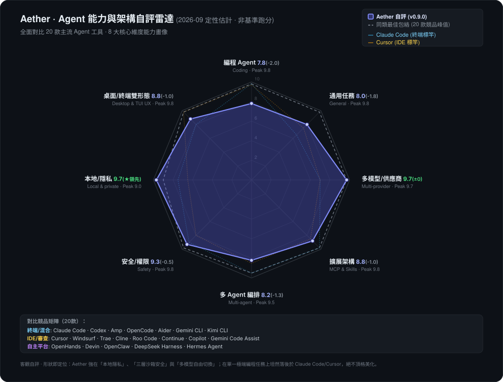

<div align="center">


# Aether

### 本機優先 · 多模型 · Agent 原生

與任意模型聊天、執行安全編碼 Agent、多模型橫向對比——桌面端與終端皆可。

**Electron + Node.js · React + TypeScript · MCP · Agent · Skills**

[](https://github.com/TQSY114514/Aether/releases) [](https://www.npmjs.com/package/aetherai)

[](./LICENSE) [](#-download)


[English](./README.md) · [简体中文](./README.zh-CN.md) · [繁體中文](./README.zh-TW.md) · [文言文](./README.zh-WEN.md) · [日本語](./README.ja.md) · [español](./README.es.md) · [français](./README.fr.md) · [Deutsch](./README.de.md) · [português](./README.pt.md) · [русский](./README.ru.md) · [українська](./README.uk.md) · [العربية](./README.ar.md) · [हिन्दी](./README.hi.md) · [한국어](./README.ko.md)<br><sup>譯文可能落後於英文 / 簡體中文版。</sup>

</div>

---

> **狀態:Beta。** Aether 是個人/業餘專案。它能用,但會有粗糙之處。歡迎提 bug——見 [CONTRIBUTING.md](./CONTRIBUTING.md) 和 [SECURITY.md](./SECURITY.md)。

> [!CAUTION]
> **出現 Windows SmartScreen 警告屬正常現象。** Aether 由學生開發者開發,未購買商業程式碼簽署憑證,因此 Win11 / Defender 首次啟動可能提示「Windows 已保護您的電腦」。
> **應用程式是安全的開源軟體——可先檢視原始碼,再點選「更多資訊 → 仍要執行」。**
> 若被防毒軟體隔離,請將應用程式資料夾加入排除清單(詳見[下載](#下載))。除您設定的 LLM 供應商外,不會有任何資料離開您的電腦。

**平台:僅支援 Windows。** 官方建置、測試與支援僅面向 Windows。macOS / Linux 可自行從原始碼建置,但不提供官方支援;專案未做程式碼簽署——首次啟動出現 SmartScreen「未知發行者」提示屬正常現象(見[下載](#下載))。

**一個應用,所有模型。** OpenAI / Claude / DeepSeek / 本機模型 / 任何 OpenAI 相容端點——聊天、執行編碼 Agent、在帶 ELO 投票的多模型競技場裡橫向對比模型能力。

**本機優先。** API 金鑰和對話儲存在本機 SQLite 中,除了發往你所設定的提供商外,絕不會離開你的電腦。

**預設安全。** 內建 Agent 執行在工作區沙箱內,配有權限階梯:檔案與命令存取在執行前需確認,每次工具呼叫都可稽核。

---

## 兩個產品形態，一個統一核心

Aether 採用**雙輪驅動架構**發布，提供完全平等的雙形態體驗，底層 100% 共享相同的 Agent 執行時、SQLite 記憶與三層安全沙箱：

- 🖥️ **Aether 桌面版（GUI）** — 基於 Electron + React。擁有直觀的圖文富文字流、多視窗拖曳、視覺化模型競技場與直觀的設定中心。**推薦絕大多數日常開發、偏好視覺化操作與新使用者首選。**（從 [GitHub Releases](#下載-桌面版) 下載，開箱即用）
- ⌨️ **Aether 終端版（CLI / TUI / SDK）** — 基於 Node.js 22+ 與 Ink v5。全鍵盤沉浸式互動、毫秒級輕量啟動、行級 Diff 審批，原生支援 SSH 遠端開發與無頭 CI/CD 流水線。**推薦重度終端極客與全鍵盤流開發者。**（`npm i -g aetherai`，詳見[下載 CLI](#下載-cli--tui--sdk)）

> 💡 **無縫協同**：二者共享 `agentCore`、42 個工具、SQLite 記憶、多模型路由、MCP 伺服器與同一會話儲存。你在桌面版開啟的會話，隨時可在終端用 `aether tui --session <id>` 續接，反之亦然。

---

**Aether 在哪一檔——誠實版。** 依據公開資料對 16 款主流終端 / IDE / 平台 Agent 工具進行系統自評（2026-09 最新評估；是估計，不是跑分）。我們把不對稱的形狀原樣畫出來：強在「本地隱私」、「三層沙箱安全」與「多模型自由切換」等軸；單模型極致編程能力坦然與第一梯隊存在客觀差距。這就是你選擇 Aether 時接受的真實取捨。完整競品深度對比詳見 [docs/competitive-analysis.md](docs/competitive-analysis.md)。

<p align="center"></p>

<sub>圖表由 <a href="./app/scripts/gen-radar.cjs">app/scripts/gen-radar.cjs</a> 生成——16 款工具評分逐字內嵌其中，可用 <code>node app/scripts/gen-radar.cjs</code> 本地復現。</sub>

---

## Aether 有什麼不同

Aether 把通常分散在多個工具裡的能力集中到一個本機桌面應用:

| 能力 | 說明 | 成熟度 |
|---|---|---|
| **多提供商聊天** | 對話中隨時切換 OpenAI、Claude、DeepSeek 與任何 OpenAI 相容端點。 | `Stable` |
| **Agent 工具迴圈** | 42 個內建工具,Plan-Act-Observe 迴圈、沙箱、權限階梯。 | `Beta` |
| **多模型競技場** | 一個提示同時發給多個模型,投票選出最佳,追蹤 ELO 排名。 | `Beta` |
| **技能與擴充** | 即插即用 `SKILL.md`、MCP 伺服器、10 點鉤子系統。 | `Experimental` |
| **結構化記憶** | Agent 跨會話回憶偏好與過往決策。 | `Beta` |
| **層次化規劃** | 複雜請求自動分解為並行子任務。 | `Experimental` |
| **上下文壓縮** | 長對話自動摘要且不丟工具呼叫對。 | `Beta` |
| **本機優先隱私** | 對話、金鑰、人設都在本機 SQLite。資料不離開你的機器。 | `Stable` |
| **15 種介面語言** | 含文言文與 RTL 阿拉伯語。 | `Beta` |
| **終端 TUI** | Ink v5 互動終端:會話流、工具卡、diff 審閱/回滾、鍵盤權限門、`/fork` 會話樹、`/memory`、todo 面板、`@` 檔案參照、`!` shell、執行中 steering 回注、會話 resume。 | `Experimental` |
| **無頭 CLI · RPC · SDK** | 四模式 CLI(單發 / NDJSON / JSONL RPC / 管道)、Electron-free SDK(`aetherai/sdk`)、機器可呼叫的 JSONL 協定。 | `Experimental` |
| **MIT 許可** | 完全開源。 | `Stable` |

---

## 下載

> 二選一即可。兩個產品共享同一 Agent 執行時與會話儲存。
> - **只想要桌面聊天應用?** → [Aether 桌面版](#下載-桌面版)
> - **想要終端 Agent / CI / SDK?** → [Aether CLI](#下載-cli--tui--sdk)

### 下載 — 桌面版

**Windows — 預建安裝套件(大多數使用者推薦)**

從最新 [Release](https://github.com/TQSY114514/Aether/releases) 下載:

| 建置 | 說明 |
|---|---|
| **`aetherai-setup-x.y.z.exe`** | NSIS 安裝套件。按使用者安裝(無需管理員),應用內自動更新。**推薦。** |
| **`aetherai-x.y.z.exe`** | 可攜單檔。免安裝、無自動更新;直接執行。 |

> 安裝套件首次啟動會出現 SmartScreen「未知發行者」警告——未簽署個人應用的正常現象。所有資料均留在本機。
>
> ⚠️ 部分防毒軟體可能因應用未簽署而隔離打包後的 `electron.exe`。若安裝套件被防毒軟體移除,請加入排除項或改用可攜版。

### 下載 — CLI / TUI / SDK

**`aetherai`** 是 npm 套件。一個二進位檔打包無頭 CLI、Ink v5 互動 TUI 與 Electron-free SDK。

```bash
# Install once (requires Node.js ≥ 22)
npm install -g aetherai
# or, no install:
npx aetherai "fix the failing test" --model deepseek

# Interactive terminal UI (best in Windows Terminal)
aether tui

# Single-shot prompt (CI / scripts)
aether "summarize README.md"

# JSONL RPC for external scripts
echo '{"type":"request","reqId":"c1","method":"listModels","params":{}}' | aether --mode rpc
```

`aether` 與 `aetherai` 指向同一個套件。`npm install -g aetherai@0.8.0` 可鎖定到與桌面版相同的版本。

> **與 GUI 共享資料** — 兩個產品共用同一 SQLite 資料庫(`%APPDATA%/aetherai/aetherai.db`)。桌面端開啟的會話可在 TUI 續接,反之亦然。

### 從原始碼執行(開發者 / 進階使用者)

想從原始碼執行或修改程式碼,使用 `start.bat`(需要 [Node.js 22+](https://nodejs.org)):

```bash
git clone https://github.com/TQSY114514/Aether.git
cd Aether
start.bat        # Windows: 安裝依賴、建置前端、啟動 Electron
```

手動分步見[快速開始](#-快速開始)。

> **兩個產品同源** — 兩個產品都在同一儲存庫。`app/electron/` 是共享的 Agent 執行時;`app/src/` 是桌面渲染層;`app/cli.js` + `app/tui/` 是 CLI/TUI 入口。從單一 git tag(`v*`)同時得到桌面安裝包與 npm 發布。

---

## 快速開始

**前置要求:** Node.js 22+、npm 9+

```bash
cd app
npm install
npm run dev      # 開發模式(熱重載)
npm run build    # 生產前端
npm start        # 啟動 Electron
```

或在儲存庫根目錄執行 `start.bat`(Windows)。

### 試試終端形態(無需 Electron 視窗)

```bash
cd app && npm install
node cli.js tui              # 互動終端 UI(Node ≥ 22;Windows Terminal 體驗最佳)
node cli.js "你好"           # 單發 prompt
echo "總結一下" | node cli.js  # 管道 stdin 作為 prompt
node cli.js --mode json "x"  # NDJSON 事件流(腳本/CI)
node cli.js tui --smoke      # headless 狀態機冒煙
```

### 設定提供商

1. 啟動後點擊側邊欄 **Models**。
2. 加入提供商(名稱 / API URL / API Key)。
3. 點擊 **Fetch models** 拉取可用模型清單。
4. 回到聊天開始對話。

### 啟用 Ask 模式

1. 開啟 **設定 - Agent 與安全**。
2. 將 Agent 權限模式設為 **Ask**。
3. 確認工作區根目錄是你希望 Agent 讀寫的資料夾。
4. 除非需要完全不受限存取,否則保持 **Yolo** 關閉。

### 執行第一個 Agent 任務

1. 開啟新對話。
2. 提問:`列出這個專案的檔案並總結這個應用是做什麼的。`
3. 逐一審閱提議的工具呼叫。批准安全讀取;拒絕任何意外操作。
4. 查看即時推理軌跡與最終回答。

---

## 功能

**狀態標籤:** `Stable` = 可日常使用,`Beta` = 可用但有已知粗糙點,`Experimental` = 新/進階行為可能變動,`Planned` = 已記錄的路標項。

### 聊天

| 功能 | 狀態 | 說明 |
|---|:---:|---|
| **多提供商** | `Stable` | 單一適配層;新增提供商 = 一個檔案。涵蓋 OpenRouter、Together、DeepSeek、Ollama、LM Studio…… |
| **並發流式** | `Stable` | 一個聊天流式輸出時,可在另一個對話繼續輸入。 |
| **思考力度滑桿** | `Beta` | 真實參數:OpenAI o 系列 / gpt-5 / 經中轉的 Claude。僅對推理模型生效。 |
| **附件** | `Beta` | 文字檔作為上下文;圖片用於多模態(需要視覺模型)。 |
| **長貼上摺疊** | `Stable` | 數百行自動摺疊為可展開片段(ChatGPT 風格)。 |
| **訊息編輯** | `Stable` | 任意位置覆寫重寫 + 重新產生。 |
| **訊息搜尋** | `Stable` | 全文高亮搜尋。 |
| **側欄摘要** | `Beta` | 模型產生的會話主題短語,非複製文字。 |

### Agent(函式呼叫)

- `Beta` **42 個內建工具** — 檔案操作(`read_file`、`list_dir`、`glob_find`、`grep_search`、`write_file`、`edit_file`、`apply_patch`)、網路(`web_search`、`web_fetch`)、Shell(`run_command`)、git 與 GitHub(`git_status`、`git_diff`、`git_log`、`git_commit`、`git_push`、`git_create_branch`、`github_pr_create/list/merge/review`、`github_issue_create/list`、`github_release_create`、`github_actions_status`)、程式碼智慧(`find_symbol`、`lsp_definition`、`lsp_references`、`lsp_diagnostics`、`lsp_code_actions`、`lsp_rename`)、Agent 元操作(`use_skill`、`ask_user`、`todo_write`、`delegate_task`、`task`、`memory_save/list/search`、`get_project_context`、`review_code`、`debug_loop`、`test_first`)——配 Plan-Act-Observe 迴圈、即時推理軌跡 + 任務清單、迴圈偵測、工具級逾時、可設定迭代預算(預設 25 輪)、上下文壓縮。
- `Experimental` **層次化規劃** — 複雜請求自動產生任務分解。
- `Experimental` **子 Agent 委派** — 經 `delegate_task` 並行執行獨立子任務。
- `Stable` **權限模式** — 風險遞進階梯:

| 模式 | 說明 | 沙箱 |
|---|---|---|
| **Off** | 純聊天,無工具 | N/A |
| **Plan** | 唯讀工具(只調查不改動) | - |
| **Ask** | 逐項確認風險操作(推薦) | - |
| **Auto** | 自動執行,不確認 | 有 |
| **Yolo** | 完全權限,無沙箱 | 無 |

- `Stable` **工作區沙箱** — `write_file`/`edit_file` 拒絕寫入設定的工作區根目錄之外;`run_command` 攔截破壞性模式。可在 設定 - Agent 與安全 中設定。
- `Beta` **上下文壓縮** — 自動摘要更早的歷史(工具呼叫/結果對完整保留;識別碼原樣保留)。
- `Beta` **工具呼叫修復** — 自動修復畸形 JSON、缺少參數、未加引號鍵與截斷呼叫。

### 記憶與學習

- `Beta` **自動長期記憶** — 每輪前注入相關記憶;自動擷取並儲存關鍵事實。可在 設定 - Agent 中開關。
- `Experimental` **習慣學習器** — 偵測重複偏好(如"總是用 Claude")並提議自動應用的技能。
- `Beta` **稽核日誌** — 每輪 Agent 執行的追蹤記錄,便於除錯。

### 競技場

- `Beta` **多模型競技場** — 一個提示、多個模型**並發**回答;投票選出最佳,自動更新 **ELO 排行榜**。模型按意圖分別計分(coding / math / translation / summary / general)。*沒有任何其他本機優先桌面聊天應用內建帶 ELO 的多模型競技場。*

### 技能與擴充

| 元件 | 格式 | 狀態 | 詳情 |
|---|---|---|:---:|---|
| **技能** | `SKILL.md` | `Experimental` | 放入 `<workspace>/.claude/skills/`;內建 `release-checklist` 與 `git-commit` |
| **斜線命令** | `CMD.md` | `Stable` | 6 個內建:`/code`、`/continue`、`/explain`、`/polish`、`/summarize`、`/translate` |
| **鉤子** | 腳本 | `Experimental` | 10 個生命週期點:PreToolUse、PostToolUse、ToolError、PreCompact、PostCompact、PreSend、PostResponse、SessionStart、SessionEnd、SubagentStop |
| **MCP** | stdio JSON-RPC 2.0 | `Beta` | 外部 MCP 伺服器與內建工具自動合併 |

### 自訂

| 設定 | 狀態 | 說明 |
|---|:---:|---|
| **進階模型設定** | `Stable` | Max tokens、temperature、top_p、自訂系統前綴、按語言自動標題、思考力度 |
| **自訂背景** | `Stable` | 上傳圖片,透明度/模糊控制 |
| **人設** | `Stable` | 系統提示預設,按會話切換 |
| **主題** | `Stable` | 淺色 / 深色 / 藍色 / 玻璃 / 復古 |
| **15 種介面語言** | `Beta` | 英文、中文(簡/繁/文言)、日文、西語、法語、德語、葡語、俄語、烏克蘭語、阿拉伯語(RTL)、印地語、韓語 |
| **自動更新** | `Beta` | NSIS 安裝套件啟動時檢查;可攜版也檢查(手動安裝) |
| **用量統計** | `Beta` | 每次 API 呼叫的日誌:tokens、成本、延遲、快取命中率 |

### 隱私

> **所有資料留在本機。** Aether 不收集、不上傳任何關於你的資訊。API 金鑰、對話、人設都儲存在本機 SQLite 資料庫。唯一的出站網路請求只會發往你設定的 LLM 提供商。

---

## 終端 TUI、RPC 與 SDK

除桌面應用和普通 CLI 外,Aether 還提供互動式終端 UI、機器可呼叫的 JSONL RPC 模式與 Electron-free SDK。三者與桌面端共用同一 Agent 核心、記憶、人設、MCP 工具與權限規則。

### 快速開始 — 雙形態

```bash
# 互動終端 UI(Ink v5;需要 Node ≥ 22)
node app/cli.js tui                # 真實終端:打字、批准工具、審閱 diff
node app/cli.js tui --smoke        # 無頭狀態機冒煙(CI 安全,輸出 JSON)

# 單發 prompt(與以前相同)
node app/cli.js "fix the failing test" --mode auto --max-iterations 30

# NDJSON 事件流供腳本/CI 使用(相容 --json-lines)
echo "summarize README.md" | node app/cli.js --mode json --model deepseek

# stdin/stdout 上的 JSONL RPC 迴圈
printf '{"type":"request","reqId":"c1","method":"listModels","params":{}}\n' \
  | node app/cli.js --mode rpc --db path\to\aetherai.db
```

其他無頭參數:`--persona <id>`(人設 + 記憶注入)、`--memory-trace`(報告注入記憶條目數)、`--skills`(技能提案 JSON)、`--setup-term`(寫入 Windows Terminal profile)、`--stdin`(顯式管道輸入)、`--resume` / `--session <id>` / `--fork [<id>]`(續跑會話;context-only——本輪訊息不回寫 DB)、`-o` / `--output-last-message <file>`(把最終答案寫入檔案)、`--version`、`--list-models` / `--list-providers`,以及 `aether completion bash|zsh|powershell`(shell 補全腳本)。

預設值來自 `~/.config/aether/config.json`(`model` / `mode` / `workspace` / `maxIterations`)與環境變數 `AETHER_MODEL` / `AETHER_MODE` / `AETHER_WORKSPACE` / `AETHER_MAX_ITERATIONS` / `AETHER_CONFIG`。優先順序:CLI 參數 > 環境變數 > 設定檔 > DB 預設。JSON 的 `done` 幀在定價表可用時攜帶 `estimatedCost`(USD)。

### TUI(`aether tui`)

互動式終端 Agent(Ink v5;Node ≥ 22;Windows Terminal 體驗最佳):

- **會話**:訊息流式渲染、每輪對話落庫 SQLite(退出不丟)、`--continue` / `--session <id>` / `--fork` 恢復會話、首條 prompt 自動標題、`/fork` 會話樹(`session.parent_session_id`)、`/sessions`、`/use <id>` 歷史切換
- **一個執行時,多個用戶端**:桌面 GUI 與 TUI 共用同一 SQLite 會話——GUI 開啟的對話可在終端用 `aether tui --session <id>` 續接(ID 可經 `aether tui --continue` 或 GUI 側欄列出),反之亦然。無頭 CLI(`--resume`/`--fork`)讀取同一批會話。
- **工具與權限**:工具呼叫卡(狀態色/耗時/摘要)、diff 審閱(`Alt+v` 展開,`Enter` 接受 / `r` 回滾——寫前快照還原,非 git 目錄也有效)、鍵盤權限門(`y` 允許一次 / `a` 總是允許 / `n` 拒絕,或 `←→` 選擇)、唯讀工具自動放行
- **審批模式**:`Shift+Tab` 迴圈 `manual → auto-edits → plan`(plan = 唯讀規劃,完成後三選項決定如何實施);`/approval-mode dontask` 走純規則審批(寫入工具需 allow 規則)
- **模式**:`Alt+m` 切換 ask/plan/auto;`/persona <id>` 切換人設(注入 persona + 記憶前綴)
- **leader 快速鍵**:`Ctrl+X` 然後 `m` 模型選擇器 / `n` 新會話 / `l` 會話清單 / `g` 時間線 / `r` rewind 檢查點 / `q` 退出 / `e` 外部編輯器
- **命令面板**:`Ctrl+P` 或 `x`(New chat / Model / History (sessions) / Timeline / Export JSONL / Help / Quit)
- **鍵位可重綁**:`~/.config/aether/keybindings.json`(如 `{ "char:?": null }` 停用 `?` 說明鍵)
- **API key 持久化**:`/apikey <provider> <key>` 儲存到 `auth.json`(桌面版 safeStorage 加密的 key 在 headless 無法解密,用此命令或環境變數 `AETHER_API_KEY`)
- **記憶與技能閉環**:`/memory <關鍵詞>` 檢索、`--memory-trace` 注入條目數、`/skills` + `/skill accept|dismiss <key>`(habitLearner → 技能提案)
- **todo 與收藏**:`Ctrl+T` 開關 agent 即時 todo 清單;`Ctrl+F` 收藏/取消目前模型(持久化);`F2` 循環最近模型
- **`@` 檔案與 `!` shell**:輸入 `@` 彈出檔案選擇(提交時內容注入,≤50KB);`!命令` 經 sandbox 執行並把輸出餵給模型
- **會話上下文命令**:`/compact` / `/compress-fast`(壓縮歷史)、`/context`(用量)、`/clear`(新會話)、`/undo`(撤銷上一輪 + 檔案快照)、`/recap`(一行摘要)、`/rename` / `/delete`、`/diff`(未提交變更檢視器)、`/permissions add <name> <ruleKey> <allow|deny|ask>`、`/provider add|list`
- **首次執行自舉**:無需先跑桌面版——`aether tui` 自動建庫並提示用 `/provider add` 設定 provider
- **steering**:執行中 `Ctrl+C` 打斷 → 輸入下一條 → 注入目前迴圈(佇列顯示 `steer:n`);執行中 `Tab` 直接排隊下一條
- **快速鍵**:雙擊 `Esc` 退出(或 `/quit`)、`Esc` 清空輸入(草稿入歷史)、`?` 說明螢幕、`PgUp/PgDn`/滑鼠滾輪翻頁、狀態列即時顯示 `approval/mode/model/tok/ctx`;完整鍵位見 [docs/tui-keys.md](./docs/tui-keys.md)

### RPC(`aether --mode rpc`)

stdin/stdout 上的機器可呼叫 JSONL 協定:`request` 幀進,`event`/`result`/`error` 幀出——每行一個 JSON 物件,無人類文字。方法:`run`(流式輸出 `text`/`tool`/`plan`/`status` 事件)、`listModels`、`listProviders`、`models.default`、`listSessions`、`session.load`、`session.fork`、`task.derive`、`task.status`。幀參考:[docs/rpc.md](./docs/rpc.md)。

### SDK(`require('aetherai/sdk')`)

供外部 Node 專案使用的 Electron-free Agent 核心聚合:`runAgent`、`openDatabase`、`resolveProviderModel`、`taskDbAdapter`、`memory`(prefetch/recall/search/……)、`classifyAgentMode`、`rpc` 幀、`sessionContext`(人設 + 記憶注入)。含型別宣告(`app/electron/sdk/index.d.ts`)。

```js
const { runAgent, openDatabase, resolveProviderModel, classifyAgentMode } = require('aetherai/sdk')
const db = openDatabase('./aetherai.db')
const { provider, model } = resolveProviderModel(db, { modelName: 'deepseek' })
console.log(classifyAgentMode({ prompt: 'delete the file' })) // { mode: 'ask', reason: ... }
```

---

## Windows 原生能力

| 能力 | 說明 |
|---|---|
| **托盤選單** | 顯示/隱藏視窗、新建會話、**新建任務**(直接開啟 TaskPanel);托盤點擊切換顯隱。 |
| **全域快速鍵** | `Ctrl+Alt+A` 喚出主視窗(未啟動則建立);註冊結果寫入啟動日誌。 |
| **`aetherai://` 協定** | `aetherai://new` / `chat` 新建會話;`aetherai://tui` 提示終端形態;`aetherai://open/?path=<編碼路徑>` 把資料夾設為工作區並新建會話(右鍵"用 Aether 開啟"鏈路)。 |
| **右鍵註冊** | `app/resources/register-protocol.reg`(替換 `<AETHER_EXE>` 後管理員匯入):`.cs/.js/.ts/.tsx/.md/.json` + 資料夾 → 右鍵"用 Aether 開啟"。 |
| **終端引導** | `app/resources/term/aether.ps1`(別名 + 啟動 `aether tui`);`node app/cli.js --setup-term` 寫入 Windows Terminal profile(深/淺兩套配色)。 |
| **沙箱強化** | Windows 路徑防禦:`\\?\` 長路徑、UNC `\\server\share`、重解析點/junction 逃逸、`.lnk/.scr/.msi` 等危險副檔名。 |

---

## 專案結構

```
app/
├── electron/              # 主進程 (Node)
│   ├── database.js        # better-sqlite3 資料層 — 25+ 張表 (WAL)
│   ├── ipc/               # IPC 處理器 (chat / arena / session / mcp / ...)
│   │   ├── chat.handler.js    # THE 中央處理器 (540 行)
│   │   ├── arena.handler.js   # 多模型競技場 + ELO
│   │   ├── agent.handler.js   # 工作區管理
│   │   └── ...
│   ├── llm/               # LLM 抽象層 (~3,700 行, 19 個檔案)
│   │   ├── providerAdapter.js # 按 api_format 分發 (openai/anthropic)
│   │   ├── openaiAdapter.js   # OpenAI 相容 SSE 流式 + 重試
│   │   ├── anthropicAdapter.js# Anthropic Messages API
│   │   ├── credentialPool.js  # 多金鑰輪換 + 冷卻
│   │   ├── toolLoop.js        # Plan-Act-Observe + 迭代預算
│   │   ├── planning.js        # 層次化任務分解
│   │   ├── subAgent.js        # 並行子 Agent 委派
│   │   ├── compaction.js      # 上下文壓縮(保留配對)
│   │   ├── autoMemory.js      # 長期結構化記憶
│   │   ├── habitLearner.js    # 重複偏好 → 自動技能
│   │   ├── hooks.js           # 10 點擴充鉤子
│   │   ├── skills.js          # SKILL.md 載入器 (Claude Code 格式)
│   │   ├── modelAdvisor.js    # 啟發式模型建議
│   │   ├── toolCallRepair.js  # 畸形工具呼叫修復
│   │   ├── auditLog.js        # 每輪 Agent 執行追蹤
│   │   └── ...
│   ├── tools/             # 內建工具註冊表 + 沙箱
│   │   ├── registry.js       # 16 個工具定義 (OpenClaw 啟發)
│   │   └── sandbox.js        # 三層防禦 (工作區根、穿越守衛、黑名單)
│   ├── mcp/               # MCP 用戶端 + 伺服器管理器
│   ├── main.js / preload.js
├── src/                   # 渲染進程 (React + TS + Zustand)
│   ├── store/index.ts     # Zustand 全域狀態 (~1,000 行)
│   ├── components/        # UI (chat / sidebar / settings / ui)
│   ├── pages/             # Chat / Models / Persona / Settings / Scores / ...
│   ├── utils/             # i18n (15 locales) / theme / markdown
│   └── types/
├── skills/                # 內建技能 (release-checklist, git-commit)
├── commands/              # 內建斜線命令 (/code, /explain, /polish, ...)
└── resources/             # 應用圖示
```

---

## 技術棧

| 層 | 技術 |
|---|---|
| 桌面 | Electron 43 |
| 前端 | React 18.3 + TypeScript 5.8 |
| 狀態 | Zustand 4.5 |
| 建置 | Vite 8 + electron-builder |
| 資料庫 | better-sqlite3 (原生 SQLite, WAL 模式) |
| LLM | OpenAI 相容 + Anthropic Messages API |
| UI | Tailwind CSS 3.4, lucide-react, highlight.js |
| MCP | 自研 stdio JSON-RPC 2.0 用戶端 |
| TUI | Ink 5 + React 18 (createElement, 無 JSX) |
| CLI/SDK | Node.js 無頭 CLI (4 種模式) + Electron-free SDK |

---

## 致謝

Aether 站在這些專案的肩膀上——它們的思想塑造了架構與體驗:

### Agent 框架

| 專案 | 啟發 |
|---|---|
| [OpenClaw](https://github.com/openclaw/openclaw) | 上下文壓縮、工具呼叫迴圈偵測、事件流架構 |
| [Hermes Agent](https://github.com/NousResearch/hermes-agent) | 迭代預算、結構化長期記憶、自主技能、cron 排程、FTS5 記憶搜尋 |
| [Evolver](https://github.com/EvoMap/evolver) | 自進化引擎、GEP(Genome Evolution Protocol) |
| [Aider](https://github.com/Aider-AI/aider) | LLM 編碼助手工具迴圈、git 整合 |
| [Cline](https://github.com/cline/cline) | IDE 內嵌 Agent、MCP 整合、權限 UX |
| [OpenCode](https://github.com/sst/opencode) | TUI 鍵盤/主題/權限互動、prompt 快取策略層 |
| [OpenAI Codex](https://github.com/openai/codex) | 沙箱處理程序樹隔離、執行時長與狀態指示 UX |

### UI 與 UX

| 專案 | 啟發 |
|---|---|
| [shadcn/ui](https://github.com/shadcn-ui/ui) | cn() 複製貼上元件方法論 |
| [Magic UI](https://github.com/magicuidesign/magicui) | 動畫模式 (shimmer, blur-fade) |
| [cc-switch](https://github.com/farion1231/cc-switch) | 用量統計面板佈局 |

### 基礎設施

| 專案 | 啟發 |
|---|---|
| [MCP](https://modelcontextprotocol.io) | Aether Agent 所說的協定規範 |
| [new-api](https://github.com/QuantumNous/new-api) | reasoning-effort 參數形狀(中轉轉換邏輯) |

---

## 貢獻

歡迎一切貢獻!無論是 bug 修復、功能請求、翻譯改進還是文件更新——請開 issue 或提交 PR。

1. Fork 儲存庫
2. 建立功能分支(`git checkout -b feat/my-feature`)
3. 提交修改(`git commit -am 'Add feature'`)
4. 推送分支(`git push origin feat/my-feature`)
5. 開啟 Pull Request

詳細指南見 [CONTRIBUTING.md](./CONTRIBUTING.md)。

---

## 許可

[MIT](./LICENSE) © 2025 Aether

---

<div align="center">

用 ❤️ 建置,Electron + Node.js + React + TypeScript

[⬆ 返回頂部](#aether)

</div>
