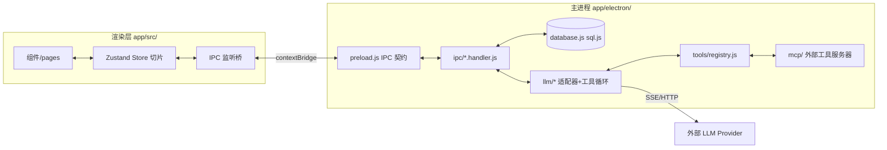

# Aether 项目总结

> [!info] 一句话定位
> Aether（前身 AetherAI）是一个 **local-first、多模型** 的桌面 AI 聊天客户端。把 LLM provider 当作可插拔后端，所有用户数据落地本地 SQLite，主进程 Electron + 渲染层 React/TS + Zustand + Tailwind + sql.js。

---

## 技术栈

| 层 | 选型 |
|---|---|
| 桌面外壳 | Electron |
| 渲染层 | React + TypeScript |
| 状态管理 | Zustand（切片化） |
| 样式 | Tailwind + CSS 变量主题 |
| 本地存储 | sql.js（SQLite WASM） |
| 构建 | Vite + electron-builder |
| 国际化 | 自研 `gen-i18n.js` 从 `i18n.base.json` 生成 15 语言 |
| 发布 | GitHub Actions，推 `v*` tag 触发 |

---

## 架构总览



### 渲染层 `app/src/`
- `store/` — 大型 Zustand store，按切片拆分：`sessionSlice` / `providerSlice` / `personaSlice` / `chatSlice` / `arenaSlice` / `settingsSlice` / `uiSlice`，`listeners.ts` 桥接 IPC 事件。
- `components/` — `chat/`（ChatWindow、ChatInput、ContextBar、ToolCallBlock、ThinkingBlock、TaskCard 等）、`sidebar/`、`settings/`、`ui/`。
- `pages/` — ChatPage、ModelPage、PersonaPage、SettingPage、ScoresPage、TokenPage、MemoryPage、LearningGraphPage、SkillsPage。
- `utils/` — `i18n.ts`（生成产物，禁手改）、`theme.ts`（设 CSS 变量含 `--content-bg`）、`markdown.ts`、`tokenEstimate.ts`。

### 主进程 `app/electron/`
- `database.js` — sql.js 封装，BigInt 经 `allRows()` 强制归一；`initDatabase` 含 CREATE TABLE 与 `addCol` 迁移块。
- `ipc/*.handler.js` — 每个域一个 handler（chat、session、provider、model、arena、memory、mcp、settings、agent、cron、git、task、toolLoopCallbacks 等）。
- `main.js` — 窗口 + handler 注册；`preload.js` — contextBridge 暴露的 **IPC 契约**；`updater.js` — 自动更新。
- `llm/` — 核心智能层（见下）。
- `tools/registry.js` — 内置工具，`risk: safe|dangerous` 权限分级。
- `mcp/` — `client.js` + `manager.js` 外部 stdio 工具服务器，工具经 `getMergedTool(s)` 与内置合并。

### LLM 层 `app/electron/llm/`
- `providerAdapter.js` — 按 `provider.api_format` 分发。
- `openaiAdapter.js` / `anthropicAdapter.js` / `responsesAdapter.js` — 各家协议适配（fetch + SSE）。
- `toolLoop.js` — Plan→Act→Observe 工具循环。
- `toolResultMiddleware.js` — 工具结果 **redact + truncate** 后才送回模型，不可绕过。
- `compaction.js` — 上下文压缩，pair-preserving 切分保留 tool-call/result 配对，UUID/路径/IP 原文保留。
- `checkpointManager.js` — 会话级检查点（表名 `agent_turn_checkpoint`，避免与 `database.js` 冲突）。
- `reasoning.js` — thinking-effort 参数塑形。
- `modelRouter.js` / `modelAdvisor.js` / `credentialPool.js` / `providerHealth.js` — 路由、建议、凭证池、健康探测。

---

## 核心子系统

### 数据库与存储
> [!important] 全 SQLite
> settings / sessions / messages / providers / models / personas / memory / arena 投票 / model scores **全部** 在 `aetherai.db`。唯一例外是 `background.img`（太大不放 TEXT 列）。

- BigInt 雷区：sql.js 对 64-bit INTEGER 返回 BigInt，**每条读路径必须走 `allRows()` 或手动强转**；`db.exec()` 不绑参，参数化读必须用 `prepare().bind()`。
- 运行时数据位于 `%APPDATA%/aetherai/`（API key、DB、背景图、聊天记录），源码绝不存 secrets。

### IPC 三件套契约
> [!warning] 硬规则
> 新增/改动 IPC 必须同步三处：
> 1. `app/electron/ipc/<domain>.handler.js` — 实现
> 2. `app/electron/preload.js` — 暴露
> 3. `app/src/env.d.ts` — 类型声明
>
> handler 收的参数 preload 不转发 = bug；返回 shape 与 env.d.ts 不符 = bug。

### 上下文压缩 `compaction.js`
- pair-preserving：tool-call 与其 result 永不拆散。
- 关键 token（UUID / 路径 / IP）原文保留，不被摘要。
- **手动 pin**（Trae 会话新增）：pinned 消息不参与摘要，长期保留。

### 检查点与会话分支
- `agent_turn_checkpoint` 表存储 agent 回合级检查点。
- 会话分支（branch）基于检查点回溯，可从某个历史点 fork 新会话。

### 模型路由
- `modelRouter.js` 按任务类型 / 上下文窗口 / 成本选模型。
- `credentialPool.js` 多 key 轮换 + `providerHealth.js` 健康探测自动降级。
- 会话级配置覆盖全局默认（`sessionConfigs[sid].modelId`）。

### 记忆系统 `autoMemory.js` / `curator.js` / `memoryGraph.js`
- 记忆分类型（entity / fact / context），带 confidence 评分。
- **Trae 会话新增**：使用反馈回路更新 confidence，低分记忆可被淘汰。

### 工具系统 `toolLoop.js` + `registry.js`
- 生命周期钩子：`prepareArguments` → `beforeToolCall` → execute → `afterToolCall`。
- 并行/串行执行可按工具配置（OpenClaw 模式）。
- `toolCallRepair.js` 自动修复畸形 JSON / 缺参 / 截断调用。
- `risk: 'dangerous'` 工具在 `ask` 模式需确认，`plan` 模式直接禁用。

### MCP 集成
- `mcp/client.js` 启动外部 stdio 工具服务器。
- `mcp/manager.js` 管理生命周期 + **断线自动重连**（Trae 会话实现）。
- 工具经 `getMergedTool(s)` 与内置合并，对上层透明。

---

## Trae 会话期间的开发成果（0.5.x 系列）

> [!note] 范围说明
> 以下为 0.5.1 → 0.5.15 在 Trae 中完成的工作。沙箱快照停留在 0.5.0，本地 `D:\Aether` 已推进到 0.5.15。

### 功能增强
- **Session-scoped chat stop** — `chat:stop` 接受 `sessionId` 参数，跨会话停止不再误杀。
- **Accumulative message registration** — `registerSessionMessages` 累加 message ID 而非替换，修复后台流式完成消息丢失。
- **手动 pin 消息** — compaction 中 pinned 消息不参与摘要。
- **MCP 断线自动重连** — `mcp/manager.js` 监控 + 指数退避重连。
- **记忆 confidence 评分** — 使用反馈驱动记忆保留/淘汰。
- **聊天界面统一** — 删除纯白欢迎页，新建聊天直接进入半透明背景空白聊天页；`newChat()` 立即 `createSession()`。
- **模型徽章 fallback 链** — `currentModel` → 会话配置 → `defaultModelId` → `is_primary` → 列表首项。

### Bug 修复
- **`controller` 未声明致 `habitLearner.proactiveSuggest` 静默失效** — `chat.handler.js` 改用 `typeof controller !== 'undefined'` 守卫 + fallback。
- **`ipcMain.emit` 参数顺序错误致设置缓存永不失效** — `settings.handler.js` 改为 `emit(channel, null, key)` 匹配监听器签名。
- **`checkpointManager` 与 `database.js` 表名冲突** — `agent_checkpoint` 重命名为 `agent_turn_checkpoint`。
- **`autoCommit` 硬编码** — `chat.handler.js` 改为读取配置。

### 架构改进
- ChatPage 单一聊天视图，移除 `if (!currentSessionId)` 的欢迎页分支。
- 启动优化：`modelsByProvider` 从已加载 `allModels` 内存构造，省去 N 次 IPC 往返。
- EmptyState/ChatPage 模型回退链统一。

---

## 开发约定（硬性规则）

> [!danger] 不可破
> - **主进程改动需完整重启** Electron（不热重载）；渲染层 `npm run build` 即可。
> - **i18n 禁手改 `i18n.ts`**，新增串只改 `i18n.base.json`（至少 zh+en）后 `gen-i18n.js` 再生成。
> - **工具权限分级不可错标**，mutating 工具绝不能标 `safe`。
> - **No secrets in source**，提交前默认仓库会公开。
> - **BigInt 读路径必须强转**。

### 改 X 前必读 Y
| 改 | 必读 |
|---|---|
| chat send/stream | `ipc/chat.handler.js` + `store/index.ts` sendMessage + `components/chat/ChatWindow.tsx` chunk listener |
| tools | `tools/registry.js` + `llm/toolLoop.js` + `llm/toolResultMiddleware.js` |
| IPC surface | handler + `preload.js` + `src/env.d.ts` |
| 主题/背景 | `utils/theme.ts` + `App.tsx` 背景层 |
| DB schema | `database.js` `initDatabase` + `addCol` 迁移块 |

---

## 关键文件索引

```text
app/electron/
  main.js                     窗口 + handler 注册
  preload.js                  IPC 契约（contextBridge）
  database.js                 sql.js 封装 + BigInt 归一
  ipc/chat.handler.js         聊天发送/流式核心
  ipc/session.handler.js      会话 CRUD + prune
  llm/providerAdapter.js      按 api_format 分发
  llm/openaiAdapter.js        fetch + SSE
  llm/toolLoop.js             Plan→Act→Observe
  llm/toolResultMiddleware.js 工具结果 redact+truncate
  llm/compaction.js           上下文压缩 + pin
  llm/checkpointManager.js    会话检查点
  llm/modelRouter.js          模型路由
  mcp/manager.js              MCP 生命周期 + 重连
  tools/registry.js           内置工具 + risk 分级
app/src/
  store/index.ts              Zustand 入口（切片聚合）
  store/chatSlice.ts          sendMessage / streamingBySession
  pages/ChatPage.tsx          统一聊天视图
  components/chat/ChatWindow.tsx  chunk listener
  utils/theme.ts              CSS 变量（含 --content-bg）
  utils/i18n.base.json       i18n 源（zh+en 起步）
```

---

## 开发与发布流程

> [!tip] 常用命令
> ```bash
> start.bat                    # 仓库根，启动
> cd app && npm run build      # 构建渲染层（提交前必过）
> cd app && npm run build:win  # 打 Windows 安装包
> node -e "require('./electron/ipc/<file>')"  # sanity-check 主进程文件加载
> ```

- **发布**：更新 `CHANGELOG.md` → 提交 → 打 `v*` tag 推送 → GitHub Actions（`.github/workflows/release.yml`）自动构建发布。
- **测试**：`app/test/` 下 Vitest，覆盖 compaction、toolLoop、modelRouter、credentialPool、sandbox 等。

---

## 相关笔记
- [[Claude Code 总结]]（你已整理）
- 待补：OpenCode 工作流总结

---

> [!quote] 项目宪法
> 详见仓库根 `AGENTS.md` — 是人类与 AI 协作者的共同宪法：什么放哪、硬规则、改前必读清单。
