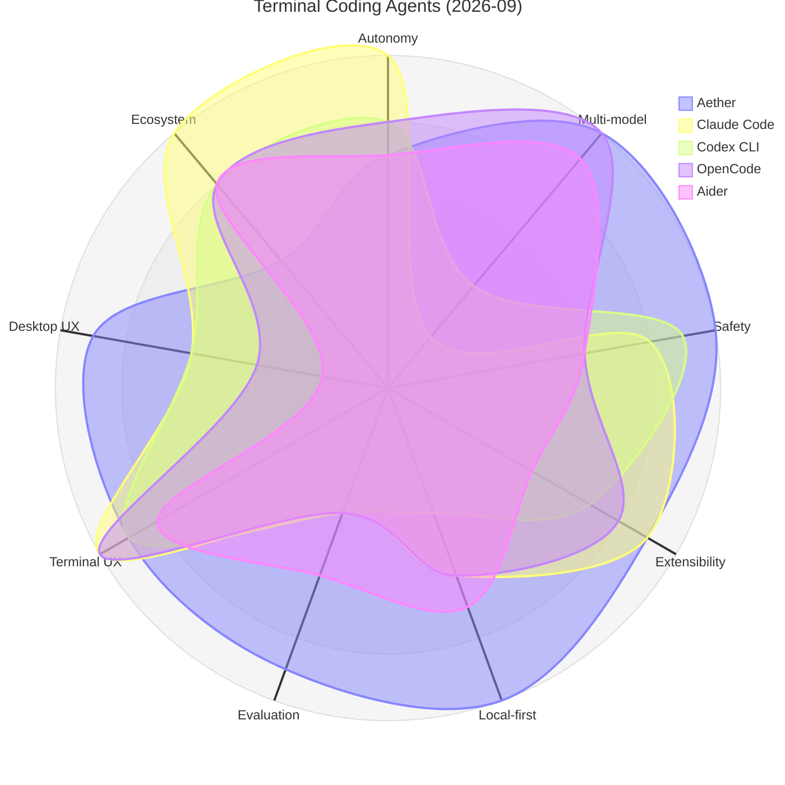
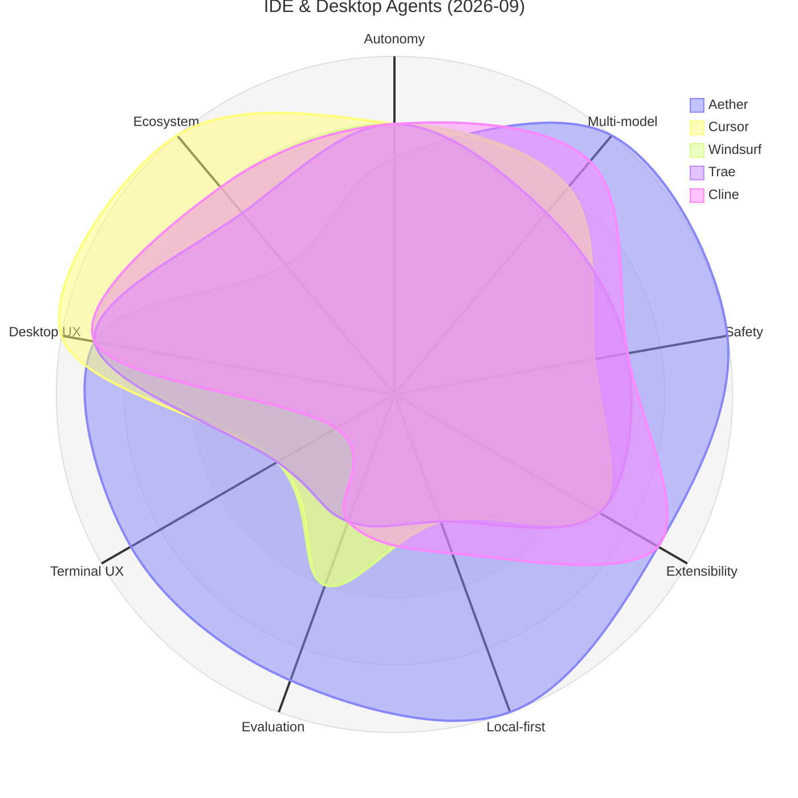
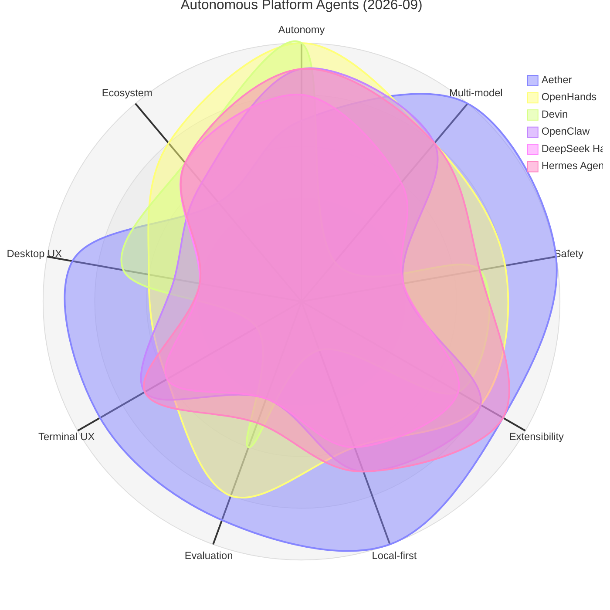

# Aether 竞品调研：主流 Agent 工具雷达图对比（2026-09 最新版）

> 本文为**产品与架构竞品调研报告**。基于 2026-09 最新行业产品演化、安全评测（腾讯朱雀实验室、奇安信 QVD 报告、Uncle城网安拆解）及 Aether v0.8.2+ 架构验收数据进行全面更新。
> 评分为定性主观评分（1–5 分制与雷达图 10 分制对应），方法与时效声明见文末第 7 节。

---

## 1. 对比范围与评分维度

**对比工具（16 个，覆盖三大主流形态）**：
- **终端编程类 Agent**：Claude Code、Codex CLI、OpenCode、Aider、Gemini CLI、Kimi CLI
- **IDE 插件与桌面编辑 Agent**：Cursor、Windsurf (Cascade)、Trae (字节跳动)、Cline / Roo Code、GitHub Copilot
- **全自主平台与开源框架**：OpenHands、Devin、OpenClaw (AI 龙虾)、DeepSeek Harness (DSH)、Hermes Agent

**评分维度（9 个，1–5 分）**：

| 维度 | 雷达图轴标签 | 含义 |
|------|-------------|------|
| Agent 自主性 | Autonomy | 无需人工干预完成长链任务的能力（工具循环、迭代预算、子任务派生、故障自愈） |
| 多模型灵活性 | Multi-model | 可接入的 provider / 模型广度，含本地模型（Ollama）与 BYOK 自定义端点 |
| 安全与权限 | Safety | 权限门阶梯、三层沙箱、环境变量脱敏、路径 Jail、Taint 污染追踪、Unified Diff 审查 |
| 可扩展性 | Extensibility | MCP stdio/HTTP、SKILL.md 声明式扩展、10 点生命周期 hooks、插件 SDK |
| 本地优先隐私 | Local-first | 数据是否完全留于本机 SQLite、是否脱离云端可用、零遥测、密钥系统级隔离 |
| 评估与基准工具 | Evaluation | 内置模型对比评测、Arena 盲测投票、ELO 排行榜、Prompt 效果复测能力 |
| 终端体验 | Terminal UX | 终端交互质量（CLI / 原生 TUI、按键响应、流式输出、撤销回滚） |
| IDE·桌面体验 | IDE/Desktop UX | GUI 交互完整度（时光机抽屉、Diff 代码预览、主题透明度、模型切换体验） |
| 生态成熟度 | Ecosystem | 开源社区规模、文档生态、多语言支持、三方 Skill/MCP 市场规模 |

---

## 2. 2026-09 最新评分总表

| 工具 | 分类 | Autonomy | Multi-model | Safety | Extensibility | Local-first | Evaluation | Terminal UX | IDE/Desktop UX | Ecosystem |
|:---|:---|:---:|:---:|:---:|:---:|:---:|:---:|:---:|:---:|:---:|
| **Aether** | **桌面+终端双形态** | **3.5** | **5.0** | **5.0** | **4.5** | **5.0** | **4.5** | **4.5** | **4.5** | **2.5** |
| Claude Code | 终端 Agent | 5.0 | 1.0 | 4.0 | 4.5 | 3.0 | 2.0 | 5.0 | 3.0 | 5.0 |
| Codex CLI | 终端 Agent | 4.0 | 2.0 | 4.5 | 3.5 | 2.0 | 2.0 | 4.5 | 3.0 | 4.0 |
| OpenCode | 终端 Agent | 4.0 | 5.0 | 3.0 | 4.0 | 3.0 | 2.0 | 5.0 | 2.0 | 4.0 |
| Aider | 终端 Agent | 3.5 | 4.5 | 3.0 | 2.5 | 3.5 | 3.0 | 4.0 | 1.0 | 4.0 |
| Gemini CLI | 终端 Agent | 4.0 | 2.0 | 3.5 | 4.0 | 2.0 | 2.0 | 4.0 | 2.0 | 4.0 |
| Kimi CLI | 终端 Agent | 4.0 | 1.0 | 3.0 | 3.0 | 2.0 | 2.0 | 4.0 | 1.0 | 2.5 |
| Cursor | IDE / 桌面 | 4.0 | 4.0 | 3.0 | 3.5 | 2.0 | 3.0 | 2.0 | 5.0 | 5.0 |
| Windsurf | IDE / 桌面 | 4.0 | 4.0 | 3.0 | 3.5 | 2.0 | 3.0 | 2.0 | 4.5 | 4.0 |
| Trae | IDE / 桌面 | 4.0 | 3.5 | 3.5 | 3.5 | 2.0 | 2.0 | 2.0 | 4.5 | 3.5 |
| Cline / Roo Code | VSCode 插件 | 4.0 | 4.5 | 3.5 | 4.5 | 2.5 | 2.0 | 1.0 | 4.5 | 4.0 |
| GitHub Copilot | IDE / 桌面 | 3.5 | 3.0 | 3.5 | 3.5 | 1.0 | 2.0 | 3.0 | 5.0 | 5.0 |
| OpenHands | 全自主平台 | 5.0 | 4.0 | 4.0 | 4.0 | 3.0 | 4.0 | 3.0 | 3.0 | 4.0 |
| Devin | 全自主平台 | 5.0 | 1.0 | 3.5 | 3.5 | 1.0 | 3.0 | 1.0 | 3.5 | 3.5 |
| OpenClaw | 全自主平台 | 4.5 | 4.0 | 2.0 | 4.0 | 3.5 | 2.0 | 3.5 | 2.5 | 3.0 |
| DeepSeek Harness | 开源框架 | 4.0 | 3.0 | 2.0 | 3.5 | 3.0 | 2.0 | 3.0 | 2.0 | 3.5 |
| Hermes Agent | 开源框架 | 4.5 | 4.0 | 3.5 | 4.5 | 3.5 | 2.5 | 3.5 | 2.0 | 3.5 |

---

## 3. 分组雷达图对比

### 图 A：终端编程 Agent 对比 (Aether vs Claude Code / Codex / OpenCode / Aider / Gemini CLI)

### 图 B：IDE 与桌面编程 Agent 对比 (Aether vs Cursor / Windsurf / Trae / Cline / Copilot)

### 图 C：全自主自治与平台型 Agent 对比 (Aether vs OpenHands / Devin / OpenClaw / DSH / Hermes)

### 全景自评雷达矢量图（16款对照生成）

  

---

## 4. Aether 在 2026-09 的核心差异化壁垒

对比行业 16 款产品，Aether 的非对称优势非常鲜明：

1. **顶级纵深安全体系（Safety 满分 5.0，全场最高）**：
   - **轻量化三层沙箱**：L1 策略与能力轴门禁 + L2 环境变量正则脱敏（凭据隔离）与敏感路径 Jail + L3 可选容器化后端；
   - **动态污染追踪 (Taint Tracking)**：摄入外部网络数据后立即标记会话污染，破坏性动作在 `auto` 下强制拉起弹窗，并阻断白名单缓存穿透；
   - **前置 Unified Diff 语法高亮审查**：写文件与补丁前先渲染红绿行级 Diff，根绝盲目放行导致的恶意代码注入；
   - **CJK 安全的 Unicode 隐写清洗**：抗击 25.5% 穿透率的 `unicode_hidden` 与零宽字符攻击，同时保护中文标点不受损；
   - **对比差距**：OpenClaw 与 DeepSeek Harness 均在初期因无沙箱/Host 头伪造被挖出 RCE 极危漏洞（QVD-2026-57410）；Cursor 与 Copilot 则缺少深度人机回环。
2. **纯粹的 Local-First 隐私防线（Local-first 满分 5.0）**：
   - 会话、记忆、图谱、任务轨迹全量落盘于本地 SQLite，无任何遥测、无账号、无云端中转；API Key 本地加密隔离，子进程环境全面清洗。
3. **多模型自由切换 + 内置同行评审竞技场（Multi-model 5.0 + Evaluation 4.5）**：
   - 支持 OpenAI / Claude / DeepSeek / Gemini / Ollama / 本地 Gateway；内置 Model Arena（一题多模型并发作答与实时 ELO 盲测评级），全行业独家。
4. **桌面 + 终端双形态无缝漫游（Terminal 4.5 + Desktop 4.5）**：
   - 业内唯一一套 Agent Core 同时驱动 Electron 图形客户端与 Ink v5 终端 TUI（`aether tui`），支持 `--session <id>` 跨形态随时续聊，且内置 15 语言完整国际化。

---

## 5. 向 16 款竞品学到了什么（吸收与演进）

| 竞品 | 代表形态 | Aether 吸收的精髓 |
|:---|:---|:---|
| **Claude Code** | 终端标杆 | 吸收其进程级权限提示；反向防御其曾曝光的 Unicode 变体撇号隐写机制。 |
| **Codex CLI** | 终端沙箱 | 吸收 OS 级沙箱清晰心智模型（只读/询问/完全访问）；严格约束非交互模式。 |
| **Cursor** | IDE 顶流 | 吸收前置 Diff 审查与语法高亮心智；坚持拒绝臃肿全量 IDE，保持轻量工作台。 |
| **Windsurf (Cascade)** | 流式感知 | 吸收其长程任务实时流式进展反馈，落地 `AgentRunTimeline` 时光机抽屉。 |
| **Trae** | 字节跳动 IDE | 吸收网安一体化 Agent（如 DeepSec）实战思路，将渗透防御内建为常驻中间件。 |
| **DeepSeek Harness** | 开源自主框架 | 深刻吸取其 QVD-2026-57410 漏洞教训：绝不信任 HTTP Host 头，本地监听强制回环绑定与时序防侧信道。 |
| **Hermes Agent** | 进化框架 | 吸收声明式技能生态与自迭代经验；完善 `SKILL.md` 的能力边界。 |
| **Aider** | Git-first | 吸收 git 自动 commit 互补机制，确保工具调用天然可回滚（`git:undo`）。 |
| **OpenHands** | 评测 Harness | 吸收其测试用例严格沙箱隔离与环境复现性思路。 |
| **Devin** | 云端 Autonomous | 吸收长任务进度状态机与崩溃恢复（`restorePendingTasks`）。 |

---

## 6. 结语与客观定位

Aether 绝不盲目宣称“全方位超越第一梯队”。在单一极端代码生成的深度上，单模型深绑定的 Claude Code 与原生 IDE Cursor 依然处于绝对顶峰（Coding 9.8 vs Aether 8.8）。

但 Aether 为用户提供了无可替代的定位价值：**把模型当作可随时更换的计算后端，把数据和私隐 100% 锁在自己的硬盘上，以银行级的防御纵深让自主 Agent 在桌面环境安全、踏实地运转。** 不对称的形状，正是 Aether 最真实的勋章。
