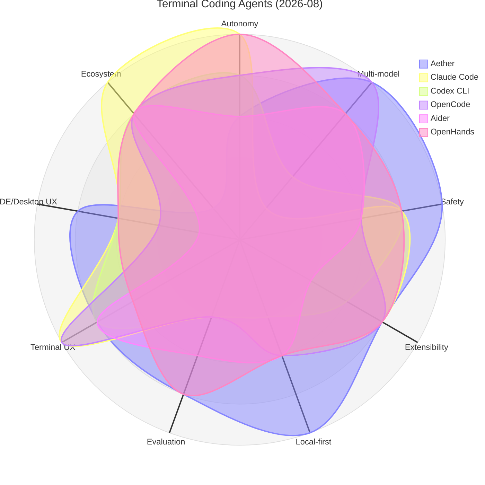
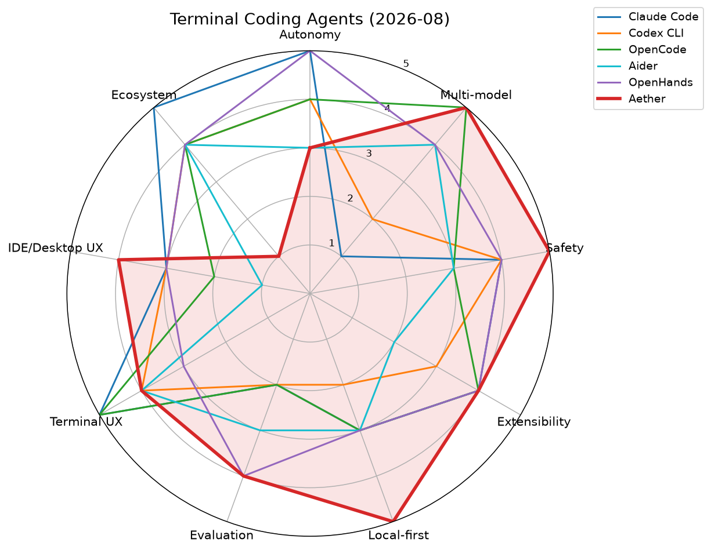
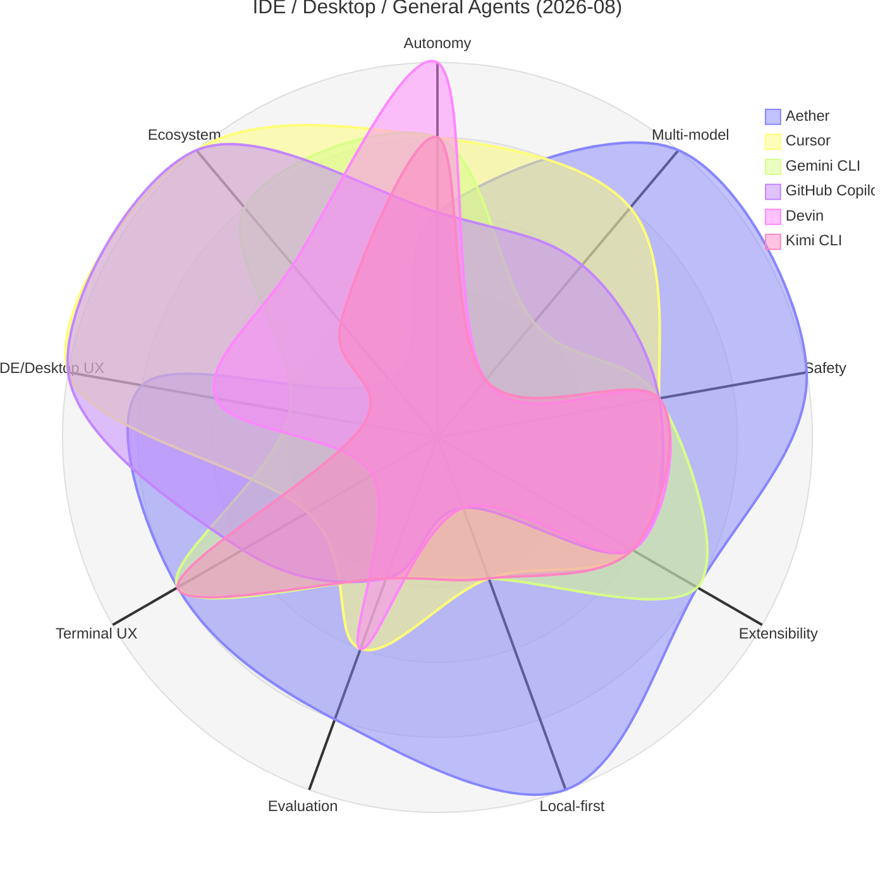
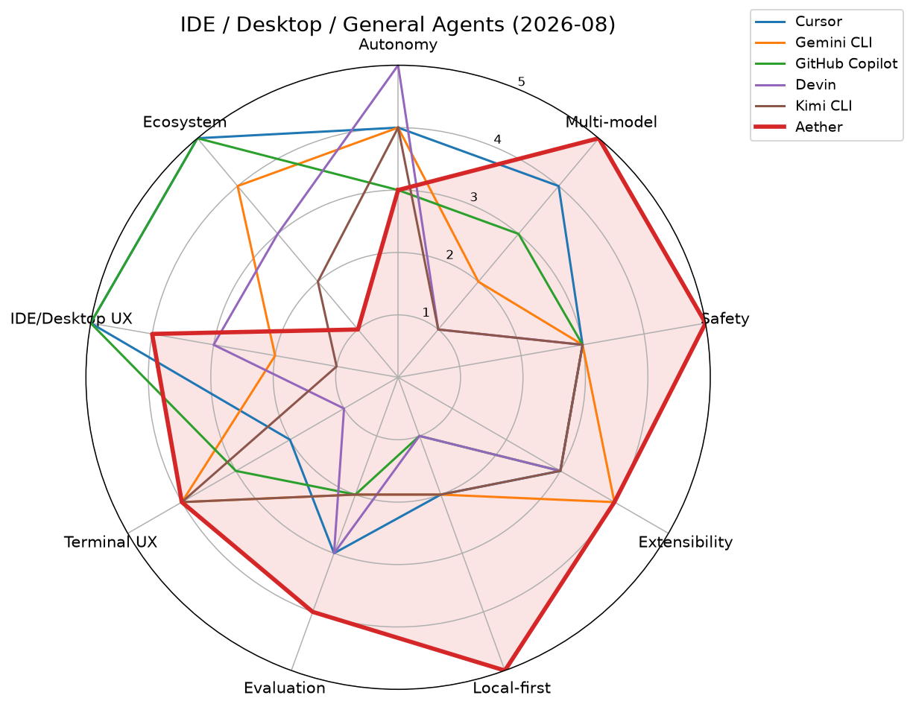

# Aether 竞品调研：主流 Agent 工具雷达图对比（2026-08）

> 本文是**纯调研文档**，不改任何代码。结论与 [`docs/roadmap.md`](./roadmap.md)（2026-08 版）对齐，不重复、不冲突。
> 评分为 2026-08 桌面调研得出的**定性主观评分**（1–5 分），方法与时效声明见文末第 7 节。

## 1. 对比范围与评分维度

**对比工具（11 个）**：Claude Code、Codex CLI、Gemini CLI、OpenCode、Aider、Cline、Cursor、GitHub Copilot、Devin、OpenHands、Kimi CLI。

**评分维度（9 个，1–5 分）**：

| 维度 | 雷达图轴标签 | 含义 |
|------|-------------|------|
| Agent 自主性 | Autonomy | 无需人工干预完成任务链的能力（工具循环、迭代预算、子任务） |
| 多模型灵活性 | Multi-model | 可接入的 provider / 模型广度，含本地模型与 BYOK |
| 安全与权限 | Safety | 权限门、沙箱、敏感路径保护、危险操作确认 |
| 可扩展性 | Extensibility | MCP / 插件 / Skills / hooks 等扩展机制 |
| 本地优先隐私 | Local-first | 数据是否留在本机、是否依赖云端、遥测情况 |
| 评估与基准工具 | Evaluation | 内置的模型对比 / benchmark / 排行榜能力 |
| 终端体验 | Terminal UX | CLI / TUI 的完整度与交互质量 |
| IDE·桌面体验 | IDE/Desktop UX | GUI / IDE 集成的完整度与交互质量 |
| 生态成熟度 | Ecosystem | 社区规模、文档、第三方集成、商业背书 |

## 2. 评分总表

| 工具 | Autonomy | Multi-model | Safety | Extensibility | Local-first | Evaluation | Terminal UX | IDE/Desktop UX | Ecosystem |
|------|:---:|:---:|:---:|:---:|:---:|:---:|:---:|:---:|:---:|
| **Aether** | **3** | **5** | **5** | **4** | **5** | **4** | **4** | **4** | **1** |
| Claude Code | 5 | 1 | 4 | 4 | 3 | 2 | 5 | 3 | 5 |
| Codex CLI | 4 | 2 | 4 | 3 | 2 | 2 | 4 | 3 | 4 |
| Gemini CLI | 4 | 2 | 3 | 4 | 2 | 2 | 4 | 2 | 4 |
| OpenCode | 4 | 5 | 3 | 4 | 3 | 2 | 5 | 2 | 4 |
| Aider | 3 | 4 | 3 | 2 | 3 | 3 | 4 | 1 | 4 |
| Cline | 4 | 4 | 3 | 4 | 2 | 2 | 1 | 5 | 4 |
| Cursor | 4 | 4 | 3 | 3 | 2 | 3 | 2 | 5 | 5 |
| GitHub Copilot | 3 | 3 | 3 | 3 | 1 | 2 | 3 | 5 | 5 |
| Devin | 5 | 1 | 3 | 3 | 1 | 3 | 1 | 3 | 3 |
| OpenHands | 5 | 4 | 4 | 4 | 3 | 4 | 3 | 3 | 4 |
| Kimi CLI | 4 | 1 | 3 | 3 | 2 | 2 | 4 | 1 | 2 |

## 3. 雷达图

分组绘制以保证可读性，Aether 在两组中均作为参照线（粗红线）。每张图提供 Mermaid（GitHub 直接渲染）与 PNG 兜底两种形式，数据与第 2 节评分总表一一对应。

> 说明：Cline 未出现在任何一张图中——它的画像是"终端弱、VS Code 内强"的单极形态，放入任一组都会稀释对比焦点；其评分仍收录于第 2 节总表与第 5 节学习清单。

### 图 A：终端编程 Agent（Aether vs Claude Code / Codex CLI / OpenCode / Aider / OpenHands）

### 图 B：IDE·桌面·通用 Agent（Aether vs Cursor / Gemini CLI / GitHub Copilot / Devin / Kimi CLI）

## 4. Aether 的优势

从雷达图可直接读出的差异化：

1. **Local-first 隐私（5 分，全场最高）**：全部数据（会话、记忆、KG、Arena 投票）存本机 SQLite，唯一落盘例外是背景图。对比之下 Cursor / Copilot / Devin / Gemini CLI 均强依赖云端。
2. **多模型灵活性 + 评估工具的组合（5 + 4）**：多 provider 接入叠加 Arena（一题多模型并发作答、投票、按 intent 分类的 ELO 排行榜）。OpenCode 只有 provider 广度、没有评估；Claude Code / Kimi CLI / Devin 则是单模型锁定。这一组合直接支撑 roadmap 的"Aether 替你决定"定位。
3. **安全与权限（5 分，全场最高）**：五档权限阶梯（Off/Plan/Ask/Auto/Yolo）+ allowlist 沙箱 + 敏感路径（`.git` / `.ssh` / hooks）写保护 + 工具结果经 `toolResultMiddleware` 脱敏截断后才进模型。多数对手只有"每步确认"或单层沙箱。
4. **全形态覆盖（GUI + TUI + CLI + RPC + SDK）**：同一份 agent core、42 个内置工具、同一 session store，GUI 起的会话可用 `aether tui --session <id>` 续聊。终端与桌面双 4 分，没有对手两项都强。
5. **15 语言 i18n**：终端类对手基本只提供英文界面。

## 5. 可向各家学习的点

| 对手 | 值得学习的点 |
|------|-------------|
| Claude Code | 进程级沙箱与权限人话摘要的打磨；子 Agent（subagents）编排；hooks 生态的文档化方式 |
| Codex CLI | OS 级沙箱分级（read-only / auto / full-access）的清晰心智模型；headless 非交互模式的稳定契约 |
| Gemini CLI | 扩展市场（extensions）的分发与发现机制；免费额度带来的低门槛 onboarding |
| OpenCode | provider 广度（Models.dev 聚合，含自托管）；TUI 交互细节的完成度 |
| Aider | architect / editor 双模型分工模式；git-first 工作流（每步自动 commit，天然可回滚）；公开 polyglot benchmark 带来的可信度 |
| Cline | 逐步审批（human-in-the-loop）的交互密度；MCP marketplace 的运营 |
| Cursor | IDE 内 diff 审查与 Tab 补全的无缝融合；公开 benchmark（CursorBench / Terminal-Bench / SWE-bench）作为市场证据 |
| GitHub Copilot | 与 GitHub 工作流（issue → PR → review）的深度绑定；企业级策略管理 |
| Devin | 云端隔离环境（shell + editor + browser 一体）的交付形态；长时任务的进度汇报 |
| OpenHands | benchmark harness 工程化（SWE-bench 评测流水线）；Docker 沙箱 runtime 的可复现性 |
| Kimi CLI | 单模型深度调优的体验一致性；与国内模型生态的整合 |

## 6. 优化方向（与 roadmap 对齐）

调研结论**印证**了 [`docs/roadmap.md`](./roadmap.md) 的现有优先级，而非另起炉灶：

- **P0-1 Agent 可靠性**：所有高分对手（Claude Code / OpenHands / Devin，Autonomy 5 分）都把可靠性放在第一位。Aether Autonomy 3 分是雷达图上最明显的短板，Tool Router、统一错误降级正是正确的补课方向。
- **P0-2 权限系统品牌化**：Safety 已是 Aether 最高分维度，但竞品（Codex 的 OS 沙箱分级、Claude Code 的权限摘要）说明"好"还不够，要做成 capability-based 三轴控制 + 人话弹窗，把 5 分变成"最能打"的卖点。
- **P0-3 Arena 2.0**：Evaluation 维度全场没有 5 分——这是空档。个人 benchmark（自己的任务集一键重跑）+ 导出对比报告，是 OpenCode / Claude Code 都没有的差异化，Aider 与 Cursor 已证明公开 benchmark 的说服力。
- **P1-4 统一 Agent Runtime**：Aether 全形态覆盖是唯一双 4 分，但 GUI / TUI 各起会话会稀释这一优势；统一 runtime 后"GUI 做一半 → TUI 继续"将成为独有体验。
- **P1-6 Skills 生态化**：Gemini CLI 的扩展市场与 Cline 的 MCP marketplace 说明分发机制比格式更重要；SKILL.md 加 `permissions:` 声明正好与安全卖点闭环。

**少量增量建议**（不违反"明确不做"清单）：

1. 学 Aider 的 git-first 自动 commit：在 workspace 沙箱内为 Agent 改动自动创建 wip commit，与已有 checkpoint/rollback 互补，成本极低。
2. 学 Cursor / Aider：Arena 2.0 落地后，定期发布 anonymized 聚合排行榜，作为低成本市场证据。
3. 学 OpenHands：为 P0 的 Tool Router 补一个最小 benchmark harness（固定任务集 + 成功率统计），让可靠性改进可度量。

**明确不做的事不变**：不追 Cursor 完整 IDE（IDE/Desktop UX 4 分已够用）、不做跨平台、不买代码签名、不堆工具数量。

## 7. 评分方法与时效声明

- **数据来源**：2026-08 桌面调研（各工具官方文档、产品页与公开评测），未做逐项实测。
- **评分性质**：1–5 分为**定性主观评分**，用于结构化对比，不构成精确度量；同一维度 ±1 分属正常判断误差。
- **评分锚点**：1 = 基本无此能力或形同虚设；3 = 能力可用但有明显限制；5 = 同类最佳实践。2 / 4 为中间过渡档。
- **覆盖限制**：评分反映各工具**公开默认形态**；企业版 / 私有部署能力未单独计分。
- **时效**：Agent 工具迭代极快，本文结论有效期约一个季度，**建议每季度复评一次**（重点复核 Autonomy、Extensibility、Ecosystem 三个变动最快的维度）。
