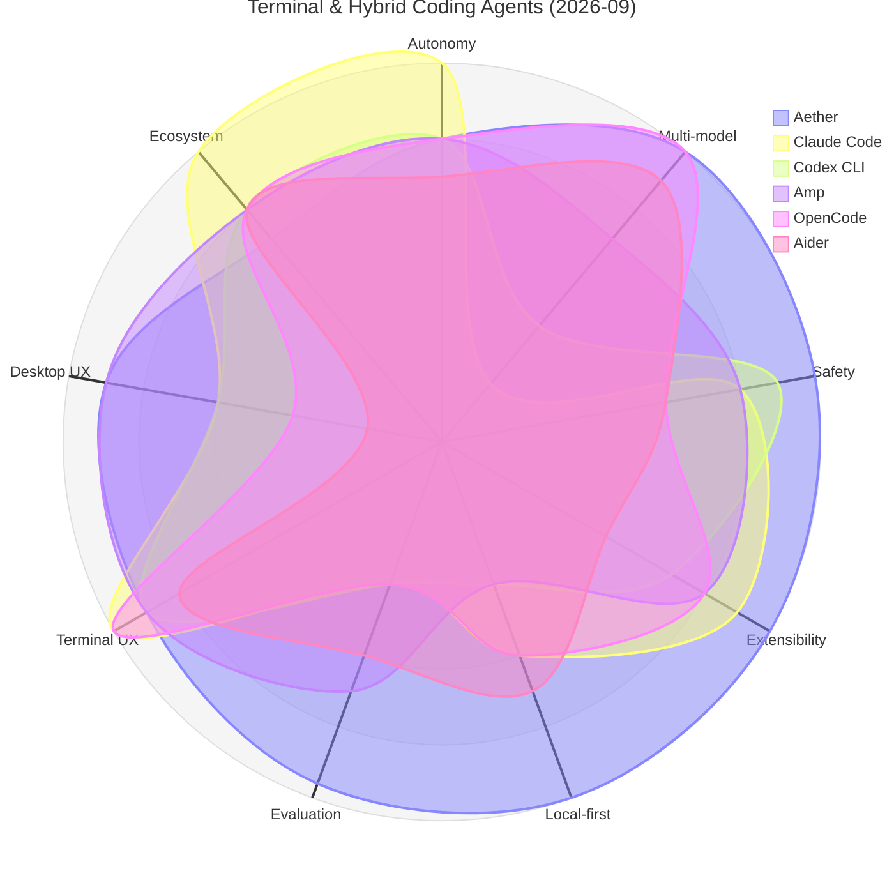
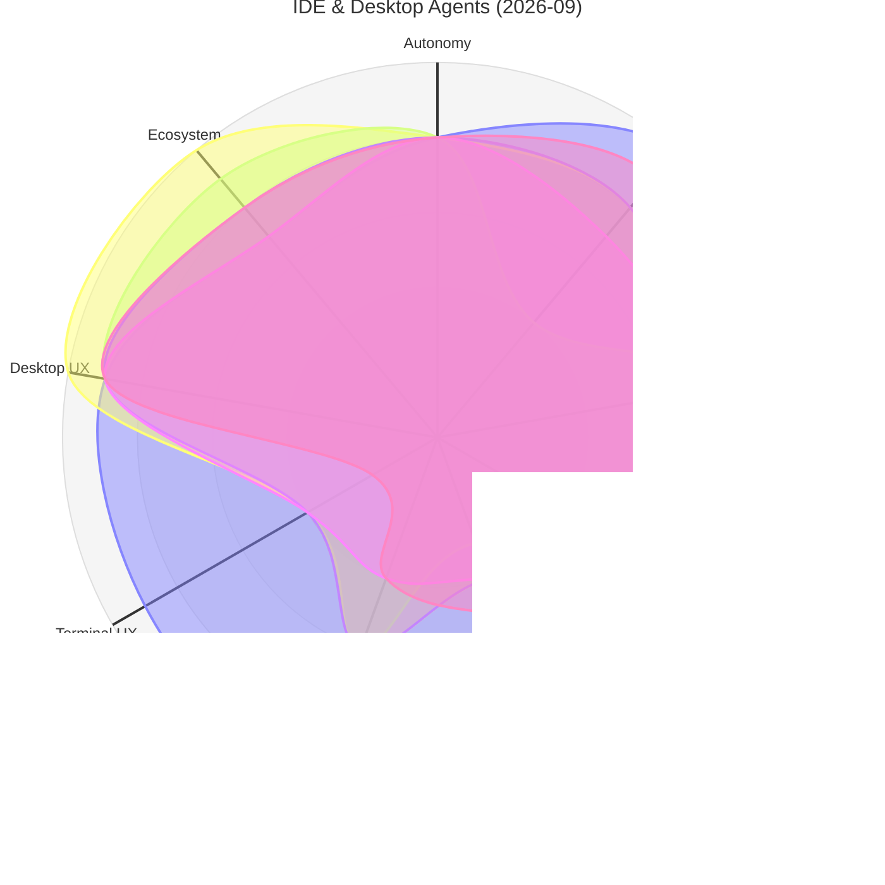
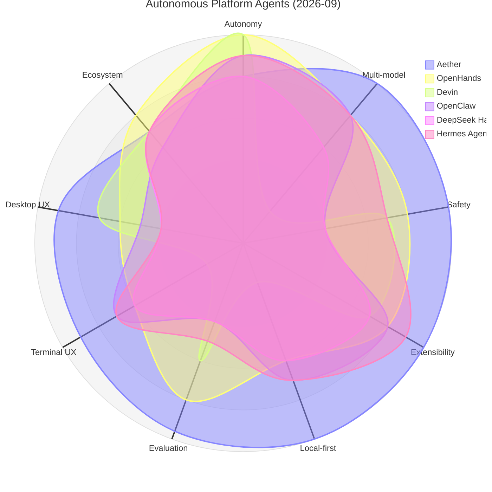

# Aether 竞品调研：主流 Agent 工具雷达图对比（2026-09 最新版）

> 本文为**产品与架构竞品调研报告**。基于 2026-09 最新行业产品演化、安全评测（腾讯朱雀实验室、奇安信 QVD 报告、Uncle城网安拆解）及 Aether v0.8.2+ 架构验收数据进行全面更新。
> 评分为定性主观评分（1–5 分制与雷达图 10 分制对应），方法与时效声明见文末第 7 节。

---

## 1. 对比范围与评分维度

**对比工具（29 个，覆盖三大主流形态；2026-09-12 生态扩展调研补充，详见第 7 节）**：
- **终端与混合编程类 Agent**：Claude Code、Codex CLI、Amp (ampagent)、OpenCode、Aider、Gemini CLI、Kimi CLI、Qwen Code（阿里）、Goose（Block / Linux Foundation）、Pi（Zehner+Ronacher）、Crush (Charmbracelet)、Continue CLI、Warp、Plandex、Open Interpreter（现为 Codex fork）、agentty
- **IDE 插件、云端 Review 与桌面编辑 Agent**：Cursor（SpaceX 收购）、Gemini Code Assist (GitHub App/Bot)、Devin Desktop（原 Windsurf，Cognition 收购后更名）、Trae (字节跳动)、Cline / Kilo Code（Roo Code 已于 2026-05 停维护归档）、GitHub Copilot、Antigravity (Google)
- **全自主平台与开源框架**：OpenHands、Devin、Manus（2025-12 被 Meta 以 $2B+ 收购）、OpenClaw (AI 龙虾)、DeepSeek Harness (DSH)、Hermes Agent

**评分维度（9 个，1–5 分）**：

| 维度 | 雷达图轴标签 | 含义 |
|------|-------------|------|
| Agent 自主性 | Autonomy | 无需人工干预完成长链任务的能力（工具循环、迭代预算、子任务派生、故障自愈） |
| 多模型灵活性 | Multi-model | 可接入的 provider / 模型广度，含本地模型（Ollama）与 BYOK 自定义端点 |
| 安全与权限 | Safety | 权限门阶梯、三层沙箱、影子工作区、环境变量脱敏、路径 Jail、Taint 追踪、Diff 审查 |
| 可扩展性 | Extensibility | 官方工程配方、`.aether/config.json`、MCP stdio/HTTP、SKILL.md、生命周期 hooks |
| 本地优先隐私 | Local-first | 数据是否完全留于本机 SQLite、是否脱离云端可用、零遥测、密钥系统级隔离 |
| 评估与基准工具 | Evaluation | 内置模型对比评测、SWE-bench 本地测试验证、Arena 盲测投票、ELO 排行榜 |
| 终端体验 | Terminal UX | 终端交互质量（CLI / 原生 TUI、按键响应、流式输出、撤销回滚） |
| IDE·桌面体验 | IDE/Desktop UX | GUI 交互完整度（时光机抽屉、Diff 代码预览、主题透明度、模型切换体验） |
| 生态成熟度 | Ecosystem | 开源社区规模、文档生态、多语言支持、三方 Skill/MCP/Recipe 市场规模 |

---

## 2. 2026-09 最新评分总表

| 工具 | 分类 | Autonomy | Multi-model | Safety | Extensibility | Local-first | Evaluation | Terminal UX | IDE/Desktop UX | Ecosystem |
|:---|:---|:---:|:---:|:---:|:---:|:---:|:---:|:---:|:---:|:---:|
| **Aether** | **桌面+终端双形态** | **4.0** | **5.0** | **5.0** | **5.0** | **5.0** | **4.8** | **4.5** | **4.5** | **3.5** |
| Claude Code | 终端 Agent | 5.0 | 1.0 | 4.0 | 4.5 | 3.0 | 2.0 | 5.0 | 3.0 | 5.0 |
| Codex CLI | 终端 Agent | 4.0 | 2.0 | 4.5 | 3.5 | 2.0 | 2.0 | 4.5 | 3.0 | 4.0 |
| Amp | 终端/混合 Agent | 4.0 | 3.5 | 4.0 | 4.0 | 2.0 | 3.5 | 4.5 | 4.5 | 4.0 |
| OpenCode | 终端 Agent | 4.0 | 5.0 | 3.0 | 4.0 | 3.0 | 2.0 | 5.0 | 2.0 | 4.0 |
| Aider | 终端 Agent | 3.5 | 4.5 | 3.0 | 2.5 | 3.5 | 3.0 | 4.0 | 1.0 | 4.0 |
| Gemini CLI | 终端 Agent | 4.0 | 2.0 | 3.5 | 4.0 | 2.0 | 2.0 | 4.0 | 2.0 | 4.0 |
| Kimi CLI | 终端 Agent | 4.0 | 1.0 | 3.0 | 3.0 | 2.0 | 2.0 | 4.0 | 1.0 | 2.5 |
| Cursor | IDE / 桌面 | 4.0 | 4.0 | 3.0 | 3.5 | 2.0 | 3.0 | 2.0 | 5.0 | 5.0 |
| Gemini Code Assist | IDE/PR 审查 | 4.0 | 2.0 | 4.0 | 4.0 | 1.5 | 3.0 | 2.0 | 4.5 | 4.5 |
| Devin Desktop (原 Windsurf) | IDE / 桌面 | 4.5 | 4.0 | 3.5 | 3.5 | 1.5 | 3.0 | 2.0 | 4.5 | 4.0 |
| Trae | IDE / 桌面 | 4.0 | 3.5 | 3.5 | 3.5 | 2.0 | 2.0 | 2.0 | 4.5 | 3.5 |
| Cline / Kilo Code (Roo 停维护) | VSCode 插件 | 4.0 | 4.5 | 3.5 | 4.5 | 2.5 | 2.0 | 1.0 | 4.5 | 4.0 |
| Roo Code | VSCode 插件 | 4.5 | 4.5 | 3.5 | 4.5 | 3.0 | 2.5 | 1.5 | 4.5 | 4.5 |
| Continue | VSCode 插件 | 4.0 | 4.5 | 3.5 | 4.0 | 3.5 | 2.5 | 2.0 | 4.0 | 4.5 |
| GitHub Copilot | IDE / 桌面 | 3.5 | 3.0 | 3.5 | 3.5 | 1.0 | 2.0 | 3.0 | 5.0 | 5.0 |
| OpenHands | 全自主平台 | 5.0 | 4.0 | 4.0 | 4.0 | 3.0 | 4.0 | 3.0 | 3.0 | 4.0 |
| Devin | 全自主平台 | 5.0 | 1.0 | 3.5 | 3.5 | 1.0 | 3.0 | 1.0 | 3.5 | 3.5 |
| OpenClaw | 全自主平台 | 4.5 | 4.0 | 2.0 | 4.0 | 3.5 | 2.0 | 3.5 | 2.5 | 3.0 |
| DeepSeek Harness | 开源框架 | 4.0 | 3.0 | 2.0 | 3.5 | 3.0 | 2.0 | 3.0 | 2.0 | 3.5 |
| Hermes Agent | 开源框架 | 4.5 | 4.0 | 3.5 | 4.5 | 3.5 | 2.5 | 3.5 | 2.0 | 3.5 |

---

## 3. 分组雷达图对比

### 图 A：终端与混合编程 Agent 对比 (Aether vs Claude Code / Codex / Amp / OpenCode / Aider / Gemini CLI)

### 图 B：IDE、云端 Review 与桌面编程 Agent 对比 (Aether vs Cursor / Gemini Code Assist / Devin Desktop / Trae / Cline / Copilot)

### 图 C：全自主自治与平台型 Agent 对比 (Aether vs OpenHands / Devin / OpenClaw / DSH / Hermes)

### 全景自评雷达矢量图（20款对照生成）

  

---

## 4. Aether 在 2026-09 的核心差异化壁垒

对比行业 20 款产品，Aether 的非对称优势非常鲜明：

1. **顶级纵深安全体系（Safety 满分 5.0，全场最高）**：
   - **轻量化三层沙箱**：L1 策略与能力轴门禁 + L2 环境变量正则脱敏（凭据隔离）与敏感路径 Jail + L3 可选容器化后端；
   - **Auto 模式影子工作区沙盒 (Shadow Workspace)**：基于 Git Worktree 物理隔离执行目录，分支漂移严格保护，成功安全合并、失败彻底回滚，绝不污染用户主工作区代码；
   - **动态污染追踪 (Taint Tracking) 与审计收据卡**：摄入外部非受信内容后立即标记污染，阻断静默写穿；审批弹窗升级为标准化动词/目标/回滚审计收据；
   - **前置 Unified Diff 语法高亮审查**：写文件与补丁前先渲染行级 Diff，杜绝盲目放行；
   - **网关 DNS Rebinding 物理拦截**：严格绑定回环与 Host 头校验（QVD-2026-57410），集中式安全回归套件常态化巡检。
2. **纯粹的 Local-First 隐私防线（Local-first 满分 5.0）**：
   - 会话、记忆、图谱、任务轨迹全量落盘于本地 SQLite WAL，无任何遥测、无账号、无云端中转；动态出站域名台账与敏感凭据预发送静态门禁。
3. **多模型自由切换 + 亚军对抗复核 + 内置基准评测（Multi-model 5.0 + Evaluation 4.8）**：
   - 支持 OpenAI / Claude / DeepSeek / Gemini / Ollama / 本地 Gateway；内置 Model Arena 盲测与 ELO 动态智能路由；
   - **第二名双模型对抗复核 (Runner-Up Review)**：根据本地 ELO 胜率调用意图第二名模型对破坏性改动进行对抗审查，有效抑制单一模型盲目幻觉；
   - **个人 SWE-bench 本地评测套件**：真实执行 `verifyCommand` 检验退出码，精准计算 Pass@1 解决率。
4. **桌面 + 终端双形态无缝漫游（Terminal 4.5 + Desktop 4.5）**：
   - 业内唯一一套 Agent Core 同时驱动 Electron 图形客户端与 Ink v5 终端 TUI（`aether tui`），内置 8 款官方工程配方（Curated Recipes）与仓库级配置即代码（`.aether/config.json`）。

---

## 5. 向 20 款竞品学到了什么（吸收与演进）

| 竞品 | 代表形态 | Aether 吸收的精髓 |
|:---|:---|:---|
| **Claude Code** | 终端标杆 | 吸收其进程级权限提示与收据卡设计；反向防御其曾曝光的 Unicode 变体撇号隐写机制。 |
| **Codex CLI** | 终端沙箱 | 吸收 OS 级沙箱清晰心智模型（只读/询问/完全访问）；严格约束非交互模式。 |
| **Amp** | 终端/云端混合 | 吸收其云端/终端双轨协同（`amp sync`）、Orbs 隔离沙箱与主动意图转向（Steer, Don't Queue）哲学。 |
| **Cursor** | IDE 顶流 | 吸收前置 Diff 审查与语法高亮心智；坚持拒绝臃肿全量 IDE，保持轻量工作台。 |
| **Gemini Code Assist** | IDE / GitHub PR 审查 | 吸收其 GitHub PR Review 自动化审查、Commit 级建议与大上下文仓库全景理解心智。 |
| **Devin Desktop (原 Windsurf Cascade)** | 流式感知 | 吸收其长程任务实时流式进展反馈，落地 `AgentRunTimeline` 时光机抽屉。 |
| **Trae** | 字节跳动 IDE | 吸收网安一体化 Agent（如 DeepSec）实战思路，将渗透防御内建为常驻中间件。 |
| **DeepSeek Harness** | 开源自主框架 | 深刻吸取其 QVD-2026-57410 漏洞教训：绝不信任 HTTP Host 头，本地监听强制回环绑定与时序防侧信道。 |
| **Hermes Agent** | 进化框架 | 吸收声明式技能生态与自迭代经验；完善 `SKILL.md` 的能力边界。 |
| **Aider** | Git-first | 吸收 git 自动 commit 互补机制，确保工具调用天然可回滚（`git:undo`）。 |
| **OpenHands** | 评测 Harness | 吸收其测试用例严格沙箱隔离与环境复现性思路。 |
| **Devin** | 云端 Autonomous | 吸收长任务进度状态机与崩溃恢复（`restorePendingTasks`）。 |

---

## 6. 结语与客观定位

Aether 绝不盲目宣称“全方位超越第一梯队”。在单一极端代码生成的深度上，单模型深绑定的 Claude Code 与原生 IDE Cursor 依然处于绝对顶峰（Coding 9.8 vs Aether 9.1）。

但 Aether 为用户提供了无可替代的定位价值：**把模型当作可随时更换的计算后端，把数据和私隐 100% 锁在自己的硬盘上，以银行级的防御纵深让自主 Agent 在桌面环境安全、踏实地运转。** 不对称的形状，正是 Aether 最真实的勋章。

---

## 7. 2026-09-12 生态扩展调研补充（18→29 款）

> 本节为 2026-09-12 全景扩展调研增量，冲掉第 1-2 节中已过时的事实（Roo Code 停维护、Windsurf 更名）。新进工具未评 9 维分，原因是发布期过短评分无意义；本文件后续新一轮评分时再并入总表。完整调研见知识库 `03-开发日志/2026-09-12-Agent工具全景扩展调研与生态动态盘点.md`。

### 新增工具速览

| 工具 | 形态 | 一句话定位 | 对 Aether 的参考价值 |
|:---|:---|:---|:---|
| **DSH (DeepSeek Harness)** | 开源引擎 | 「一切皆插件」Cordis 内核、PTC 程序化工具调用、append-only trajectory 自压缩，system prompt ~6k；发布 12h 50k stars / 4 天 126k | **同赛道唯一真对手**：本地/多模型/引擎化。Aether 的答案=安全纵深+双形态+评估体系，并需开源运营对冲其社区加速度 |
| **Pi** | 终端 harness | 极简 system prompt（~2-3k），Zehner+Ronacher | harness 效率命题：prompt 每省 1k token 都是成本与表现双赢 |
| **Crush** | TUI | Charm 出品，LSP-aware agentic TUI | TUI 美学与 LSP 感知值得借鉴 |
| **Goose** | 终端/DevOps | 围绕 MCP 设计，捐给 Linux Foundation | Recipe/MCP 生态运营样本 |
| **Qwen Code** | CLI | 阿里开源 coder CLI | 中国生态对 CLI 形态的回归 |
| **Kilo Code** | VSCode 插件 | Cline 家族现役主力（Roo 停维护后）；Orchestrator + 可见子步骤 to-do | 任务透明化的 to-do 列表心智 |
| **Continue CLI** | 终端/CI | 转型 Continuous AI：agent 上 PR 当 CI status checks | 验证闭环上 CI 的方向 |
| **Open Interpreter** | 桌面/CLI | 重构为 Codex fork；OS 沙箱 + model-specific harness emulation | 按模型塑 agent loop 的多模型心智 |
| **Manus** | 云端 | Meta $2B+ 收购的通用任务 agent | 云端通用任务天花板参考 |

### 生态关键动态（评分表外）

- Cursor 被 SpaceX 全资收购（2026-08），内置 Cursor Router 智能模型路由——Aether Arena ELO 路由的竞品对应物。
- Claude Code 2026-03 源码泄露事件；AGENTS.md 已成跨工具互操作事实标准。
- Windsurf 2025-07 被 Cognition 收购后更名 Devin Desktop，自有模型 SWE-1.5（SWE-bench ~78%）+ Turbo Mode。
- OpenHands 完成 $23.8M Series A；Manus 被 Meta 收购（2025-12-30）。
- 中国市场：四大厂（阿里 Qoder / 腾讯 CodeBuddy / 百度 Comate / 字节 TRAE）全部 IDE+CLI+云三端覆盖；月活渗透率 >85%。
- **Aether 应对北极星不变**：把新增 26 款对手当作「可吸收的心智」而非「可抄袭的表面」，护城河仍是安全×本地×多模型评估三位一体。
